# Visual DSA Roadmap

**Coding-interview algorithms you can watch.** Every lesson below is a 3-minute interactive page on [bytepatterns.com](https://bytepatterns.com?utm_source=github&utm_medium=readme&utm_campaign=visual-dsa-roadmap): a step-by-step animation you control, under 150 words of explanation, one real-world example, one exercise, and a three-question quiz. No wall of text.

This repository is the map. It is regenerated from the site's content, so the numbers and links are always current.

| | |
|---|---|
| Lessons | **324** across **31** modules (~29 hours) |
| Practice problems | **270** (89 easy · 137 medium · 44 hard) |
| Cost | Free. No account needed to read a lesson. |
| Machine-readable | [`roadmap.json`](roadmap.json) — every lesson and problem with its URL |

## How to use this map

1. Go phase by phase. Each phase is ordered so the next module only needs what came before it.
2. Inside a module, do the lessons in order — each animation builds on the previous one's picture.
3. After a module, do its practice problems. Hints unlock one at a time; the solution stays behind a gate until you ask for it.
4. Coming back before an interview? The one-liners below are the whole course in one screen.

## Contents

- [Foundations](#foundations)
  - [Big-O](#big-o)
  - [Arrays](#arrays)
  - [Strings](#strings)
  - [Searching](#searching)
  - [Sorting](#sorting)
- [Data Structures](#structures)
  - [Linked Lists](#linked-lists)
  - [Stacks & Queues](#stacks-queues)
  - [Hash Tables](#hash-tables)
  - [Trees & BST](#trees)
  - [Tries](#tries)
  - [Heaps](#heaps)
  - [Two Heaps & K-Way Merge](#two-heaps-k-way)
  - [Graphs](#graphs)
  - [Matrix & Grid](#matrix-grid)
  - [Union-Find](#union-find)
- [Algorithms](#algorithms)
  - [Recursion](#recursion)
  - [Backtracking](#backtracking)
  - [Greedy](#greedy)
  - [Intervals](#intervals)
  - [Bit Manipulation](#bit-manipulation)
  - [Math & Number Theory](#math-number-theory)
  - [Dynamic Programming](#dynamic-programming)
- [Systems](#systems)
  - [System Design](#system-design)
  - [System Design Cases](#system-design-cases)
  - [AWS for Interviews](#aws)
  - [Docker & Kubernetes for Interviews](#kubernetes)
  - [Concurrency](#concurrency)
  - [SQL](#sql)
- [The Rest of the Loop](#interview)
  - [Low-Level Design](#lld)
  - [Behavioral](#behavioral)
- [AI & ML](#ai)
  - [AI & ML](#ai-ml)
- [Browse by topic](#browse-by-topic)
- [Practice problems](#practice-problems)

## Foundations

_Cost, then the one structure everything else is built on. Nothing here is optional._

### Big-O

[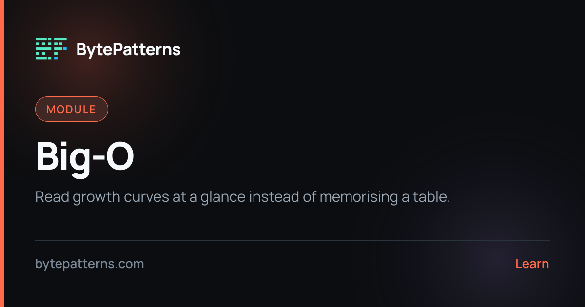](https://bytepatterns.com/learn/big-o?utm_source=github&utm_medium=readme&utm_campaign=visual-dsa-roadmap)

_Read growth curves at a glance instead of memorising a table._ · 5 lessons · [open module](https://bytepatterns.com/learn/big-o?utm_source=github&utm_medium=readme&utm_campaign=visual-dsa-roadmap)

| # | Lesson | What you will see | Min |
|---|---|---|---|
| 1 | [What Is Big-O?](https://bytepatterns.com/learn/big-o/what-is-big-o?utm_source=github&utm_medium=readme&utm_campaign=visual-dsa-roadmap) | Stop timing code. Start predicting how it scales. | 4 |
| 2 | [O(1) and O(n)](https://bytepatterns.com/learn/big-o/o1-and-on?utm_source=github&utm_medium=readme&utm_campaign=visual-dsa-roadmap) | One step, or every step? That's the whole difference. | 4 |
| 3 | [O(n²) and Nested Loops](https://bytepatterns.com/learn/big-o/on2-and-nested-loops?utm_source=github&utm_medium=readme&utm_campaign=visual-dsa-roadmap) | Every pair costs you. Nested loops explode fast. | 5 |
| 4 | [O(log n) and Halving](https://bytepatterns.com/learn/big-o/ologn-halving?utm_source=github&utm_medium=readme&utm_campaign=visual-dsa-roadmap) | Throw away half the problem, every single step. | 4 |
| 5 | [Comparing Complexities](https://bytepatterns.com/learn/big-o/comparing-complexities?utm_source=github&utm_medium=readme&utm_campaign=visual-dsa-roadmap) | O(n log n) beats O(n²) long before you notice. | 5 |

### Arrays

[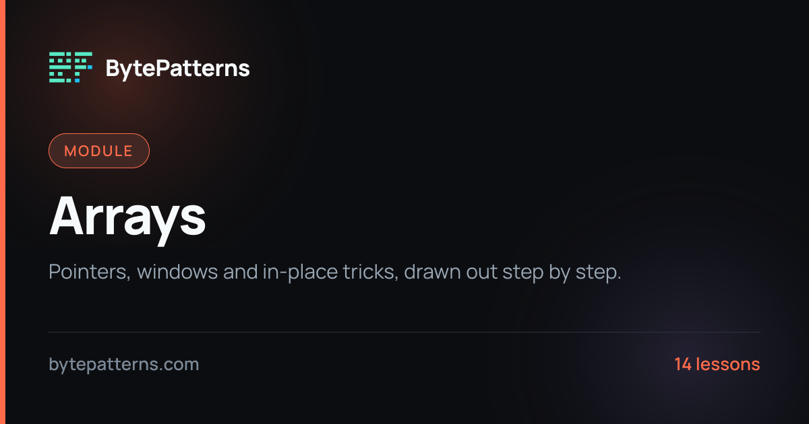](https://bytepatterns.com/learn/arrays?utm_source=github&utm_medium=readme&utm_campaign=visual-dsa-roadmap)

_Pointers, windows and in-place tricks, drawn out step by step._ · 14 lessons · [open module](https://bytepatterns.com/learn/arrays?utm_source=github&utm_medium=readme&utm_campaign=visual-dsa-roadmap)

| # | Lesson | What you will see | Min |
|---|---|---|---|
| 1 | [Array Basics](https://bytepatterns.com/learn/arrays/array-basics?utm_source=github&utm_medium=readme&utm_campaign=visual-dsa-roadmap) | One block of memory, instant access to any slot. | 4 |
| 2 | [Two Pointers](https://bytepatterns.com/learn/arrays/two-pointers?utm_source=github&utm_medium=readme&utm_campaign=visual-dsa-roadmap) | Two indexes closing in beat one loop nesting another. | 5 |
| 3 | [Sliding Window](https://bytepatterns.com/learn/arrays/sliding-window?utm_source=github&utm_medium=readme&utm_campaign=visual-dsa-roadmap) | Reuse the last answer instead of recomputing it. | 5 |
| 4 | [Prefix Sums](https://bytepatterns.com/learn/arrays/prefix-sums?utm_source=github&utm_medium=readme&utm_campaign=visual-dsa-roadmap) | Pay once up front, answer range queries instantly. | 5 |
| 5 | [In-Place Reversal](https://bytepatterns.com/learn/arrays/in-place-reversal?utm_source=github&utm_medium=readme&utm_campaign=visual-dsa-roadmap) | Flip an array with one temp variable, not a copy. | 4 |
| 6 | [Move Zeroes](https://bytepatterns.com/learn/arrays/move-zeroes?utm_source=github&utm_medium=readme&utm_campaign=visual-dsa-roadmap) | Push the junk to the back without losing the order. | 5 |
| 7 | [Container With Most Water](https://bytepatterns.com/learn/arrays/container-with-most-water?utm_source=github&utm_medium=readme&utm_campaign=visual-dsa-roadmap) | The shorter wall decides. So move the shorter wall. | 6 |
| 8 | [Kadane's Algorithm](https://bytepatterns.com/learn/arrays/kadanes-algorithm?utm_source=github&utm_medium=readme&utm_campaign=visual-dsa-roadmap) | Drop the past the moment it starts costing you. | 6 |
| 9 | [Cyclic Sort](https://bytepatterns.com/learn/arrays/cyclic-sort?utm_source=github&utm_medium=readme&utm_campaign=visual-dsa-roadmap) | When values are 1..n, every value already knows its index. | 5 |
| 10 | [Merge Sorted Arrays](https://bytepatterns.com/learn/arrays/merge-sorted-arrays?utm_source=github&utm_medium=readme&utm_campaign=visual-dsa-roadmap) | Fill from the back and you never overwrite unread data. | 5 |
| 11 | [Dutch National Flag](https://bytepatterns.com/learn/arrays/dutch-national-flag?utm_source=github&utm_medium=readme&utm_campaign=visual-dsa-roadmap) | Three values, three regions, one pass. | 5 |
| 12 | [Product Except Self](https://bytepatterns.com/learn/arrays/product-except-self?utm_source=github&utm_medium=readme&utm_campaign=visual-dsa-roadmap) | Two sweeps beat one division. | 5 |
| 13 | [Rotate an Array](https://bytepatterns.com/learn/arrays/rotate-array?utm_source=github&utm_medium=readme&utm_campaign=visual-dsa-roadmap) | Three reversals move every element home. | 4 |
| 14 | [Majority Element](https://bytepatterns.com/learn/arrays/majority-element?utm_source=github&utm_medium=readme&utm_campaign=visual-dsa-roadmap) | Cancel the votes in pairs and the majority survives. | 5 |

Practice: [Single Stock Trade](https://bytepatterns.com/practice/arrays/single-stock-trade?utm_source=github&utm_medium=readme&utm_campaign=visual-dsa-roadmap) (easy) · [Drop Sorted Duplicates](https://bytepatterns.com/practice/arrays/drop-sorted-duplicates?utm_source=github&utm_medium=readme&utm_campaign=visual-dsa-roadmap) (easy) · [Product Of Others](https://bytepatterns.com/practice/arrays/product-of-others?utm_source=github&utm_medium=readme&utm_campaign=visual-dsa-roadmap) (medium) · [Longest Distinct Run](https://bytepatterns.com/practice/arrays/longest-distinct-run?utm_source=github&utm_medium=readme&utm_campaign=visual-dsa-roadmap) (medium) · [Window Maximums](https://bytepatterns.com/practice/arrays/window-maximums?utm_source=github&utm_medium=readme&utm_campaign=visual-dsa-roadmap) (hard) · [Majority Value](https://bytepatterns.com/practice/arrays/majority-value?utm_source=github&utm_medium=readme&utm_campaign=visual-dsa-roadmap) (easy) · [Rotate Right By K](https://bytepatterns.com/practice/arrays/rotate-right-by-k?utm_source=github&utm_medium=readme&utm_campaign=visual-dsa-roadmap) (medium) · [Spiral Grid Walk](https://bytepatterns.com/practice/arrays/spiral-grid-walk?utm_source=github&utm_medium=readme&utm_campaign=visual-dsa-roadmap) (medium) · [Push Target Values Back](https://bytepatterns.com/practice/arrays/push-target-values-back?utm_source=github&utm_medium=readme&utm_campaign=visual-dsa-roadmap) (easy) · [Subarray Sums Divisible by K](https://bytepatterns.com/practice/arrays/sums-divisible-by-k?utm_source=github&utm_medium=readme&utm_campaign=visual-dsa-roadmap) (medium) · [Smallest Absent Positive](https://bytepatterns.com/practice/arrays/smallest-absent-positive?utm_source=github&utm_medium=readme&utm_campaign=visual-dsa-roadmap) (hard) · [Water Held Between Bars](https://bytepatterns.com/practice/arrays/water-held-between-bars?utm_source=github&utm_medium=readme&utm_campaign=visual-dsa-roadmap) (hard) · [Squares of a Sorted List](https://bytepatterns.com/practice/arrays/squares-of-a-sorted-list?utm_source=github&utm_medium=readme&utm_campaign=visual-dsa-roadmap) (easy) · [Reverse Every K Block](https://bytepatterns.com/practice/arrays/reverse-every-k-block?utm_source=github&utm_medium=readme&utm_campaign=visual-dsa-roadmap) (easy) · [Balance Point Index](https://bytepatterns.com/practice/arrays/balance-point-index?utm_source=github&utm_medium=readme&utm_campaign=visual-dsa-roadmap) (easy) · [Longest Window Within Budget](https://bytepatterns.com/practice/arrays/longest-window-within-budget?utm_source=github&utm_medium=readme&utm_campaign=visual-dsa-roadmap) (medium) · [Taller Than Everything After](https://bytepatterns.com/practice/arrays/taller-than-everything-after?utm_source=github&utm_medium=readme&utm_campaign=visual-dsa-roadmap) (easy)

### Strings

[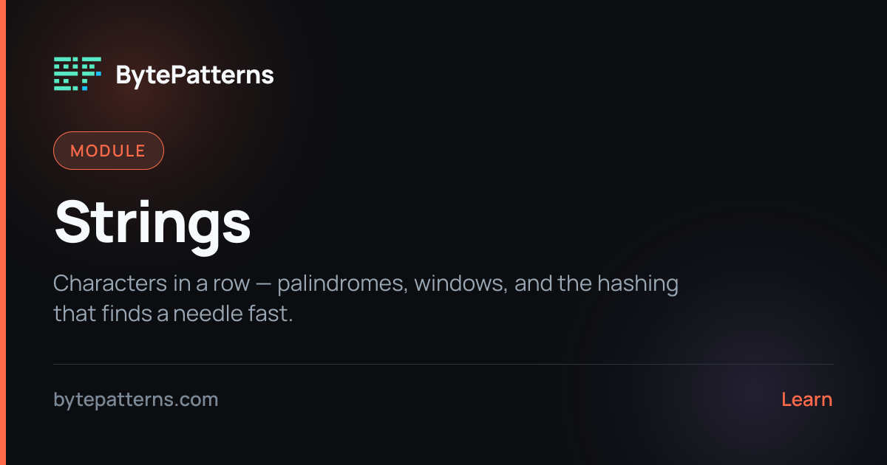](https://bytepatterns.com/learn/strings?utm_source=github&utm_medium=readme&utm_campaign=visual-dsa-roadmap)

_Characters in a row — palindromes, windows, and the hashing that finds a needle fast._ · 11 lessons · [open module](https://bytepatterns.com/learn/strings?utm_source=github&utm_medium=readme&utm_campaign=visual-dsa-roadmap)

| # | Lesson | What you will see | Min |
|---|---|---|---|
| 1 | [String Basics](https://bytepatterns.com/learn/strings/string-basics?utm_source=github&utm_medium=readme&utm_campaign=visual-dsa-roadmap) | Strings never change — every edit builds a brand-new one. | 4 |
| 2 | [Valid Palindrome](https://bytepatterns.com/learn/strings/valid-palindrome?utm_source=github&utm_medium=readme&utm_campaign=visual-dsa-roadmap) | Two pointers walk inward and settle it in one pass. | 4 |
| 3 | [Reverse Words](https://bytepatterns.com/learn/strings/reverse-words?utm_source=github&utm_medium=readme&utm_campaign=visual-dsa-roadmap) | Flip the word order without disturbing the letters. | 4 |
| 4 | [Longest Unique Substring](https://bytepatterns.com/learn/strings/longest-substring-without-repeats?utm_source=github&utm_medium=readme&utm_campaign=visual-dsa-roadmap) | Grow a window, shrink it the moment a letter repeats. | 5 |
| 5 | [Longest Palindromic Substring](https://bytepatterns.com/learn/strings/longest-palindromic-substring?utm_source=github&utm_medium=readme&utm_campaign=visual-dsa-roadmap) | Stand on every centre and push outwards. | 5 |
| 6 | [Rabin-Karp Rolling Hash](https://bytepatterns.com/learn/strings/rabin-karp-rolling-hash?utm_source=github&utm_medium=readme&utm_campaign=visual-dsa-roadmap) | Slide a number across the text instead of re-reading it. | 5 |
| 7 | [String Matching Intuition](https://bytepatterns.com/learn/strings/string-matching-intuition?utm_source=github&utm_medium=readme&utm_campaign=visual-dsa-roadmap) | A mismatch already tells you where to restart. | 5 |
| 8 | [Build the KMP Table](https://bytepatterns.com/learn/strings/kmp-failure-table?utm_source=github&utm_medium=readme&utm_campaign=visual-dsa-roadmap) | Every prefix remembers its longest border. | 6 |
| 9 | [Z-Algorithm Intuition](https://bytepatterns.com/learn/strings/z-algorithm?utm_source=github&utm_medium=readme&utm_campaign=visual-dsa-roadmap) | Reuse what an earlier match already proved. | 6 |
| 10 | [String Compression](https://bytepatterns.com/learn/strings/string-compression?utm_source=github&utm_medium=readme&utm_campaign=visual-dsa-roadmap) | One read cursor, one write cursor, no second string. | 5 |
| 11 | [Encode and Decode Strings](https://bytepatterns.com/learn/strings/encode-decode-strings?utm_source=github&utm_medium=readme&utm_campaign=visual-dsa-roadmap) | Send the length first and no character is special. | 5 |

Practice: [Longest Shared Prefix](https://bytepatterns.com/practice/strings/longest-shared-prefix?utm_source=github&utm_medium=readme&utm_campaign=visual-dsa-roadmap) (easy) · [First Unique Character](https://bytepatterns.com/practice/strings/first-unique-character?utm_source=github&utm_medium=readme&utm_campaign=visual-dsa-roadmap) (easy) · [Run Length Compression](https://bytepatterns.com/practice/strings/run-length-compression?utm_source=github&utm_medium=readme&utm_campaign=visual-dsa-roadmap) (medium) · [Multiply Digit Strings](https://bytepatterns.com/practice/strings/multiply-digit-strings?utm_source=github&utm_medium=readme&utm_campaign=visual-dsa-roadmap) (medium) · [Minimum Window Cover](https://bytepatterns.com/practice/strings/minimum-window-cover?utm_source=github&utm_medium=readme&utm_campaign=visual-dsa-roadmap) (hard) · [Group Anagrams Together](https://bytepatterns.com/practice/strings/group-anagrams-together?utm_source=github&utm_medium=readme&utm_campaign=visual-dsa-roadmap) (medium) · [Repeated DNA Sequences](https://bytepatterns.com/practice/strings/repeated-dna-sequences?utm_source=github&utm_medium=readme&utm_campaign=visual-dsa-roadmap) (medium) · [Palindrome After One Deletion](https://bytepatterns.com/practice/strings/palindrome-after-one-deletion?utm_source=github&utm_medium=readme&utm_campaign=visual-dsa-roadmap) (easy) · [Reverse the Word Order](https://bytepatterns.com/practice/strings/reverse-the-word-order?utm_source=github&utm_medium=readme&utm_campaign=visual-dsa-roadmap) (easy) · [Shortest Palindrome by Prepending](https://bytepatterns.com/practice/strings/shortest-palindrome-by-prepending?utm_source=github&utm_medium=readme&utm_campaign=visual-dsa-roadmap) (hard) · [Count Palindromic Substrings](https://bytepatterns.com/practice/strings/count-palindromic-substrings?utm_source=github&utm_medium=readme&utm_campaign=visual-dsa-roadmap) (medium) · [Smallest Repeating Unit](https://bytepatterns.com/practice/strings/smallest-repeating-unit?utm_source=github&utm_medium=readme&utm_campaign=visual-dsa-roadmap) (medium) · [How Often Each Prefix Appears](https://bytepatterns.com/practice/strings/how-often-each-prefix-appears?utm_source=github&utm_medium=readme&utm_campaign=visual-dsa-roadmap) (hard) · [Pack a Word List Into One String](https://bytepatterns.com/practice/strings/pack-a-word-list?utm_source=github&utm_medium=readme&utm_campaign=visual-dsa-roadmap) (easy)

### Searching

[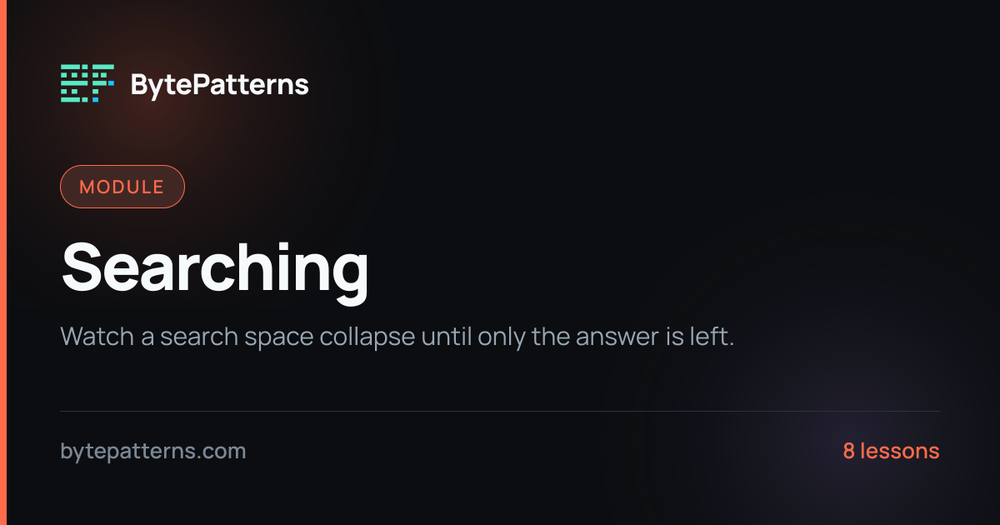](https://bytepatterns.com/learn/searching?utm_source=github&utm_medium=readme&utm_campaign=visual-dsa-roadmap)

_Watch a search space collapse until only the answer is left._ · 8 lessons · [open module](https://bytepatterns.com/learn/searching?utm_source=github&utm_medium=readme&utm_campaign=visual-dsa-roadmap)

| # | Lesson | What you will see | Min |
|---|---|---|---|
| 1 | [Linear Search](https://bytepatterns.com/learn/searching/linear-search?utm_source=github&utm_medium=readme&utm_campaign=visual-dsa-roadmap) | The simple one that always works. Often that's enough. | 3 |
| 2 | [Binary Search](https://bytepatterns.com/learn/searching/binary-search?utm_source=github&utm_medium=readme&utm_campaign=visual-dsa-roadmap) | A million records, twenty guesses. Sorted data only. | 5 |
| 3 | [Binary Search Variants](https://bytepatterns.com/learn/searching/binary-search-variants?utm_source=github&utm_medium=readme&utm_campaign=visual-dsa-roadmap) | Don't just find it. Find the first one that qualifies. | 6 |
| 4 | [Search in Rotated Array](https://bytepatterns.com/learn/searching/search-in-rotated-array?utm_source=github&utm_medium=readme&utm_campaign=visual-dsa-roadmap) | Half of it is still sorted. Find that half, use it. | 6 |
| 5 | [Binary Search on Answer](https://bytepatterns.com/learn/searching/binary-search-on-answer?utm_source=github&utm_medium=readme&utm_campaign=visual-dsa-roadmap) | No sorted array? Binary search the answer range. | 6 |
| 6 | [Search a 2D Matrix](https://bytepatterns.com/learn/searching/search-2d-matrix?utm_source=github&utm_medium=readme&utm_campaign=visual-dsa-roadmap) | Start in the corner where one step rules out a whole line. | 5 |
| 7 | [Find a Peak](https://bytepatterns.com/learn/searching/find-peak-element?utm_source=github&utm_medium=readme&utm_campaign=visual-dsa-roadmap) | An uphill step always has a summit ahead of it. | 5 |
| 8 | [Kth Smallest in a Matrix](https://bytepatterns.com/learn/searching/kth-smallest-matrix?utm_source=github&utm_medium=readme&utm_campaign=visual-dsa-roadmap) | Search the values, not the positions. | 6 |

Practice: [Integer Square Root](https://bytepatterns.com/practice/searching/integer-square-root?utm_source=github&utm_medium=readme&utm_campaign=visual-dsa-roadmap) (easy) · [Peak In Bumpy List](https://bytepatterns.com/practice/searching/peak-in-bumpy-list?utm_source=github&utm_medium=readme&utm_campaign=visual-dsa-roadmap) (medium) · [Median Of Two Sorted Lists](https://bytepatterns.com/practice/searching/median-of-two-sorted-lists?utm_source=github&utm_medium=readme&utm_campaign=visual-dsa-roadmap) (hard) · [First And Last Occurrence](https://bytepatterns.com/practice/searching/first-and-last-occurrence?utm_source=github&utm_medium=readme&utm_campaign=visual-dsa-roadmap) (medium) · [Minimum Daily Capacity](https://bytepatterns.com/practice/searching/minimum-daily-capacity?utm_source=github&utm_medium=readme&utm_campaign=visual-dsa-roadmap) (medium) · [Nearest Two Words](https://bytepatterns.com/practice/searching/nearest-two-words?utm_source=github&utm_medium=readme&utm_campaign=visual-dsa-roadmap) (easy) · [Count the Rotations](https://bytepatterns.com/practice/searching/count-the-rotations?utm_source=github&utm_medium=readme&utm_campaign=visual-dsa-roadmap) (medium) · [Search a List of Unknown Length](https://bytepatterns.com/practice/searching/search-a-list-of-unknown-length?utm_source=github&utm_medium=readme&utm_campaign=visual-dsa-roadmap) (medium) · [Kth Number Missing From a List](https://bytepatterns.com/practice/searching/kth-number-missing-from-a-list?utm_source=github&utm_medium=readme&utm_campaign=visual-dsa-roadmap) (easy) · [Value at a Point in Time](https://bytepatterns.com/practice/searching/value-at-a-point-in-time?utm_source=github&utm_medium=readme&utm_campaign=visual-dsa-roadmap) (medium) · [Next Letter After the Target](https://bytepatterns.com/practice/searching/next-letter-after-the-target?utm_source=github&utm_medium=readme&utm_campaign=visual-dsa-roadmap) (easy)

### Sorting

[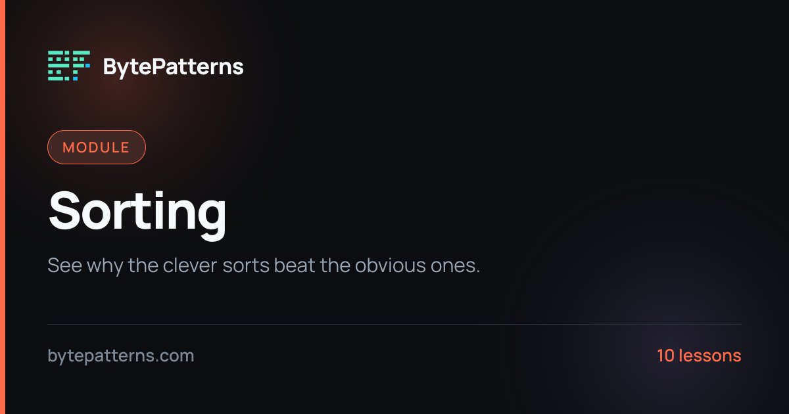](https://bytepatterns.com/learn/sorting?utm_source=github&utm_medium=readme&utm_campaign=visual-dsa-roadmap)

_See why the clever sorts beat the obvious ones._ · 10 lessons · [open module](https://bytepatterns.com/learn/sorting?utm_source=github&utm_medium=readme&utm_campaign=visual-dsa-roadmap)

| # | Lesson | What you will see | Min |
|---|---|---|---|
| 1 | [Sorting Basics](https://bytepatterns.com/learn/sorting/sorting-basics?utm_source=github&utm_medium=readme&utm_campaign=visual-dsa-roadmap) | Comparisons, swaps, stability: the vocabulary of order. | 4 |
| 2 | [Bubble Sort](https://bytepatterns.com/learn/sorting/bubble-sort?utm_source=github&utm_medium=readme&utm_campaign=visual-dsa-roadmap) | Swap neighbours until the big values float to the end. | 4 |
| 3 | [Selection Sort](https://bytepatterns.com/learn/sorting/selection-sort?utm_source=github&utm_medium=readme&utm_campaign=visual-dsa-roadmap) | Find the smallest, put it in front, then do it again. | 4 |
| 4 | [Insertion Sort](https://bytepatterns.com/learn/sorting/insertion-sort?utm_source=github&utm_medium=readme&utm_campaign=visual-dsa-roadmap) | Build a sorted run, slide each newcomer into place. | 5 |
| 5 | [Merge Sort](https://bytepatterns.com/learn/sorting/merge-sort?utm_source=github&utm_medium=readme&utm_campaign=visual-dsa-roadmap) | Split until trivial, then merge your way back up. | 6 |
| 6 | [Quick Sort](https://bytepatterns.com/learn/sorting/quick-sort?utm_source=github&utm_medium=readme&utm_campaign=visual-dsa-roadmap) | Pick a pivot, split around it, and never merge. | 6 |
| 7 | [Counting Sort](https://bytepatterns.com/learn/sorting/counting-sort?utm_source=github&utm_medium=readme&utm_campaign=visual-dsa-roadmap) | Skip comparisons entirely when the values are small. | 5 |
| 8 | [Which Sort When?](https://bytepatterns.com/learn/sorting/which-sort-when?utm_source=github&utm_medium=readme&utm_campaign=visual-dsa-roadmap) | The right sort is the one that fits your data's shape. | 5 |
| 9 | [Heap Sort](https://bytepatterns.com/learn/sorting/heap-sort?utm_source=github&utm_medium=readme&utm_campaign=visual-dsa-roadmap) | Build a heap, then peel the maximum off n times. | 6 |
| 10 | [Radix Sort](https://bytepatterns.com/learn/sorting/radix-sort?utm_source=github&utm_medium=readme&utm_campaign=visual-dsa-roadmap) | Sort by the last digit first, and never compare a thing. | 5 |

Practice: [Out Of Place Count](https://bytepatterns.com/practice/sorting/out-of-place-count?utm_source=github&utm_medium=readme&utm_campaign=visual-dsa-roadmap) (easy) · [Three Way Flag Sort](https://bytepatterns.com/practice/sorting/three-way-flag-sort?utm_source=github&utm_medium=readme&utm_campaign=visual-dsa-roadmap) (medium) · [Largest Number Arrangement](https://bytepatterns.com/practice/sorting/largest-number-arrangement?utm_source=github&utm_medium=readme&utm_campaign=visual-dsa-roadmap) (medium) · [H Index From Citations](https://bytepatterns.com/practice/sorting/h-index-from-citations?utm_source=github&utm_medium=readme&utm_campaign=visual-dsa-roadmap) (medium) · [Maximum Gap Buckets](https://bytepatterns.com/practice/sorting/maximum-gap-buckets?utm_source=github&utm_medium=readme&utm_campaign=visual-dsa-roadmap) (hard) · [Insertion Sort Shift Count](https://bytepatterns.com/practice/sorting/insertion-sort-shift-count?utm_source=github&utm_medium=readme&utm_campaign=visual-dsa-roadmap) (easy) · [Sort a Linked Chain](https://bytepatterns.com/practice/sorting/sort-a-linked-chain?utm_source=github&utm_medium=readme&utm_campaign=visual-dsa-roadmap) (medium) · [Fewest Swaps to Sort](https://bytepatterns.com/practice/sorting/fewest-swaps-to-sort?utm_source=github&utm_medium=readme&utm_campaign=visual-dsa-roadmap) (medium) · [Kth Smallest by Partitioning](https://bytepatterns.com/practice/sorting/kth-smallest-by-partitioning?utm_source=github&utm_medium=readme&utm_campaign=visual-dsa-roadmap) (medium) · [Pairs Below a Budget](https://bytepatterns.com/practice/sorting/pairs-below-a-budget?utm_source=github&utm_medium=readme&utm_campaign=visual-dsa-roadmap) (easy) · [Order After K Digit Passes](https://bytepatterns.com/practice/sorting/order-after-k-digit-passes?utm_source=github&utm_medium=readme&utm_campaign=visual-dsa-roadmap) (medium) · [Count Out-of-Order Pairs](https://bytepatterns.com/practice/sorting/count-out-of-order-pairs?utm_source=github&utm_medium=readme&utm_campaign=visual-dsa-roadmap) (hard) · [Sort by Another List's Order](https://bytepatterns.com/practice/sorting/sort-by-another-lists-order?utm_source=github&utm_medium=readme&utm_campaign=visual-dsa-roadmap) (easy)

## Data Structures

_Ten shapes for holding data, and the trade each one makes to be fast at something._

### Linked Lists

[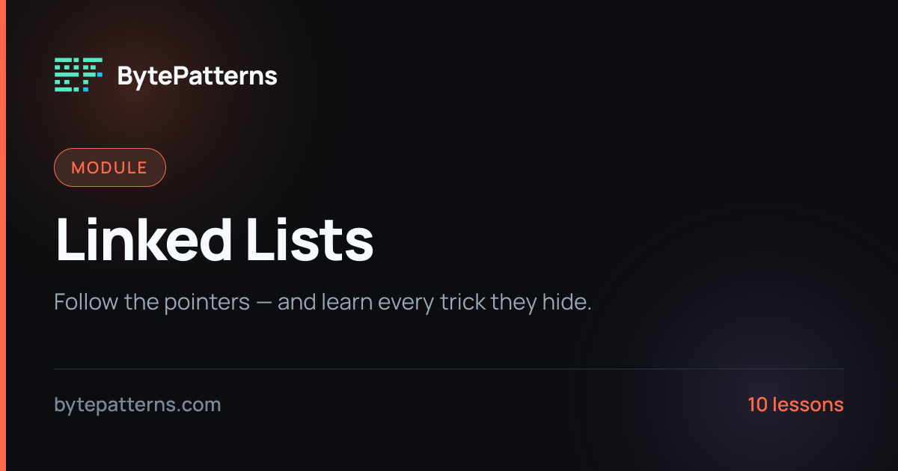](https://bytepatterns.com/learn/linked-lists?utm_source=github&utm_medium=readme&utm_campaign=visual-dsa-roadmap)

_Follow the pointers — and learn every trick they hide._ · 10 lessons · [open module](https://bytepatterns.com/learn/linked-lists?utm_source=github&utm_medium=readme&utm_campaign=visual-dsa-roadmap)

| # | Lesson | What you will see | Min |
|---|---|---|---|
| 1 | [Singly Linked List Basics](https://bytepatterns.com/learn/linked-lists/singly-linked-list-basics?utm_source=github&utm_medium=readme&utm_campaign=visual-dsa-roadmap) | Each item carries the address of the next one. | 4 |
| 2 | [Traversal and Search](https://bytepatterns.com/learn/linked-lists/traversal-and-search?utm_source=github&utm_medium=readme&utm_campaign=visual-dsa-roadmap) | One node at a time is the only way through. | 4 |
| 3 | [Insert and Delete](https://bytepatterns.com/learn/linked-lists/insert-and-delete?utm_source=github&utm_medium=readme&utm_campaign=visual-dsa-roadmap) | Rewire two links, and nothing else has to move. | 5 |
| 4 | [Reverse a Linked List](https://bytepatterns.com/learn/linked-lists/reverse-linked-list?utm_source=github&utm_medium=readme&utm_campaign=visual-dsa-roadmap) | Flip every arrow backwards using three pointers. | 5 |
| 5 | [Fast and Slow Pointers](https://bytepatterns.com/learn/linked-lists/fast-and-slow-pointers?utm_source=github&utm_medium=readme&utm_campaign=visual-dsa-roadmap) | One hop versus two finds the middle in one pass. | 5 |
| 6 | [Detect a Cycle](https://bytepatterns.com/learn/linked-lists/detect-cycle?utm_source=github&utm_medium=readme&utm_campaign=visual-dsa-roadmap) | If the list loops, the fast pointer laps the slow one. | 5 |
| 7 | [Find the Cycle Start](https://bytepatterns.com/learn/linked-lists/find-the-cycle-start?utm_source=github&utm_medium=readme&utm_campaign=visual-dsa-roadmap) | Knowing a loop exists is half the job — now find its door. | 6 |
| 8 | [Merge Two Sorted Lists](https://bytepatterns.com/learn/linked-lists/merge-two-sorted-lists?utm_source=github&utm_medium=readme&utm_campaign=visual-dsa-roadmap) | Zip two ordered chains together without allocating a single node. | 5 |
| 9 | [Copy a List With Random Links](https://bytepatterns.com/learn/linked-lists/copy-list-with-random-pointer?utm_source=github&utm_medium=readme&utm_campaign=visual-dsa-roadmap) | Clone the nodes first, wire the pointers second. | 6 |
| 10 | [Doubly Linked Lists](https://bytepatterns.com/learn/linked-lists/doubly-linked-lists?utm_source=github&utm_medium=readme&utm_campaign=visual-dsa-roadmap) | Add a backwards pointer and removal stops needing a search. | 6 |

Practice: [Merge Sorted Chains](https://bytepatterns.com/practice/linked-lists/merge-sorted-chains?utm_source=github&utm_medium=readme&utm_campaign=visual-dsa-roadmap) (easy) · [Drop Nth From End](https://bytepatterns.com/practice/linked-lists/drop-nth-from-end?utm_source=github&utm_medium=readme&utm_campaign=visual-dsa-roadmap) (medium) · [Weave List Halves](https://bytepatterns.com/practice/linked-lists/weave-list-halves?utm_source=github&utm_medium=readme&utm_campaign=visual-dsa-roadmap) (medium) · [Remove Value Nodes](https://bytepatterns.com/practice/linked-lists/remove-value-nodes?utm_source=github&utm_medium=readme&utm_campaign=visual-dsa-roadmap) (easy) · [Add Two Digit Chains](https://bytepatterns.com/practice/linked-lists/add-two-digit-chains?utm_source=github&utm_medium=readme&utm_campaign=visual-dsa-roadmap) (medium) · [Partition Around Value](https://bytepatterns.com/practice/linked-lists/partition-around-value?utm_source=github&utm_medium=readme&utm_campaign=visual-dsa-roadmap) (medium) · [Loop in a Chain](https://bytepatterns.com/practice/linked-lists/chain-loop-check?utm_source=github&utm_medium=readme&utm_campaign=visual-dsa-roadmap) (easy) · [Back and Forward History](https://bytepatterns.com/practice/linked-lists/back-forward-history?utm_source=github&utm_medium=readme&utm_campaign=visual-dsa-roadmap) (easy) · [Where the Loop Begins](https://bytepatterns.com/practice/linked-lists/loop-entry-node?utm_source=github&utm_medium=readme&utm_campaign=visual-dsa-roadmap) (medium) · [Clone a Chain With Jump Links](https://bytepatterns.com/practice/linked-lists/clone-a-chain-with-jump-links?utm_source=github&utm_medium=readme&utm_campaign=visual-dsa-roadmap) (medium) · [Chain Reads the Same Backwards](https://bytepatterns.com/practice/linked-lists/chain-reads-the-same-backwards?utm_source=github&utm_medium=readme&utm_campaign=visual-dsa-roadmap) (easy) · [Least Recently Used Cache](https://bytepatterns.com/practice/linked-lists/least-recently-used-cache?utm_source=github&utm_medium=readme&utm_campaign=visual-dsa-roadmap) (medium)

### Stacks & Queues

[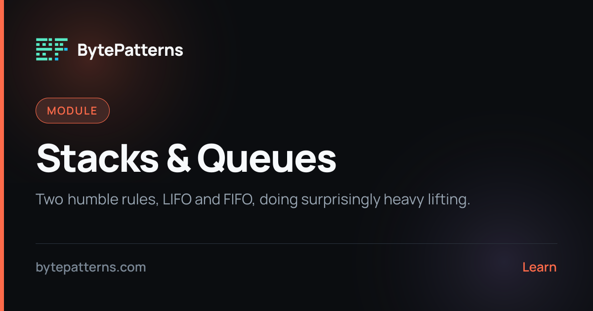](https://bytepatterns.com/learn/stacks-queues?utm_source=github&utm_medium=readme&utm_campaign=visual-dsa-roadmap)

_Two humble rules, LIFO and FIFO, doing surprisingly heavy lifting._ · 9 lessons · [open module](https://bytepatterns.com/learn/stacks-queues?utm_source=github&utm_medium=readme&utm_campaign=visual-dsa-roadmap)

| # | Lesson | What you will see | Min |
|---|---|---|---|
| 1 | [Stack Basics](https://bytepatterns.com/learn/stacks-queues/stack-basics?utm_source=github&utm_medium=readme&utm_campaign=visual-dsa-roadmap) | Last one in is the first one out. | 4 |
| 2 | [Valid Parentheses](https://bytepatterns.com/learn/stacks-queues/valid-parentheses?utm_source=github&utm_medium=readme&utm_campaign=visual-dsa-roadmap) | A closing bracket must answer the newest opening one. | 5 |
| 3 | [Queue Basics](https://bytepatterns.com/learn/stacks-queues/queue-basics?utm_source=github&utm_medium=readme&utm_campaign=visual-dsa-roadmap) | First one in is the first one out. | 4 |
| 4 | [Queue From Two Stacks](https://bytepatterns.com/learn/stacks-queues/queue-with-two-stacks?utm_source=github&utm_medium=readme&utm_campaign=visual-dsa-roadmap) | Reverse a reversal and LIFO turns into FIFO. | 5 |
| 5 | [Monotonic Stack](https://bytepatterns.com/learn/stacks-queues/monotonic-stack?utm_source=github&utm_medium=readme&utm_campaign=visual-dsa-roadmap) | Keep the stack ordered and every item waits only once. | 6 |
| 6 | [Min Stack](https://bytepatterns.com/learn/stacks-queues/min-stack?utm_source=github&utm_medium=readme&utm_campaign=visual-dsa-roadmap) | Carry the answer up with the data instead of recomputing it. | 5 |
| 7 | [Sliding Window Maximum](https://bytepatterns.com/learn/stacks-queues/sliding-window-maximum?utm_source=github&utm_medium=readme&utm_campaign=visual-dsa-roadmap) | A queue that drops anyone it has already outgrown. | 6 |
| 8 | [Circular Queue](https://bytepatterns.com/learn/stacks-queues/circular-queue?utm_source=github&utm_medium=readme&utm_campaign=visual-dsa-roadmap) | A fixed array that never shifts, because the ends wrap around. | 5 |
| 9 | [Largest Rectangle](https://bytepatterns.com/learn/stacks-queues/largest-rectangle?utm_source=github&utm_medium=readme&utm_campaign=visual-dsa-roadmap) | Every bar waits on the stack until both its walls are known. | 7 |

Practice: [Constant Time Min Stack](https://bytepatterns.com/practice/stacks-queues/constant-time-min-stack?utm_source=github&utm_medium=readme&utm_campaign=visual-dsa-roadmap) (easy) · [Days Until Warmer](https://bytepatterns.com/practice/stacks-queues/days-until-warmer?utm_source=github&utm_medium=readme&utm_campaign=visual-dsa-roadmap) (medium) · [Collapse Adjacent Pairs](https://bytepatterns.com/practice/stacks-queues/collapse-adjacent-pairs?utm_source=github&utm_medium=readme&utm_campaign=visual-dsa-roadmap) (easy) · [Decode Nested Repeats](https://bytepatterns.com/practice/stacks-queues/decode-nested-repeats?utm_source=github&utm_medium=readme&utm_campaign=visual-dsa-roadmap) (medium) · [Largest Bar Rectangle](https://bytepatterns.com/practice/stacks-queues/largest-bar-rectangle?utm_source=github&utm_medium=readme&utm_campaign=visual-dsa-roadmap) (hard) · [Requests in the Last Window](https://bytepatterns.com/practice/stacks-queues/requests-in-the-last-window?utm_source=github&utm_medium=readme&utm_campaign=visual-dsa-roadmap) (easy) · [Two-Stack Queue Operations](https://bytepatterns.com/practice/stacks-queues/two-stack-queue-operations?utm_source=github&utm_medium=readme&utm_campaign=visual-dsa-roadmap) (easy) · [Ring Buffer Deque](https://bytepatterns.com/practice/stacks-queues/ring-buffer-deque?utm_source=github&utm_medium=readme&utm_campaign=visual-dsa-roadmap) (medium) · [Evaluate Postfix Tokens](https://bytepatterns.com/practice/stacks-queues/evaluate-postfix-tokens?utm_source=github&utm_medium=readme&utm_campaign=visual-dsa-roadmap) (easy) · [Colliding Rocks in a Row](https://bytepatterns.com/practice/stacks-queues/colliding-rocks-in-a-row?utm_source=github&utm_medium=readme&utm_campaign=visual-dsa-roadmap) (medium) · [Evaluate Sums With Brackets](https://bytepatterns.com/practice/stacks-queues/evaluate-sums-with-brackets?utm_source=github&utm_medium=readme&utm_campaign=visual-dsa-roadmap) (hard) · [Next Greater Value Lookup](https://bytepatterns.com/practice/stacks-queues/next-greater-value-lookup?utm_source=github&utm_medium=readme&utm_campaign=visual-dsa-roadmap) (easy) · [Prices After the Next Discount](https://bytepatterns.com/practice/stacks-queues/prices-after-the-next-discount?utm_source=github&utm_medium=readme&utm_campaign=visual-dsa-roadmap) (easy)

### Hash Tables

[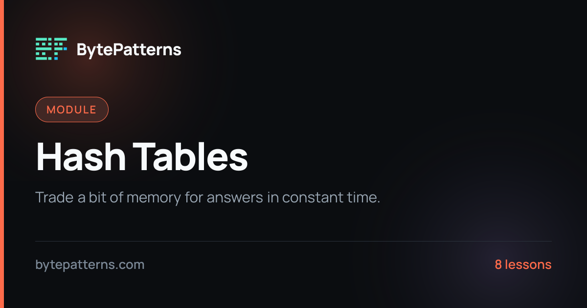](https://bytepatterns.com/learn/hash-tables?utm_source=github&utm_medium=readme&utm_campaign=visual-dsa-roadmap)

_Trade a bit of memory for answers in constant time._ · 8 lessons · [open module](https://bytepatterns.com/learn/hash-tables?utm_source=github&utm_medium=readme&utm_campaign=visual-dsa-roadmap)

| # | Lesson | What you will see | Min |
|---|---|---|---|
| 1 | [Hash Table Basics](https://bytepatterns.com/learn/hash-tables/hash-table-basics?utm_source=github&utm_medium=readme&utm_campaign=visual-dsa-roadmap) | Turn a key into an address and skip the search. | 4 |
| 2 | [Two Sum](https://bytepatterns.com/learn/hash-tables/two-sum?utm_source=github&utm_medium=readme&utm_campaign=visual-dsa-roadmap) | Remember what you have seen and the pair finds itself. | 5 |
| 3 | [Frequency Counting](https://bytepatterns.com/learn/hash-tables/frequency-counting?utm_source=github&utm_medium=readme&utm_campaign=visual-dsa-roadmap) | One pass, one counter per distinct value. | 4 |
| 4 | [Group Anagrams](https://bytepatterns.com/learn/hash-tables/group-anagrams?utm_source=github&utm_medium=readme&utm_campaign=visual-dsa-roadmap) | Give every item a canonical key, then bucket by it. | 5 |
| 5 | [When Hashing Fails](https://bytepatterns.com/learn/hash-tables/when-hashing-fails?utm_source=github&utm_medium=readme&utm_campaign=visual-dsa-roadmap) | O(1) is an average, not a promise. | 5 |
| 6 | [Subarray Sums With a Map](https://bytepatterns.com/learn/hash-tables/subarray-sum-map?utm_source=github&utm_medium=readme&utm_campaign=visual-dsa-roadmap) | The complement trick, moved onto running totals. | 6 |
| 7 | [Top K Without a Heap](https://bytepatterns.com/learn/hash-tables/top-k-buckets?utm_source=github&utm_medium=readme&utm_campaign=visual-dsa-roadmap) | Counts are small integers, so index by them. | 5 |
| 8 | [LFU: Frequency Buckets](https://bytepatterns.com/learn/hash-tables/lfu-frequency-buckets?utm_source=github&utm_medium=readme&utm_campaign=visual-dsa-roadmap) | Group keys by use count and eviction becomes O(1). | 6 |

Practice: [Repeated Value Check](https://bytepatterns.com/practice/hash-tables/repeated-value-check?utm_source=github&utm_medium=readme&utm_campaign=visual-dsa-roadmap) (easy) · [Subarrays Summing To K](https://bytepatterns.com/practice/hash-tables/subarrays-summing-to-k?utm_source=github&utm_medium=readme&utm_campaign=visual-dsa-roadmap) (medium) · [Longest Consecutive Run](https://bytepatterns.com/practice/hash-tables/longest-consecutive-run?utm_source=github&utm_medium=readme&utm_campaign=visual-dsa-roadmap) (medium) · [Shared Values Of Two Lists](https://bytepatterns.com/practice/hash-tables/shared-values-of-two-lists?utm_source=github&utm_medium=readme&utm_campaign=visual-dsa-roadmap) (easy) · [Consistent Renaming Check](https://bytepatterns.com/practice/hash-tables/consistent-renaming-check?utm_source=github&utm_medium=readme&utm_campaign=visual-dsa-roadmap) (easy) · [Four List Zero Tuples](https://bytepatterns.com/practice/hash-tables/four-list-zero-tuples?utm_source=github&utm_medium=readme&utm_campaign=visual-dsa-roadmap) (medium) · [Closest Repeat Distance](https://bytepatterns.com/practice/hash-tables/closest-repeat-distance?utm_source=github&utm_medium=readme&utm_campaign=visual-dsa-roadmap) (easy) · [Where Linear Probing Lands](https://bytepatterns.com/practice/hash-tables/where-linear-probing-lands?utm_source=github&utm_medium=readme&utm_campaign=visual-dsa-roadmap) (medium) · [Sort Letters by Frequency](https://bytepatterns.com/practice/hash-tables/sort-letters-by-frequency?utm_source=github&utm_medium=readme&utm_campaign=visual-dsa-roadmap) (medium) · [Least Frequently Used Cache](https://bytepatterns.com/practice/hash-tables/least-frequently-used-cache?utm_source=github&utm_medium=readme&utm_campaign=visual-dsa-roadmap) (hard) · [Longest Balanced Zeros and Ones](https://bytepatterns.com/practice/hash-tables/longest-balanced-zeros-and-ones?utm_source=github&utm_medium=readme&utm_campaign=visual-dsa-roadmap) (medium) · [Count Pairs With a Given Gap](https://bytepatterns.com/practice/hash-tables/count-pairs-with-a-given-gap?utm_source=github&utm_medium=readme&utm_campaign=visual-dsa-roadmap) (easy)

### Trees & BST

[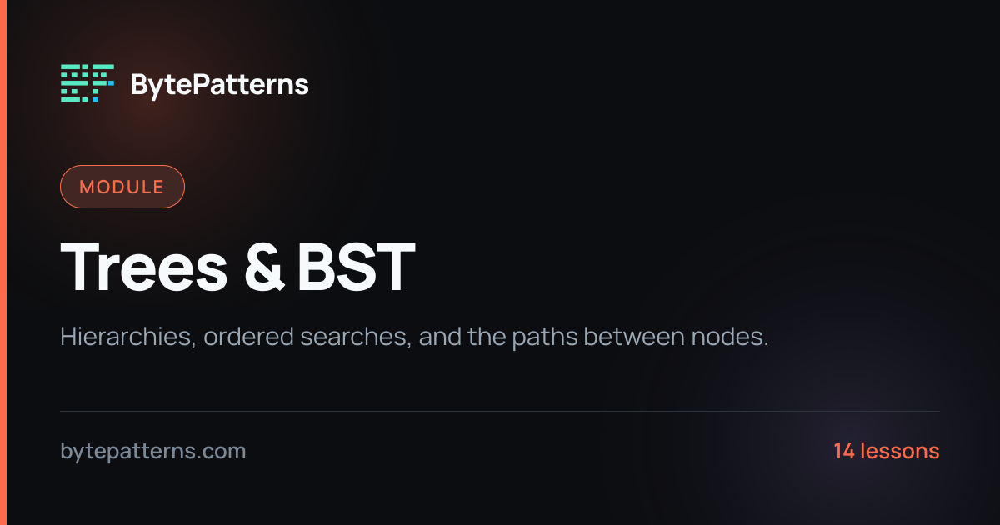](https://bytepatterns.com/learn/trees?utm_source=github&utm_medium=readme&utm_campaign=visual-dsa-roadmap)

_Hierarchies, ordered searches, and the paths between nodes._ · 14 lessons · [open module](https://bytepatterns.com/learn/trees?utm_source=github&utm_medium=readme&utm_campaign=visual-dsa-roadmap)

| # | Lesson | What you will see | Min |
|---|---|---|---|
| 1 | [Tree Basics](https://bytepatterns.com/learn/trees/tree-basics?utm_source=github&utm_medium=readme&utm_campaign=visual-dsa-roadmap) | One root, many branches, and no way back up. | 4 |
| 2 | [Binary Trees](https://bytepatterns.com/learn/trees/binary-trees?utm_source=github&utm_medium=readme&utm_campaign=visual-dsa-roadmap) | At most two children: one left, one right, never swapped. | 4 |
| 3 | [Tree Traversals](https://bytepatterns.com/learn/trees/tree-traversals?utm_source=github&utm_medium=readme&utm_campaign=visual-dsa-roadmap) | Same nodes, same recursion, three different reading orders. | 5 |
| 4 | [BST Basics](https://bytepatterns.com/learn/trees/bst-basics?utm_source=github&utm_medium=readme&utm_campaign=visual-dsa-roadmap) | Smaller values left, larger values right, all the way down. | 5 |
| 5 | [BST Insert and Search](https://bytepatterns.com/learn/trees/bst-insert-and-search?utm_source=github&utm_medium=readme&utm_campaign=visual-dsa-roadmap) | One comparison per level throws away half the tree. | 5 |
| 6 | [Validate a BST](https://bytepatterns.com/learn/trees/validate-bst?utm_source=github&utm_medium=readme&utm_campaign=visual-dsa-roadmap) | Checking the parent is not enough; carry a range down. | 6 |
| 7 | [Tree Depth and Balance](https://bytepatterns.com/learn/trees/tree-depth-and-balance?utm_source=github&utm_medium=readme&utm_campaign=visual-dsa-roadmap) | Height decides speed, and balance decides height. | 5 |
| 8 | [Lowest Common Ancestor](https://bytepatterns.com/learn/trees/lowest-common-ancestor?utm_source=github&utm_medium=readme&utm_campaign=visual-dsa-roadmap) | Walk down from the root until the two targets part ways. | 6 |
| 9 | [Level Order Traversal](https://bytepatterns.com/learn/trees/level-order-traversal?utm_source=github&utm_medium=readme&utm_campaign=visual-dsa-roadmap) | A queue turns a tree into one tidy row per depth. | 5 |
| 10 | [Diameter of a Tree](https://bytepatterns.com/learn/trees/tree-diameter?utm_source=github&utm_medium=readme&utm_campaign=visual-dsa-roadmap) | The longest path bends at exactly one node — find that node. | 6 |
| 11 | [Path Sum Variants](https://bytepatterns.com/learn/trees/path-sum-variants?utm_source=github&utm_medium=readme&utm_campaign=visual-dsa-roadmap) | Same tree, three questions — and three different things to carry. | 6 |
| 12 | [Serialize a Tree](https://bytepatterns.com/learn/trees/serialize-and-deserialize?utm_source=github&utm_medium=readme&utm_campaign=visual-dsa-roadmap) | Write the gaps down and the shape survives the trip. | 6 |
| 13 | [Vertical Order Traversal](https://bytepatterns.com/learn/trees/vertical-order-traversal?utm_source=github&utm_medium=readme&utm_campaign=visual-dsa-roadmap) | Give every node an x-coordinate and read the tree in columns. | 6 |
| 14 | [Rebuild From Traversals](https://bytepatterns.com/learn/trees/build-tree-from-traversals?utm_source=github&utm_medium=readme&utm_campaign=visual-dsa-roadmap) | Preorder names the root, inorder says where to cut. | 6 |

Practice: [Deepest Level Count](https://bytepatterns.com/practice/trees/deepest-level-count?utm_source=github&utm_medium=readme&utm_campaign=visual-dsa-roadmap) (easy) · [Zigzag Level Walk](https://bytepatterns.com/practice/trees/zigzag-level-walk?utm_source=github&utm_medium=readme&utm_campaign=visual-dsa-roadmap) (medium) · [Right Edge View](https://bytepatterns.com/practice/trees/right-edge-view?utm_source=github&utm_medium=readme&utm_campaign=visual-dsa-roadmap) (medium) · [Mirror Symmetry Check](https://bytepatterns.com/practice/trees/mirror-symmetry-check?utm_source=github&utm_medium=readme&utm_campaign=visual-dsa-roadmap) (easy) · [Root To Leaf Target Sum](https://bytepatterns.com/practice/trees/root-to-leaf-target-sum?utm_source=github&utm_medium=readme&utm_campaign=visual-dsa-roadmap) (easy) · [Widest Node To Node Path](https://bytepatterns.com/practice/trees/widest-node-to-node-path?utm_source=github&utm_medium=readme&utm_campaign=visual-dsa-roadmap) (medium) · [Rebuild From Two Walks](https://bytepatterns.com/practice/trees/rebuild-from-two-walks?utm_source=github&utm_medium=readme&utm_campaign=visual-dsa-roadmap) (hard) · [Closest Key in a BST](https://bytepatterns.com/practice/trees/closest-key-in-a-bst?utm_source=github&utm_medium=readme&utm_campaign=visual-dsa-roadmap) (easy) · [Distance Between Two BST Keys](https://bytepatterns.com/practice/trees/distance-between-bst-keys?utm_source=github&utm_medium=readme&utm_campaign=visual-dsa-roadmap) (medium) · [Shallowest Leaf Depth](https://bytepatterns.com/practice/trees/shallowest-leaf-depth?utm_source=github&utm_medium=readme&utm_campaign=visual-dsa-roadmap) (easy) · [Flatten a Tree Into a Chain](https://bytepatterns.com/practice/trees/flatten-a-tree-into-a-chain?utm_source=github&utm_medium=readme&utm_campaign=visual-dsa-roadmap) (medium) · [Top View of a Tree](https://bytepatterns.com/practice/trees/top-view-of-a-tree?utm_source=github&utm_medium=readme&utm_campaign=visual-dsa-roadmap) (medium) · [Largest BST Inside a Tree](https://bytepatterns.com/practice/trees/largest-bst-inside-a-tree?utm_source=github&utm_medium=readme&utm_campaign=visual-dsa-roadmap) (medium) · [Compact BST Serialization](https://bytepatterns.com/practice/trees/compact-bst-serialization?utm_source=github&utm_medium=readme&utm_campaign=visual-dsa-roadmap) (medium)

### Tries

[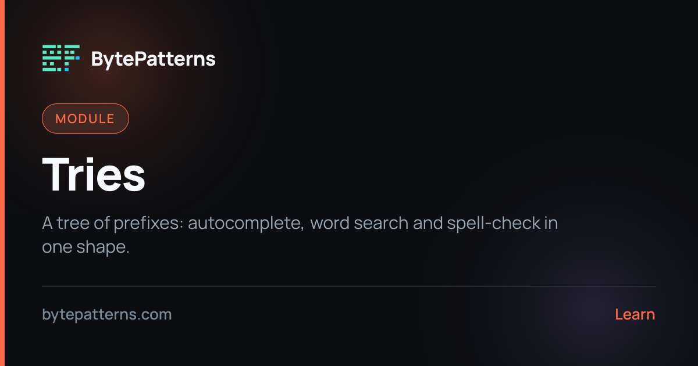](https://bytepatterns.com/learn/tries?utm_source=github&utm_medium=readme&utm_campaign=visual-dsa-roadmap)

_A tree of prefixes: autocomplete, word search and spell-check in one shape._ · 4 lessons · [open module](https://bytepatterns.com/learn/tries?utm_source=github&utm_medium=readme&utm_campaign=visual-dsa-roadmap)

| # | Lesson | What you will see | Min |
|---|---|---|---|
| 1 | [Trie Basics](https://bytepatterns.com/learn/tries/trie-basics?utm_source=github&utm_medium=readme&utm_campaign=visual-dsa-roadmap) | Store words by their letters so shared prefixes are stored once. | 5 |
| 2 | [Prefix Search](https://bytepatterns.com/learn/tries/prefix-search-and-autocomplete?utm_source=github&utm_medium=readme&utm_campaign=visual-dsa-roadmap) | Walk to the prefix once, then everything below it is the answer. | 5 |
| 3 | [Word Search With a Trie](https://bytepatterns.com/learn/tries/word-search-with-a-trie?utm_source=github&utm_medium=readme&utm_campaign=visual-dsa-roadmap) | One walk over the grid, pruned the moment the path stops being a prefix. | 6 |
| 4 | [Trie vs Hash Set](https://bytepatterns.com/learn/tries/trie-vs-hash-set?utm_source=github&utm_medium=readme&utm_campaign=visual-dsa-roadmap) | A set answers 'is this word here'. A trie answers 'what starts with this'. | 4 |

Practice: [Wildcard Word Search](https://bytepatterns.com/practice/tries/wildcard-word-search?utm_source=github&utm_medium=readme&utm_campaign=visual-dsa-roadmap) (medium) · [Replace Words With Roots](https://bytepatterns.com/practice/tries/replace-words-with-roots?utm_source=github&utm_medium=readme&utm_campaign=visual-dsa-roadmap) (medium) · [Maximum XOR Pair](https://bytepatterns.com/practice/tries/maximum-xor-pair?utm_source=github&utm_medium=readme&utm_campaign=visual-dsa-roadmap) (hard) · [Prefix Tree Operations](https://bytepatterns.com/practice/tries/prefix-tree-operations?utm_source=github&utm_medium=readme&utm_campaign=visual-dsa-roadmap) (easy) · [Typeahead Top Three](https://bytepatterns.com/practice/tries/typeahead-top-three?utm_source=github&utm_medium=readme&utm_campaign=visual-dsa-roadmap) (medium) · [Dictionary Words In A Grid](https://bytepatterns.com/practice/tries/dictionary-words-in-grid?utm_source=github&utm_medium=readme&utm_campaign=visual-dsa-roadmap) (hard) · [Longest Word Built Letter by Letter](https://bytepatterns.com/practice/tries/longest-word-built-letter-by-letter?utm_source=github&utm_medium=readme&utm_campaign=visual-dsa-roadmap) (medium) · [Sum of Values by Prefix](https://bytepatterns.com/practice/tries/sum-of-values-by-prefix?utm_source=github&utm_medium=readme&utm_campaign=visual-dsa-roadmap) (easy) · [Word Endings in a Letter Stream](https://bytepatterns.com/practice/tries/word-endings-in-a-letter-stream?utm_source=github&utm_medium=readme&utm_campaign=visual-dsa-roadmap) (hard) · [Shortest Unique Prefixes](https://bytepatterns.com/practice/tries/shortest-unique-prefixes?utm_source=github&utm_medium=readme&utm_campaign=visual-dsa-roadmap) (medium)

### Heaps

[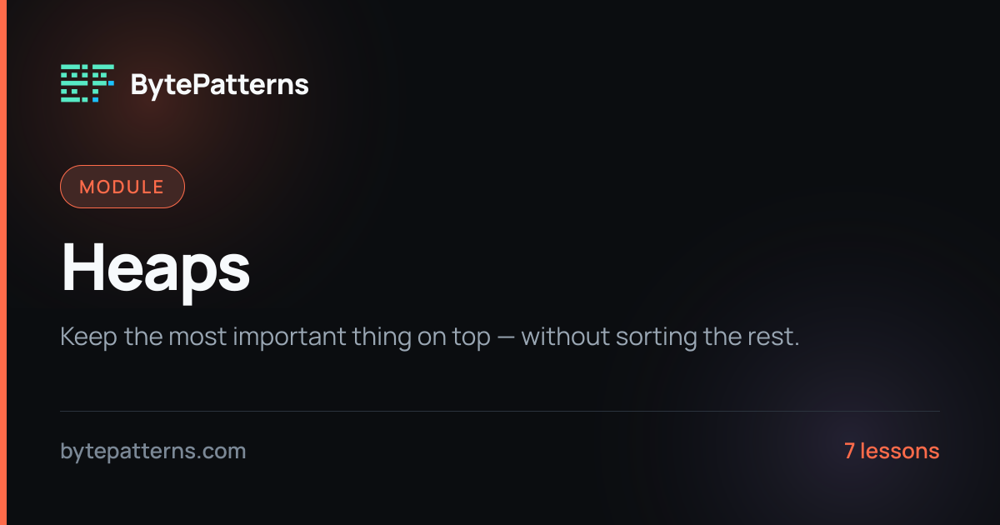](https://bytepatterns.com/learn/heaps?utm_source=github&utm_medium=readme&utm_campaign=visual-dsa-roadmap)

_Keep the most important thing on top — without sorting the rest._ · 7 lessons · [open module](https://bytepatterns.com/learn/heaps?utm_source=github&utm_medium=readme&utm_campaign=visual-dsa-roadmap)

| # | Lesson | What you will see | Min |
|---|---|---|---|
| 1 | [Heap Basics](https://bytepatterns.com/learn/heaps/heap-basics?utm_source=github&utm_medium=readme&utm_campaign=visual-dsa-roadmap) | Not sorted — just guaranteed to know its own winner. | 5 |
| 2 | [Heapify and Sift](https://bytepatterns.com/learn/heaps/heapify-and-sift?utm_source=github&utm_medium=readme&utm_campaign=visual-dsa-roadmap) | One wrong value walks a single path back into place. | 6 |
| 3 | [Priority Queue](https://bytepatterns.com/learn/heaps/priority-queue?utm_source=github&utm_medium=readme&utm_campaign=visual-dsa-roadmap) | Serve by urgency, not by who shouted first. | 5 |
| 4 | [Top K Elements](https://bytepatterns.com/learn/heaps/top-k-elements?utm_source=github&utm_medium=readme&utm_campaign=visual-dsa-roadmap) | Hold k winners and let the weakest one guard the door. | 6 |
| 5 | [K Closest Points](https://bytepatterns.com/learn/heaps/k-closest-points?utm_source=github&utm_medium=readme&utm_campaign=visual-dsa-roadmap) | Keep the k best by always evicting the current worst. | 6 |
| 6 | [Reorganize a String](https://bytepatterns.com/learn/heaps/reorganize-a-string?utm_source=github&utm_medium=readme&utm_campaign=visual-dsa-roadmap) | Spend the commonest letter first, and hold it back one round. | 6 |
| 7 | [Task Scheduler](https://bytepatterns.com/learn/heaps/task-scheduler?utm_source=github&utm_medium=readme&utm_campaign=visual-dsa-roadmap) | Same greedy pick, but now the loser has to sit out a cooldown. | 7 |

Practice: [Kth Largest Value](https://bytepatterns.com/practice/heaps/kth-largest-value?utm_source=github&utm_medium=readme&utm_campaign=visual-dsa-roadmap) (medium) · [Smash Heaviest Stones](https://bytepatterns.com/practice/heaps/smash-heaviest-stones?utm_source=github&utm_medium=readme&utm_campaign=visual-dsa-roadmap) (easy) · [Closest Points To Origin](https://bytepatterns.com/practice/heaps/closest-points-to-origin?utm_source=github&utm_medium=readme&utm_campaign=visual-dsa-roadmap) (medium) · [Running Median Stream](https://bytepatterns.com/practice/heaps/running-median-stream?utm_source=github&utm_medium=readme&utm_campaign=visual-dsa-roadmap) (hard) · [Task Scheduler Cooldown](https://bytepatterns.com/practice/heaps/task-scheduler-cooldown?utm_source=github&utm_medium=readme&utm_campaign=visual-dsa-roadmap) (medium) · [Reorganize String Gaps](https://bytepatterns.com/practice/heaps/reorganize-string-gaps?utm_source=github&utm_medium=readme&utm_campaign=visual-dsa-roadmap) (medium) · [Min-Heap Array Check](https://bytepatterns.com/practice/heaps/min-heap-array-check?utm_source=github&utm_medium=readme&utm_campaign=visual-dsa-roadmap) (easy) · [Sort a Nearly Sorted List](https://bytepatterns.com/practice/heaps/sort-a-nearly-sorted-list?utm_source=github&utm_medium=readme&utm_campaign=visual-dsa-roadmap) (medium) · [How Far Bricks and Ladders Go](https://bytepatterns.com/practice/heaps/how-far-bricks-and-ladders-go?utm_source=github&utm_medium=readme&utm_campaign=visual-dsa-roadmap) (medium) · [Process Tasks on One CPU](https://bytepatterns.com/practice/heaps/process-tasks-on-one-cpu?utm_source=github&utm_medium=readme&utm_campaign=visual-dsa-roadmap) (medium) · [K Weakest Squads](https://bytepatterns.com/practice/heaps/k-weakest-squads?utm_source=github&utm_medium=readme&utm_campaign=visual-dsa-roadmap) (easy) · [Closest K Values to a Target](https://bytepatterns.com/practice/heaps/closest-k-values-to-a-target?utm_source=github&utm_medium=readme&utm_campaign=visual-dsa-roadmap) (easy)

### Two Heaps & K-Way Merge

[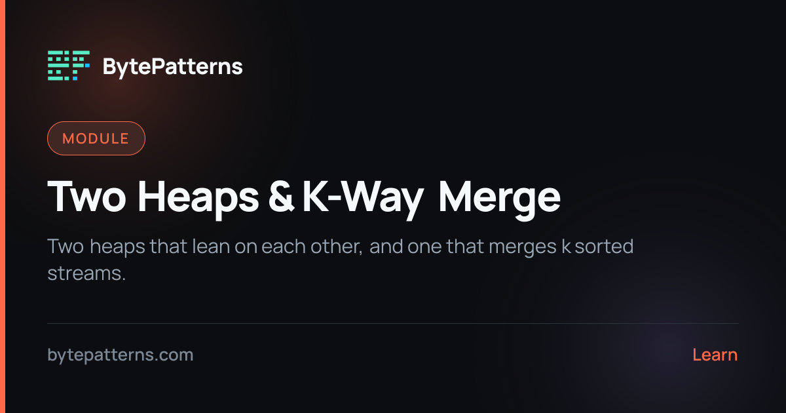](https://bytepatterns.com/learn/two-heaps-k-way?utm_source=github&utm_medium=readme&utm_campaign=visual-dsa-roadmap)

_Two heaps that lean on each other, and one that merges k sorted streams._ · 4 lessons · [open module](https://bytepatterns.com/learn/two-heaps-k-way?utm_source=github&utm_medium=readme&utm_campaign=visual-dsa-roadmap)

| # | Lesson | What you will see | Min |
|---|---|---|---|
| 1 | [Two Heaps: Running Median](https://bytepatterns.com/learn/two-heaps-k-way/two-heaps-running-median?utm_source=github&utm_medium=readme&utm_campaign=visual-dsa-roadmap) | Two heaps face each other, and the middle sits between their roots. | 6 |
| 2 | [K-Way Merge](https://bytepatterns.com/learn/two-heaps-k-way/k-way-merge?utm_source=github&utm_medium=readme&utm_campaign=visual-dsa-roadmap) | One heap of k heads turns k sorted lists into one. | 6 |
| 3 | [Top K in a Stream](https://bytepatterns.com/learn/two-heaps-k-way/top-k-frequent-stream?utm_source=github&utm_medium=readme&utm_campaign=visual-dsa-roadmap) | Count once, then let a k-sized heap keep only the winners. | 6 |
| 4 | [Sliding Window Median](https://bytepatterns.com/learn/two-heaps-k-way/sliding-window-median?utm_source=github&utm_medium=readme&utm_campaign=visual-dsa-roadmap) | You cannot dig a value out of a heap — so mark it dead instead. | 7 |

Practice: [Kth Smallest In Matrix](https://bytepatterns.com/practice/two-heaps-k-way/kth-smallest-in-sorted-matrix?utm_source=github&utm_medium=readme&utm_campaign=visual-dsa-roadmap) (medium) · [Smallest Range K Lists](https://bytepatterns.com/practice/two-heaps-k-way/smallest-range-k-lists?utm_source=github&utm_medium=readme&utm_campaign=visual-dsa-roadmap) (hard) · [Capital Project Picks](https://bytepatterns.com/practice/two-heaps-k-way/capital-project-picks?utm_source=github&utm_medium=readme&utm_campaign=visual-dsa-roadmap) (hard) · [Merge K Sorted Runs](https://bytepatterns.com/practice/two-heaps-k-way/merge-k-sorted-runs?utm_source=github&utm_medium=readme&utm_campaign=visual-dsa-roadmap) (easy) · [K Smallest Pair Sums](https://bytepatterns.com/practice/two-heaps-k-way/k-smallest-pair-sums?utm_source=github&utm_medium=readme&utm_campaign=visual-dsa-roadmap) (medium) · [Rolling Window Median](https://bytepatterns.com/practice/two-heaps-k-way/rolling-window-median?utm_source=github&utm_medium=readme&utm_campaign=visual-dsa-roadmap) (hard) · [K Most Frequent Values](https://bytepatterns.com/practice/two-heaps-k-way/k-most-frequent-values?utm_source=github&utm_medium=readme&utm_campaign=visual-dsa-roadmap) (medium) · [Next Span to the Right](https://bytepatterns.com/practice/two-heaps-k-way/next-span-to-the-right?utm_source=github&utm_medium=readme&utm_campaign=visual-dsa-roadmap) (medium) · [Kth Smallest Prime Fraction](https://bytepatterns.com/practice/two-heaps-k-way/kth-smallest-prime-fraction?utm_source=github&utm_medium=readme&utm_campaign=visual-dsa-roadmap) (medium) · [Middle Score After Each Entry](https://bytepatterns.com/practice/two-heaps-k-way/middle-score-after-each-entry?utm_source=github&utm_medium=readme&utm_campaign=visual-dsa-roadmap) (easy) · [Bid-Ask Spread After Each Quote](https://bytepatterns.com/practice/two-heaps-k-way/bid-ask-spread-after-each-quote?utm_source=github&utm_medium=readme&utm_campaign=visual-dsa-roadmap) (easy)

### Graphs

[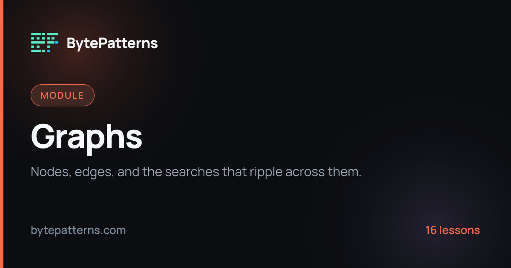](https://bytepatterns.com/learn/graphs?utm_source=github&utm_medium=readme&utm_campaign=visual-dsa-roadmap)

_Nodes, edges, and the searches that ripple across them._ · 16 lessons · [open module](https://bytepatterns.com/learn/graphs?utm_source=github&utm_medium=readme&utm_campaign=visual-dsa-roadmap)

| # | Lesson | What you will see | Min |
|---|---|---|---|
| 1 | [Graph Basics](https://bytepatterns.com/learn/graphs/graph-basics?utm_source=github&utm_medium=readme&utm_campaign=visual-dsa-roadmap) | Things, plus the connections between them. | 5 |
| 2 | [List vs Matrix](https://bytepatterns.com/learn/graphs/adjacency-representations?utm_source=github&utm_medium=readme&utm_campaign=visual-dsa-roadmap) | Store the edges you have, or a cell for every pair you don't. | 5 |
| 3 | [Breadth-First Search](https://bytepatterns.com/learn/graphs/breadth-first-search?utm_source=github&utm_medium=readme&utm_campaign=visual-dsa-roadmap) | Sweep outward one ring at a time, using a queue. | 6 |
| 4 | [Depth-First Search](https://bytepatterns.com/learn/graphs/depth-first-search?utm_source=github&utm_medium=readme&utm_campaign=visual-dsa-roadmap) | Commit to one branch until it dead-ends, then back up. | 5 |
| 5 | [Connected Components](https://bytepatterns.com/learn/graphs/connected-components?utm_source=github&utm_medium=readme&utm_campaign=visual-dsa-roadmap) | Count the islands by starting a fresh sweep on each one. | 5 |
| 6 | [Shortest Path, Unweighted](https://bytepatterns.com/learn/graphs/shortest-path-unweighted?utm_source=github&utm_medium=readme&utm_campaign=visual-dsa-roadmap) | BFS already found it — store parents to read it back. | 6 |
| 7 | [Dijkstra's Algorithm](https://bytepatterns.com/learn/graphs/dijkstra-intro?utm_source=github&utm_medium=readme&utm_campaign=visual-dsa-roadmap) | When edges cost different amounts, always settle the nearest first. | 6 |
| 8 | [Topological Sort](https://bytepatterns.com/learn/graphs/topological-sort?utm_source=github&utm_medium=readme&utm_campaign=visual-dsa-roadmap) | Order the steps so nothing runs before what it depends on. | 6 |
| 9 | [Bellman-Ford](https://bytepatterns.com/learn/graphs/bellman-ford?utm_source=github&utm_medium=readme&utm_campaign=visual-dsa-roadmap) | Relax every edge, V-1 times, and negative weights stop being a problem. | 6 |
| 10 | [Kruskal's Spanning Tree](https://bytepatterns.com/learn/graphs/kruskal-mst?utm_source=github&utm_medium=readme&utm_campaign=visual-dsa-roadmap) | Buy the cheapest cable that joins two pieces you have not joined yet. | 6 |
| 11 | [Prim's Spanning Tree](https://bytepatterns.com/learn/graphs/prim-mst?utm_source=github&utm_medium=readme&utm_campaign=visual-dsa-roadmap) | One tree that grows, always by its cheapest way out. | 6 |
| 12 | [Bipartite Check](https://bytepatterns.com/learn/graphs/bipartite-check?utm_source=github&utm_medium=readme&utm_campaign=visual-dsa-roadmap) | Two colours, no neighbour sharing one — or the split is impossible. | 5 |
| 13 | [Cycles in a Directed Graph](https://bytepatterns.com/learn/graphs/directed-cycle-colours?utm_source=github&utm_medium=readme&utm_campaign=visual-dsa-roadmap) | Grey means still on the path — meet grey again and you have looped. | 6 |
| 14 | [Graphs You Never Build](https://bytepatterns.com/learn/graphs/implicit-graph-bfs?utm_source=github&utm_medium=readme&utm_campaign=visual-dsa-roadmap) | Generate the neighbours on demand and BFS works the same. | 6 |
| 15 | [Multi-Source BFS](https://bytepatterns.com/learn/graphs/multi-source-bfs?utm_source=github&utm_medium=readme&utm_campaign=visual-dsa-roadmap) | Seed the queue with every source and one sweep answers them all. | 5 |
| 16 | [Strongly Connected Parts](https://bytepatterns.com/learn/graphs/strongly-connected-components?utm_source=github&utm_medium=readme&utm_campaign=visual-dsa-roadmap) | Groups where every node can reach every other — found in two passes. | 7 |

Practice: [Count Island Blobs](https://bytepatterns.com/practice/graphs/count-island-blobs?utm_source=github&utm_medium=readme&utm_campaign=visual-dsa-roadmap) (medium) · [Course Order Feasibility](https://bytepatterns.com/practice/graphs/course-order-feasibility?utm_source=github&utm_medium=readme&utm_campaign=visual-dsa-roadmap) (medium) · [Word Ladder Steps](https://bytepatterns.com/practice/graphs/word-ladder-steps?utm_source=github&utm_medium=readme&utm_campaign=visual-dsa-roadmap) (hard) · [Trusted Town Judge](https://bytepatterns.com/practice/graphs/trusted-town-judge?utm_source=github&utm_medium=readme&utm_campaign=visual-dsa-roadmap) (easy) · [Deep Copy A Graph](https://bytepatterns.com/practice/graphs/deep-copy-a-graph?utm_source=github&utm_medium=readme&utm_campaign=visual-dsa-roadmap) (medium) · [Spreading Rot Minutes](https://bytepatterns.com/practice/graphs/spreading-rot-minutes?utm_source=github&utm_medium=readme&utm_campaign=visual-dsa-roadmap) (medium) · [Two Colour Split Check](https://bytepatterns.com/practice/graphs/two-colour-split-check?utm_source=github&utm_medium=readme&utm_campaign=visual-dsa-roadmap) (medium) · [Signal Spread Time](https://bytepatterns.com/practice/graphs/signal-spread-time?utm_source=github&utm_medium=readme&utm_campaign=visual-dsa-roadmap) (medium) · [Cheapest Trip Within a Stop Limit](https://bytepatterns.com/practice/graphs/cheapest-trip-stop-limit?utm_source=github&utm_medium=readme&utm_campaign=visual-dsa-roadmap) (medium) · [Mutual Reach Groups](https://bytepatterns.com/practice/graphs/mutual-reach-groups?utm_source=github&utm_medium=readme&utm_campaign=visual-dsa-roadmap) (hard) · [Rising Tide Crossing](https://bytepatterns.com/practice/graphs/rising-tide-crossing?utm_source=github&utm_medium=readme&utm_campaign=visual-dsa-roadmap) (hard) · [Nodes Clear of Cycles](https://bytepatterns.com/practice/graphs/nodes-clear-of-cycles?utm_source=github&utm_medium=readme&utm_campaign=visual-dsa-roadmap) (medium) · [Mutual Follow Pairs](https://bytepatterns.com/practice/graphs/mutual-follow-pairs?utm_source=github&utm_medium=readme&utm_campaign=visual-dsa-roadmap) (easy) · [Water Every House](https://bytepatterns.com/practice/graphs/water-every-house?utm_source=github&utm_medium=readme&utm_campaign=visual-dsa-roadmap) (hard) · [Fewest Roads to Link Every Town](https://bytepatterns.com/practice/graphs/fewest-roads-to-link-every-town?utm_source=github&utm_medium=readme&utm_campaign=visual-dsa-roadmap) (hard) · [Order the Build Steps](https://bytepatterns.com/practice/graphs/order-the-build-steps?utm_source=github&utm_medium=readme&utm_campaign=visual-dsa-roadmap) (easy) · [Deadlock in a Wait-For Graph](https://bytepatterns.com/practice/graphs/deadlock-in-a-wait-for-graph?utm_source=github&utm_medium=readme&utm_campaign=visual-dsa-roadmap) (easy) · [Cheapest Route Between Two Stops](https://bytepatterns.com/practice/graphs/cheapest-route-between-two-stops?utm_source=github&utm_medium=readme&utm_campaign=visual-dsa-roadmap) (easy) · [Shortest Paths With Rebate Roads](https://bytepatterns.com/practice/graphs/shortest-paths-with-rebate-roads?utm_source=github&utm_medium=readme&utm_campaign=visual-dsa-roadmap) (easy)

### Matrix & Grid

[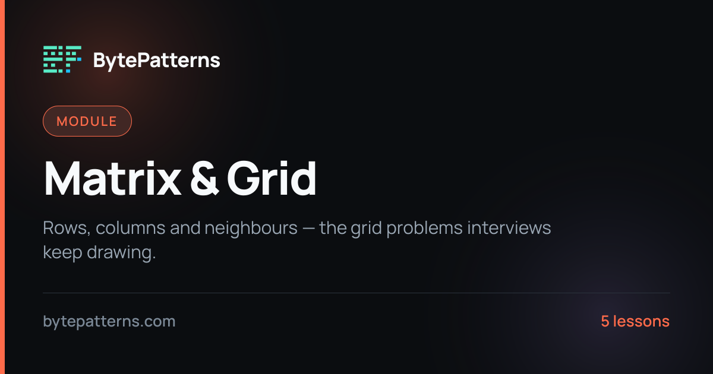](https://bytepatterns.com/learn/matrix-grid?utm_source=github&utm_medium=readme&utm_campaign=visual-dsa-roadmap)

_Rows, columns and neighbours — the grid problems interviews keep drawing._ · 5 lessons · [open module](https://bytepatterns.com/learn/matrix-grid?utm_source=github&utm_medium=readme&utm_campaign=visual-dsa-roadmap)

| # | Lesson | What you will see | Min |
|---|---|---|---|
| 1 | [Grid Traversal](https://bytepatterns.com/learn/matrix-grid/grid-traversal-and-neighbours?utm_source=github&utm_medium=readme&utm_campaign=visual-dsa-roadmap) | Row first, column second, and always check the edge. | 4 |
| 2 | [Spiral Order](https://bytepatterns.com/learn/matrix-grid/spiral-order?utm_source=github&utm_medium=readme&utm_campaign=visual-dsa-roadmap) | Four walls that close in after every pass. | 5 |
| 3 | [Rotate In Place](https://bytepatterns.com/learn/matrix-grid/rotate-in-place?utm_source=github&utm_medium=readme&utm_campaign=visual-dsa-roadmap) | Mirror the diagonal, then flip each row. | 5 |
| 4 | [Number of Islands](https://bytepatterns.com/learn/matrix-grid/number-of-islands?utm_source=github&utm_medium=readme&utm_campaign=visual-dsa-roadmap) | Count a blob once, then erase it so it cannot count twice. | 5 |
| 5 | [Flood Fill](https://bytepatterns.com/learn/matrix-grid/flood-fill?utm_source=github&utm_medium=readme&utm_campaign=visual-dsa-roadmap) | Spread while the colour matches, stop the moment it does not. | 4 |

Practice: [Perimeter Of An Island](https://bytepatterns.com/practice/matrix-grid/island-perimeter-walk?utm_source=github&utm_medium=readme&utm_campaign=visual-dsa-roadmap) (easy) · [Zero Out Rows And Columns](https://bytepatterns.com/practice/matrix-grid/zero-out-rows-and-columns?utm_source=github&utm_medium=readme&utm_campaign=visual-dsa-roadmap) (medium) · [Search A Sorted Grid](https://bytepatterns.com/practice/matrix-grid/staircase-grid-search?utm_source=github&utm_medium=readme&utm_campaign=visual-dsa-roadmap) (medium) · [Repaint A Connected Region](https://bytepatterns.com/practice/matrix-grid/repaint-connected-region?utm_source=github&utm_medium=readme&utm_campaign=visual-dsa-roadmap) (easy) · [Rotate A Square Grid](https://bytepatterns.com/practice/matrix-grid/rotate-square-grid?utm_source=github&utm_medium=readme&utm_campaign=visual-dsa-roadmap) (medium) · [Longest Climbing Path](https://bytepatterns.com/practice/matrix-grid/longest-climbing-path?utm_source=github&utm_medium=readme&utm_campaign=visual-dsa-roadmap) (hard) · [Landlocked Islands](https://bytepatterns.com/practice/matrix-grid/landlocked-islands?utm_source=github&utm_medium=readme&utm_campaign=visual-dsa-roadmap) (medium) · [Shortest Clear Grid Path](https://bytepatterns.com/practice/matrix-grid/shortest-clear-grid-path?utm_source=github&utm_medium=readme&utm_campaign=visual-dsa-roadmap) (medium) · [Largest All-Ones Rectangle](https://bytepatterns.com/practice/matrix-grid/largest-all-ones-rectangle?utm_source=github&utm_medium=readme&utm_campaign=visual-dsa-roadmap) (hard) · [Same Value Along Every Diagonal](https://bytepatterns.com/practice/matrix-grid/same-value-along-every-diagonal?utm_source=github&utm_medium=readme&utm_campaign=visual-dsa-roadmap) (easy) · [Next Generation of Cells](https://bytepatterns.com/practice/matrix-grid/next-generation-of-cells?utm_source=github&utm_medium=readme&utm_campaign=visual-dsa-roadmap) (medium) · [Cells Draining to Both Coasts](https://bytepatterns.com/practice/matrix-grid/cells-draining-to-both-coasts?utm_source=github&utm_medium=readme&utm_campaign=visual-dsa-roadmap) (medium)

### Union-Find

[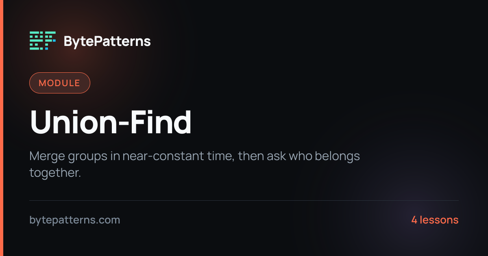](https://bytepatterns.com/learn/union-find?utm_source=github&utm_medium=readme&utm_campaign=visual-dsa-roadmap)

_Merge groups in near-constant time, then ask who belongs together._ · 4 lessons · [open module](https://bytepatterns.com/learn/union-find?utm_source=github&utm_medium=readme&utm_campaign=visual-dsa-roadmap)

| # | Lesson | What you will see | Min |
|---|---|---|---|
| 1 | [Disjoint Sets Basics](https://bytepatterns.com/learn/union-find/disjoint-sets-basics?utm_source=github&utm_medium=readme&utm_campaign=visual-dsa-roadmap) | Every group is named by one root, and find walks up to it. | 5 |
| 2 | [Path Compression](https://bytepatterns.com/learn/union-find/path-compression?utm_source=github&utm_medium=readme&utm_campaign=visual-dsa-roadmap) | You already walked to the root — leave everyone pointing straight at it. | 5 |
| 3 | [Union by Rank or Size](https://bytepatterns.com/learn/union-find/union-by-size?utm_source=github&utm_medium=readme&utm_campaign=visual-dsa-roadmap) | Hang the smaller tree under the bigger one and depth barely grows. | 5 |
| 4 | [Components & Cycles](https://bytepatterns.com/learn/union-find/components-and-cycles?utm_source=github&utm_medium=readme&utm_campaign=visual-dsa-roadmap) | Start the counter at n and drop it on every union that actually merges. | 5 |

Practice: [Count Provinces](https://bytepatterns.com/practice/union-find/count-provinces?utm_source=github&utm_medium=readme&utm_campaign=visual-dsa-roadmap) (medium) · [Redundant Connection](https://bytepatterns.com/practice/union-find/redundant-connection?utm_source=github&utm_medium=readme&utm_campaign=visual-dsa-roadmap) (medium) · [Accounts Merge By Email](https://bytepatterns.com/practice/union-find/accounts-merge-emails?utm_source=github&utm_medium=readme&utm_campaign=visual-dsa-roadmap) (hard) · [Reachable Pair Check](https://bytepatterns.com/practice/union-find/reachable-pair-check?utm_source=github&utm_medium=readme&utm_campaign=visual-dsa-roadmap) (easy) · [Consistent Equalities](https://bytepatterns.com/practice/union-find/consistent-equalities?utm_source=github&utm_medium=readme&utm_campaign=visual-dsa-roadmap) (medium) · [Stones Sharing A Line](https://bytepatterns.com/practice/union-find/stones-sharing-a-line?utm_source=github&utm_medium=readme&utm_campaign=visual-dsa-roadmap) (medium) · [Earliest Moment All Connected](https://bytepatterns.com/practice/union-find/earliest-moment-all-connected?utm_source=github&utm_medium=readme&utm_campaign=visual-dsa-roadmap) (medium) · [Smallest Equivalent String](https://bytepatterns.com/practice/union-find/smallest-equivalent-string?utm_source=github&utm_medium=readme&utm_campaign=visual-dsa-roadmap) (medium) · [Spare Roads for Two Travellers](https://bytepatterns.com/practice/union-find/spare-roads-for-two-travellers?utm_source=github&utm_medium=readme&utm_campaign=visual-dsa-roadmap) (hard) · [Largest Group by Shared Factor](https://bytepatterns.com/practice/union-find/largest-group-by-shared-factor?utm_source=github&utm_medium=readme&utm_campaign=visual-dsa-roadmap) (hard)

## Algorithms

_Recursion, backtracking and greedy choices, then recursion with a memo — plus the sweep-line, bit and number tricks that are pure technique._

### Recursion

[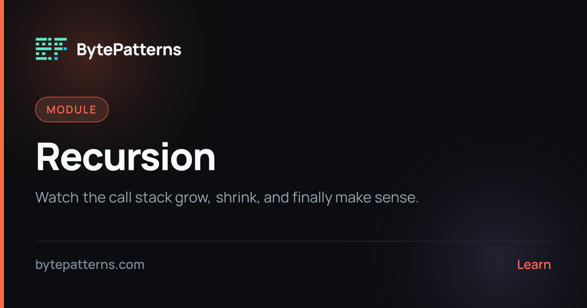](https://bytepatterns.com/learn/recursion?utm_source=github&utm_medium=readme&utm_campaign=visual-dsa-roadmap)

_Watch the call stack grow, shrink, and finally make sense._ · 8 lessons · [open module](https://bytepatterns.com/learn/recursion?utm_source=github&utm_medium=readme&utm_campaign=visual-dsa-roadmap)

| # | Lesson | What you will see | Min |
|---|---|---|---|
| 1 | [Recursion Basics](https://bytepatterns.com/learn/recursion/recursion-basics?utm_source=github&utm_medium=readme&utm_campaign=visual-dsa-roadmap) | A function that solves a smaller copy of itself. | 5 |
| 2 | [The Call Stack](https://bytepatterns.com/learn/recursion/call-stack-visualized?utm_source=github&utm_medium=readme&utm_campaign=visual-dsa-roadmap) | Every pending call waits its turn on a stack of frames. | 5 |
| 3 | [Factorial and Fibonacci](https://bytepatterns.com/learn/recursion/factorial-and-fibonacci?utm_source=github&utm_medium=readme&utm_campaign=visual-dsa-roadmap) | One call per step, or two calls that redo everything. | 6 |
| 4 | [Memoization](https://bytepatterns.com/learn/recursion/memoization-intro?utm_source=github&utm_medium=readme&utm_campaign=visual-dsa-roadmap) | Write each answer down once, never solve it twice. | 5 |
| 5 | [Backtracking](https://bytepatterns.com/learn/recursion/backtracking-intro?utm_source=github&utm_medium=readme&utm_campaign=visual-dsa-roadmap) | Choose, explore, then undo the choice and try the next. | 6 |
| 6 | [Return Up or Pass Down](https://bytepatterns.com/learn/recursion/return-up-or-pass-down?utm_source=github&utm_medium=readme&utm_campaign=visual-dsa-roadmap) | Every recursion moves information one of two ways. Pick one. | 6 |
| 7 | [Tail Calls and Loops](https://bytepatterns.com/learn/recursion/tail-recursion?utm_source=github&utm_medium=readme&utm_campaign=visual-dsa-roadmap) | When nothing happens after the call, the frame is dead weight. | 6 |
| 8 | [Your Own Call Stack](https://bytepatterns.com/learn/recursion/your-own-call-stack?utm_source=github&utm_medium=readme&utm_campaign=visual-dsa-roadmap) | Not a tail call? Then carry the stack yourself. | 6 |

Practice: [Flatten a Nested List](https://bytepatterns.com/practice/recursion/flatten-nested-counts?utm_source=github&utm_medium=readme&utm_campaign=visual-dsa-roadmap) (easy) · [Disc Tower Moves](https://bytepatterns.com/practice/recursion/disc-tower-moves?utm_source=github&utm_medium=readme&utm_campaign=visual-dsa-roadmap) (medium) · [Fast Power](https://bytepatterns.com/practice/recursion/fast-power-of-a-number?utm_source=github&utm_medium=readme&utm_campaign=visual-dsa-roadmap) (medium) · [Depth Weighted Nested Sum](https://bytepatterns.com/practice/recursion/depth-weighted-nested-sum?utm_source=github&utm_medium=readme&utm_campaign=visual-dsa-roadmap) (easy) · [Symbol In A Doubling Row](https://bytepatterns.com/practice/recursion/doubling-row-symbol?utm_source=github&utm_medium=readme&utm_campaign=visual-dsa-roadmap) (medium) · [Every Way To Bracket](https://bytepatterns.com/practice/recursion/every-way-to-bracket?utm_source=github&utm_medium=readme&utm_campaign=visual-dsa-roadmap) (medium) · [Kth Smallest BST Key, Iteratively](https://bytepatterns.com/practice/recursion/kth-smallest-bst-key-iteratively?utm_source=github&utm_medium=readme&utm_campaign=visual-dsa-roadmap) (medium) · [Halve or Subtract One Steps](https://bytepatterns.com/practice/recursion/halve-or-subtract-steps?utm_source=github&utm_medium=readme&utm_campaign=visual-dsa-roadmap) (easy) · [Look and Say Term](https://bytepatterns.com/practice/recursion/look-and-say-term?utm_source=github&utm_medium=readme&utm_campaign=visual-dsa-roadmap) (easy) · [Upside-Down Numbers of a Given Length](https://bytepatterns.com/practice/recursion/upside-down-numbers-of-a-given-length?utm_source=github&utm_medium=readme&utm_campaign=visual-dsa-roadmap) (medium)

### Backtracking

[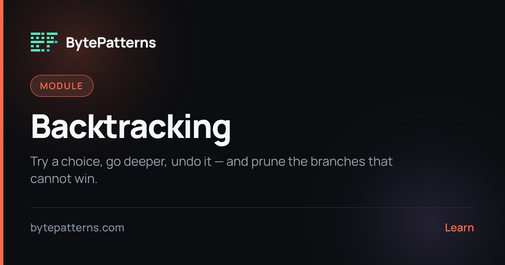](https://bytepatterns.com/learn/backtracking?utm_source=github&utm_medium=readme&utm_campaign=visual-dsa-roadmap)

_Try a choice, go deeper, undo it — and prune the branches that cannot win._ · 5 lessons · [open module](https://bytepatterns.com/learn/backtracking?utm_source=github&utm_medium=readme&utm_campaign=visual-dsa-roadmap)

| # | Lesson | What you will see | Min |
|---|---|---|---|
| 1 | [The Decision Tree](https://bytepatterns.com/learn/backtracking/the-decision-tree?utm_source=github&utm_medium=readme&utm_campaign=visual-dsa-roadmap) | Choose, explore, un-choose — one shared path walks the whole tree. | 5 |
| 2 | [Subsets](https://bytepatterns.com/learn/backtracking/subsets?utm_source=github&utm_medium=readme&utm_campaign=visual-dsa-roadmap) | Two branches per item: leave it out, or take it. | 5 |
| 3 | [Permutations](https://bytepatterns.com/learn/backtracking/permutations?utm_source=github&utm_medium=readme&utm_campaign=visual-dsa-roadmap) | Every unused value is a branch; the used set is the pruning. | 5 |
| 4 | [N-Queens](https://bytepatterns.com/learn/backtracking/n-queens?utm_source=github&utm_medium=readme&utm_campaign=visual-dsa-roadmap) | One queen per row, and a dead row sends you straight back up. | 6 |
| 5 | [Word Search & Pruning](https://bytepatterns.com/learn/backtracking/word-search-and-pruning?utm_source=github&utm_medium=readme&utm_campaign=visual-dsa-roadmap) | Walk the grid, block the cell, and quit on the first wrong letter. | 6 |

Practice: [Phone Keypad Words](https://bytepatterns.com/practice/backtracking/phone-keypad-words?utm_source=github&utm_medium=readme&utm_campaign=visual-dsa-roadmap) (medium) · [Combinations That Sum](https://bytepatterns.com/practice/backtracking/combinations-summing-to-target?utm_source=github&utm_medium=readme&utm_campaign=visual-dsa-roadmap) (medium) · [Split Into Palindromes](https://bytepatterns.com/practice/backtracking/split-into-palindrome-pieces?utm_source=github&utm_medium=readme&utm_campaign=visual-dsa-roadmap) (medium) · [Flip Letter Case Variants](https://bytepatterns.com/practice/backtracking/flip-letter-case-variants?utm_source=github&utm_medium=readme&utm_campaign=visual-dsa-roadmap) (easy) · [Balanced Bracket Strings](https://bytepatterns.com/practice/backtracking/balanced-bracket-strings?utm_source=github&utm_medium=readme&utm_campaign=visual-dsa-roadmap) (medium) · [Count Queen Placements](https://bytepatterns.com/practice/backtracking/count-queen-placements?utm_source=github&utm_medium=readme&utm_campaign=visual-dsa-roadmap) (hard) · [Distinct Arrangements](https://bytepatterns.com/practice/backtracking/distinct-arrangements?utm_source=github&utm_medium=readme&utm_campaign=visual-dsa-roadmap) (medium) · [Dotted Addresses From Digits](https://bytepatterns.com/practice/backtracking/dotted-addresses-from-digits?utm_source=github&utm_medium=readme&utm_campaign=visual-dsa-roadmap) (medium) · [Fill a Sudoku Grid](https://bytepatterns.com/practice/backtracking/fill-a-sudoku-grid?utm_source=github&utm_medium=readme&utm_campaign=visual-dsa-roadmap) (hard) · [Matchsticks Into a Square](https://bytepatterns.com/practice/backtracking/matchsticks-into-a-square?utm_source=github&utm_medium=readme&utm_campaign=visual-dsa-roadmap) (hard) · [Binary Strings With No Adjacent Ones](https://bytepatterns.com/practice/backtracking/binary-strings-with-no-adjacent-ones?utm_source=github&utm_medium=readme&utm_campaign=visual-dsa-roadmap) (easy)

### Greedy

[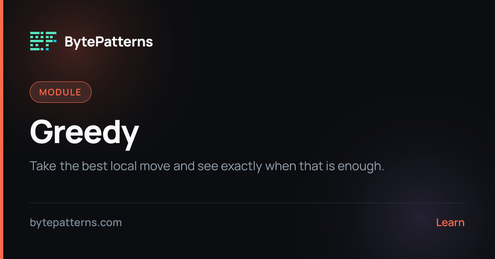](https://bytepatterns.com/learn/greedy?utm_source=github&utm_medium=readme&utm_campaign=visual-dsa-roadmap)

_Take the best local move and see exactly when that is enough._ · 5 lessons · [open module](https://bytepatterns.com/learn/greedy?utm_source=github&utm_medium=readme&utm_campaign=visual-dsa-roadmap)

| # | Lesson | What you will see | Min |
|---|---|---|---|
| 1 | [What Makes Greedy Work](https://bytepatterns.com/learn/greedy/what-makes-greedy-work?utm_source=github&utm_medium=readme&utm_campaign=visual-dsa-roadmap) | Take the best move now — but only when it can never block a better answer. | 5 |
| 2 | [Interval Scheduling](https://bytepatterns.com/learn/greedy/interval-scheduling?utm_source=github&utm_medium=readme&utm_campaign=visual-dsa-roadmap) | Sort by finishing time and the room books itself. | 5 |
| 3 | [Jump Game](https://bytepatterns.com/learn/greedy/jump-game?utm_source=github&utm_medium=readme&utm_campaign=visual-dsa-roadmap) | Carry one number: the furthest index still in reach. | 5 |
| 4 | [Gas Station](https://bytepatterns.com/learn/greedy/gas-station?utm_source=github&utm_medium=readme&utm_campaign=visual-dsa-roadmap) | One pass picks the start, because every failed prefix is proof. | 6 |
| 5 | [Huffman Intuition](https://bytepatterns.com/learn/greedy/huffman-intuition?utm_source=github&utm_medium=readme&utm_campaign=visual-dsa-roadmap) | Merge the two rarest symbols, again and again, and the code writes itself. | 6 |

Practice: [Fewest Removals to Unclash](https://bytepatterns.com/practice/greedy/fewest-removals-to-unclash?utm_source=github&utm_medium=readme&utm_campaign=visual-dsa-roadmap) (medium) · [Fewest Hops to the End](https://bytepatterns.com/practice/greedy/fewest-hops-to-the-end?utm_source=github&utm_medium=readme&utm_campaign=visual-dsa-roadmap) (medium) · [Split String Into Blocks](https://bytepatterns.com/practice/greedy/split-string-into-blocks?utm_source=github&utm_medium=readme&utm_campaign=visual-dsa-roadmap) (medium) · [Hand Out Cookies](https://bytepatterns.com/practice/greedy/hand-out-cookies?utm_source=github&utm_medium=readme&utm_campaign=visual-dsa-roadmap) (easy) · [Circular Fuel Route](https://bytepatterns.com/practice/greedy/circular-fuel-route?utm_source=github&utm_medium=readme&utm_campaign=visual-dsa-roadmap) (medium) · [Fair Candy Shares](https://bytepatterns.com/practice/greedy/fair-candy-shares?utm_source=github&utm_medium=readme&utm_campaign=visual-dsa-roadmap) (hard) · [Cheapest Rope Joining](https://bytepatterns.com/practice/greedy/cheapest-rope-joining?utm_source=github&utm_medium=readme&utm_campaign=visual-dsa-roadmap) (medium) · [Split Candidates Between Two Cities](https://bytepatterns.com/practice/greedy/split-candidates-between-two-cities?utm_source=github&utm_medium=readme&utm_campaign=visual-dsa-roadmap) (easy) · [Most Events You Can Attend](https://bytepatterns.com/practice/greedy/most-events-you-can-attend?utm_source=github&utm_medium=readme&utm_campaign=visual-dsa-roadmap) (medium) · [Fewest Clips to Cover a Broadcast](https://bytepatterns.com/practice/greedy/fewest-clips-to-cover-a-broadcast?utm_source=github&utm_medium=readme&utm_campaign=visual-dsa-roadmap) (medium)

### Intervals

[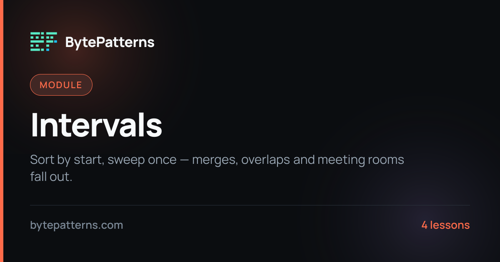](https://bytepatterns.com/learn/intervals?utm_source=github&utm_medium=readme&utm_campaign=visual-dsa-roadmap)

_Sort by start, sweep once — merges, overlaps and meeting rooms fall out._ · 4 lessons · [open module](https://bytepatterns.com/learn/intervals?utm_source=github&utm_medium=readme&utm_campaign=visual-dsa-roadmap)

| # | Lesson | What you will see | Min |
|---|---|---|---|
| 1 | [Interval Basics & Sorting](https://bytepatterns.com/learn/intervals/interval-basics-and-sorting?utm_source=github&utm_medium=readme&utm_campaign=visual-dsa-roadmap) | Sort by start and the pairwise question becomes a left-to-right scan. | 4 |
| 2 | [Merge Intervals](https://bytepatterns.com/learn/intervals/merge-intervals?utm_source=github&utm_medium=readme&utm_campaign=visual-dsa-roadmap) | Hold one block open, stretch it while they touch, close it on a gap. | 5 |
| 3 | [Insert Interval](https://bytepatterns.com/learn/intervals/insert-interval?utm_source=github&utm_medium=readme&utm_campaign=visual-dsa-roadmap) | The list is already sorted, so slot the new block in with three passes. | 5 |
| 4 | [Meeting Rooms](https://bytepatterns.com/learn/intervals/meeting-rooms?utm_source=github&utm_medium=readme&utm_campaign=visual-dsa-roadmap) | Count how many run at once; the high-water mark is the room count. | 5 |

Practice: [Non Overlapping Removals](https://bytepatterns.com/practice/intervals/non-overlapping-removals?utm_source=github&utm_medium=readme&utm_campaign=visual-dsa-roadmap) (medium) · [Employee Free Time](https://bytepatterns.com/practice/intervals/employee-free-time?utm_source=github&utm_medium=readme&utm_campaign=visual-dsa-roadmap) (hard) · [Car Pooling Capacity](https://bytepatterns.com/practice/intervals/car-pooling-capacity?utm_source=github&utm_medium=readme&utm_campaign=visual-dsa-roadmap) (medium) · [Attend Every Meeting](https://bytepatterns.com/practice/intervals/attend-every-meeting?utm_source=github&utm_medium=readme&utm_campaign=visual-dsa-roadmap) (easy) · [Condense Values Into Ranges](https://bytepatterns.com/practice/intervals/condense-values-into-ranges?utm_source=github&utm_medium=readme&utm_campaign=visual-dsa-roadmap) (easy) · [Merge Overlapping Spans](https://bytepatterns.com/practice/intervals/merge-overlapping-spans?utm_source=github&utm_medium=readme&utm_campaign=visual-dsa-roadmap) (medium) · [Insert and Merge a Span](https://bytepatterns.com/practice/intervals/insert-and-merge-span?utm_source=github&utm_medium=readme&utm_campaign=visual-dsa-roadmap) (medium) · [Overlap of Two Span Lists](https://bytepatterns.com/practice/intervals/overlap-of-two-span-lists?utm_source=github&utm_medium=readme&utm_campaign=visual-dsa-roadmap) (medium) · [Drop Spans Covered by Others](https://bytepatterns.com/practice/intervals/drop-spans-covered-by-others?utm_source=github&utm_medium=readme&utm_campaign=visual-dsa-roadmap) (medium) · [Calendar Without Double Booking](https://bytepatterns.com/practice/intervals/calendar-without-double-booking?utm_source=github&utm_medium=readme&utm_campaign=visual-dsa-roadmap) (medium) · [Fewest Shots to Burst Every Balloon](https://bytepatterns.com/practice/intervals/fewest-shots-to-burst-every-balloon?utm_source=github&utm_medium=readme&utm_campaign=visual-dsa-roadmap) (medium)

### Bit Manipulation

[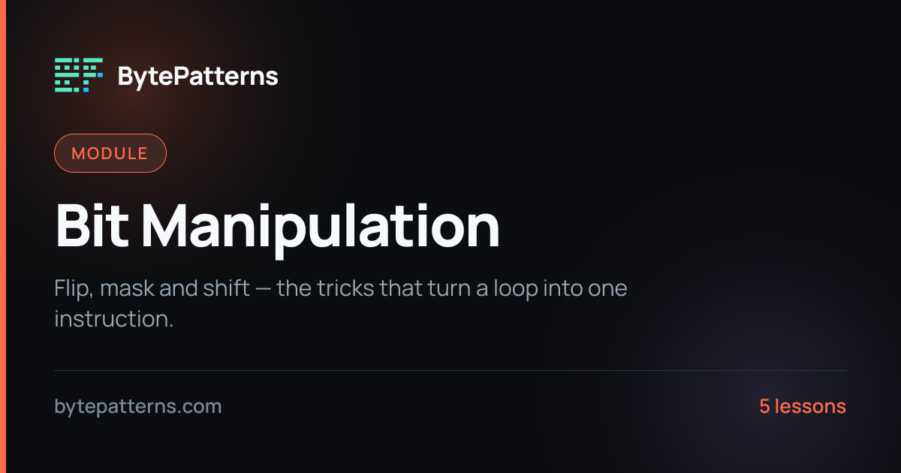](https://bytepatterns.com/learn/bit-manipulation?utm_source=github&utm_medium=readme&utm_campaign=visual-dsa-roadmap)

_Flip, mask and shift — the tricks that turn a loop into one instruction._ · 5 lessons · [open module](https://bytepatterns.com/learn/bit-manipulation?utm_source=github&utm_medium=readme&utm_campaign=visual-dsa-roadmap)

| # | Lesson | What you will see | Min |
|---|---|---|---|
| 1 | [Binary and Bitwise Ops](https://bytepatterns.com/learn/bit-manipulation/binary-and-bitwise-ops?utm_source=github&utm_medium=readme&utm_campaign=visual-dsa-roadmap) | Every integer is a row of switches you can address. | 4 |
| 2 | [XOR Tricks](https://bytepatterns.com/learn/bit-manipulation/xor-tricks?utm_source=github&utm_medium=readme&utm_campaign=visual-dsa-roadmap) | Pairs cancel out, and the loner is left standing. | 4 |
| 3 | [Counting Set Bits](https://bytepatterns.com/learn/bit-manipulation/counting-set-bits?utm_source=github&utm_medium=readme&utm_campaign=visual-dsa-roadmap) | Clear the lowest 1 and count how often you can. | 4 |
| 4 | [Masks and Power of Two](https://bytepatterns.com/learn/bit-manipulation/masks-and-power-of-two?utm_source=github&utm_medium=readme&utm_campaign=visual-dsa-roadmap) | One shifted bit is a key to any position you like. | 5 |
| 5 | [Bitmask as a Set](https://bytepatterns.com/learn/bit-manipulation/bitmask-as-a-set?utm_source=github&utm_medium=readme&utm_campaign=visual-dsa-roadmap) | An integer is a subset; counting to 2^n lists them all. | 5 |

Practice: [Reverse Bit Order](https://bytepatterns.com/practice/bit-manipulation/reverse-bit-order?utm_source=github&utm_medium=readme&utm_campaign=visual-dsa-roadmap) (easy) · [Single Value Among Triples](https://bytepatterns.com/practice/bit-manipulation/single-value-among-triples?utm_source=github&utm_medium=readme&utm_campaign=visual-dsa-roadmap) (medium) · [The Missing Value](https://bytepatterns.com/practice/bit-manipulation/missing-value-in-range?utm_source=github&utm_medium=readme&utm_campaign=visual-dsa-roadmap) (easy) · [Differing Bit Count](https://bytepatterns.com/practice/bit-manipulation/differing-bit-count?utm_source=github&utm_medium=readme&utm_campaign=visual-dsa-roadmap) (easy) · [Set Bits For Every Number](https://bytepatterns.com/practice/bit-manipulation/set-bits-for-every-number?utm_source=github&utm_medium=readme&utm_campaign=visual-dsa-roadmap) (easy) · [Two Lone Values](https://bytepatterns.com/practice/bit-manipulation/two-lone-values?utm_source=github&utm_medium=readme&utm_campaign=visual-dsa-roadmap) (medium) · [Power of Four Check](https://bytepatterns.com/practice/bit-manipulation/power-of-four-check?utm_source=github&utm_medium=readme&utm_campaign=visual-dsa-roadmap) (easy) · [Every Subset by Bitmask](https://bytepatterns.com/practice/bit-manipulation/every-subset-by-bitmask?utm_source=github&utm_medium=readme&utm_campaign=visual-dsa-roadmap) (easy) · [Sort by Equal-Bit Swaps](https://bytepatterns.com/practice/bit-manipulation/sort-by-equal-bit-swaps?utm_source=github&utm_medium=readme&utm_campaign=visual-dsa-roadmap) (medium) · [Shortest Walk Through Every Node](https://bytepatterns.com/practice/bit-manipulation/shortest-walk-through-every-node?utm_source=github&utm_medium=readme&utm_campaign=visual-dsa-roadmap) (hard) · [Add Two Numbers Without Plus](https://bytepatterns.com/practice/bit-manipulation/add-two-numbers-without-plus?utm_source=github&utm_medium=readme&utm_campaign=visual-dsa-roadmap) (medium) · [Bitwise AND Across a Range](https://bytepatterns.com/practice/bit-manipulation/bitwise-and-across-a-range?utm_source=github&utm_medium=readme&utm_campaign=visual-dsa-roadmap) (medium)

### Math & Number Theory

[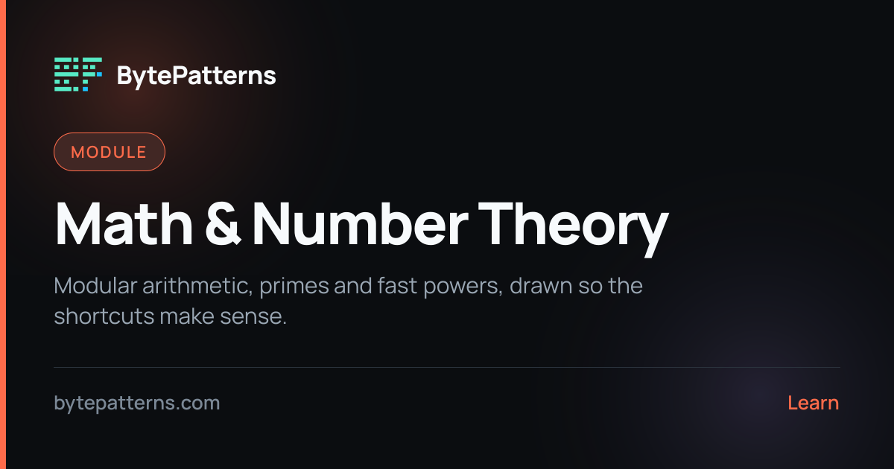](https://bytepatterns.com/learn/math-number-theory?utm_source=github&utm_medium=readme&utm_campaign=visual-dsa-roadmap)

_Modular arithmetic, primes and fast powers, drawn so the shortcuts make sense._ · 5 lessons · [open module](https://bytepatterns.com/learn/math-number-theory?utm_source=github&utm_medium=readme&utm_campaign=visual-dsa-roadmap)

| # | Lesson | What you will see | Min |
|---|---|---|---|
| 1 | [Modular Arithmetic](https://bytepatterns.com/learn/math-number-theory/modular-arithmetic?utm_source=github&utm_medium=readme&utm_campaign=visual-dsa-roadmap) | A remainder is a position on a clock, not a leftover. | 4 |
| 2 | [GCD and Euclid](https://bytepatterns.com/learn/math-number-theory/gcd-and-euclid?utm_source=github&utm_medium=readme&utm_campaign=visual-dsa-roadmap) | Replace the pair with the leftover and it shrinks fast. | 4 |
| 3 | [Sieve of Eratosthenes](https://bytepatterns.com/learn/math-number-theory/sieve-of-eratosthenes?utm_source=github&utm_medium=readme&utm_campaign=visual-dsa-roadmap) | Cross out what the primes can reach; the rest are prime. | 5 |
| 4 | [Fast Exponentiation](https://bytepatterns.com/learn/math-number-theory/fast-exponentiation?utm_source=github&utm_medium=readme&utm_campaign=visual-dsa-roadmap) | Square your way up instead of multiplying n times. | 5 |
| 5 | [Permutations vs Combinations](https://bytepatterns.com/learn/math-number-theory/counting-permutations-combinations?utm_source=github&utm_medium=readme&utm_campaign=visual-dsa-roadmap) | Divide by k! the moment order stops mattering. | 5 |

Practice: [Trailing Zeros Of A Factorial](https://bytepatterns.com/practice/math-number-theory/factorial-trailing-zeros?utm_source=github&utm_medium=readme&utm_campaign=visual-dsa-roadmap) (easy) · [Primes Below A Limit](https://bytepatterns.com/practice/math-number-theory/primes-below-limit?utm_source=github&utm_medium=readme&utm_campaign=visual-dsa-roadmap) (medium) · [Power Under A Modulus](https://bytepatterns.com/practice/math-number-theory/power-under-modulus?utm_source=github&utm_medium=readme&utm_campaign=visual-dsa-roadmap) (medium) · [Repeated Digit Sum](https://bytepatterns.com/practice/math-number-theory/repeated-digit-sum?utm_source=github&utm_medium=readme&utm_campaign=visual-dsa-roadmap) (easy) · [Measure With Two Jugs](https://bytepatterns.com/practice/math-number-theory/measure-with-two-jugs?utm_source=github&utm_medium=readme&utm_campaign=visual-dsa-roadmap) (medium) · [Choose K Modulo A Prime](https://bytepatterns.com/practice/math-number-theory/choose-k-modulo-prime?utm_source=github&utm_medium=readme&utm_campaign=visual-dsa-roadmap) (medium) · [Least Common Multiple of a List](https://bytepatterns.com/practice/math-number-theory/lcm-of-a-list?utm_source=github&utm_medium=readme&utm_campaign=visual-dsa-roadmap) (easy) · [Fraction as a Repeating Decimal](https://bytepatterns.com/practice/math-number-theory/fraction-as-a-repeating-decimal?utm_source=github&utm_medium=readme&utm_campaign=visual-dsa-roadmap) (medium) · [Primes in a Wide Range](https://bytepatterns.com/practice/math-number-theory/primes-in-a-wide-range?utm_source=github&utm_medium=readme&utm_campaign=visual-dsa-roadmap) (hard) · [One Row of Pascal's Triangle](https://bytepatterns.com/practice/math-number-theory/one-row-of-pascals-triangle?utm_source=github&utm_medium=readme&utm_campaign=visual-dsa-roadmap) (easy)

### Dynamic Programming

[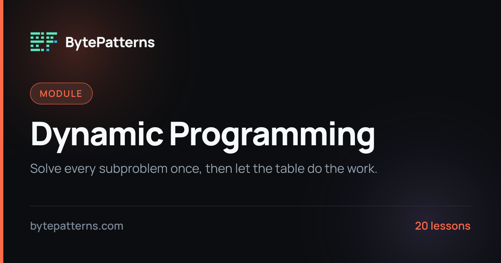](https://bytepatterns.com/learn/dynamic-programming?utm_source=github&utm_medium=readme&utm_campaign=visual-dsa-roadmap)

_Solve every subproblem once, then let the table do the work._ · 20 lessons · [open module](https://bytepatterns.com/learn/dynamic-programming?utm_source=github&utm_medium=readme&utm_campaign=visual-dsa-roadmap)

| # | Lesson | What you will see | Min |
|---|---|---|---|
| 1 | [What Is Dynamic Programming?](https://bytepatterns.com/learn/dynamic-programming/what-is-dp?utm_source=github&utm_medium=readme&utm_campaign=visual-dsa-roadmap) | Solve each overlapping subproblem once, then reuse the answer. | 5 |
| 2 | [Top-Down vs Bottom-Up](https://bytepatterns.com/learn/dynamic-programming/top-down-vs-bottom-up?utm_source=github&utm_medium=readme&utm_campaign=visual-dsa-roadmap) | One recurrence, two directions: recurse and cache, or fill a table. | 5 |
| 3 | [Climbing Stairs](https://bytepatterns.com/learn/dynamic-programming/climbing-stairs?utm_source=github&utm_medium=readme&utm_campaign=visual-dsa-roadmap) | Ways to reach step n = ways to n-1 plus ways to n-2. | 4 |
| 4 | [House Robber](https://bytepatterns.com/learn/dynamic-programming/house-robber?utm_source=github&utm_medium=readme&utm_campaign=visual-dsa-roadmap) | Take this one and skip its neighbour, or skip it and keep the best. | 5 |
| 5 | [Coin Change](https://bytepatterns.com/learn/dynamic-programming/coin-change?utm_source=github&utm_medium=readme&utm_campaign=visual-dsa-roadmap) | Fewest pieces to hit a target, one amount at a time. | 6 |
| 6 | [Longest Common Subsequence](https://bytepatterns.com/learn/dynamic-programming/longest-common-subsequence?utm_source=github&utm_medium=readme&utm_campaign=visual-dsa-roadmap) | Match the two ends, or drop a character from one side. | 6 |
| 7 | [0/1 Knapsack](https://bytepatterns.com/learn/dynamic-programming/knapsack-01?utm_source=github&utm_medium=readme&utm_campaign=visual-dsa-roadmap) | Each item is all or nothing, so try both and keep the better. | 6 |
| 8 | [Edit Distance](https://bytepatterns.com/learn/dynamic-programming/edit-distance?utm_source=github&utm_medium=readme&utm_campaign=visual-dsa-roadmap) | Insert, delete, or replace — count the cheapest route. | 6 |
| 9 | [Longest Increasing Subsequence](https://bytepatterns.com/learn/dynamic-programming/longest-increasing-subsequence?utm_source=github&utm_medium=readme&utm_campaign=visual-dsa-roadmap) | Every element asks which smaller one it can extend. | 6 |
| 10 | [DP on Grids](https://bytepatterns.com/learn/dynamic-programming/dp-on-grids?utm_source=github&utm_medium=readme&utm_campaign=visual-dsa-roadmap) | Each cell's answer comes from the cells above and to its left. | 6 |
| 11 | [Unbounded Knapsack](https://bytepatterns.com/learn/dynamic-programming/unbounded-knapsack?utm_source=github&utm_medium=readme&utm_campaign=visual-dsa-roadmap) | Same table, forward loop — and every item can be taken again. | 6 |
| 12 | [Counting Ways, Not Coins](https://bytepatterns.com/learn/dynamic-programming/coin-change-ways?utm_source=github&utm_medium=readme&utm_campaign=visual-dsa-roadmap) | Loop coins on the outside and each combination is counted once. | 6 |
| 13 | [Equal Split](https://bytepatterns.com/learn/dynamic-programming/partition-equal-subset?utm_source=github&utm_medium=readme&utm_campaign=visual-dsa-roadmap) | Can any subset hit exactly half the total? Track reachable sums. | 6 |
| 14 | [House Robber in a Circle](https://bytepatterns.com/learn/dynamic-programming/house-robber-circle?utm_source=github&utm_medium=readme&utm_campaign=visual-dsa-roadmap) | First and last are now neighbours, so run the line twice. | 5 |
| 15 | [LIS in O(n log n)](https://bytepatterns.com/learn/dynamic-programming/lis-patience-tails?utm_source=github&utm_medium=readme&utm_campaign=visual-dsa-roadmap) | Keep the smallest possible ending for a chain of each length. | 7 |
| 16 | [Interval DP](https://bytepatterns.com/learn/dynamic-programming/matrix-chain-order?utm_source=github&utm_medium=readme&utm_campaign=visual-dsa-roadmap) | Answer every short stretch first, then split the long ones. | 7 |
| 17 | [DP on Trees](https://bytepatterns.com/learn/dynamic-programming/dp-on-trees?utm_source=github&utm_medium=readme&utm_campaign=visual-dsa-roadmap) | Every node returns two answers: taken, and not taken. | 7 |
| 18 | [Word Break](https://bytepatterns.com/learn/dynamic-programming/word-break-dp?utm_source=github&utm_medium=readme&utm_campaign=visual-dsa-roadmap) | A prefix is splittable if some earlier cut leaves a real word. | 6 |
| 19 | [Reading the Answer Back](https://bytepatterns.com/learn/dynamic-programming/reading-the-answer-back?utm_source=github&utm_medium=readme&utm_campaign=visual-dsa-roadmap) | The table holds the score; walking it backwards holds the answer. | 6 |
| 20 | [DP as a State Machine](https://bytepatterns.com/learn/dynamic-programming/stock-state-machine?utm_source=github&utm_medium=readme&utm_campaign=visual-dsa-roadmap) | Two running totals, one per state, updated day by day. | 6 |

Practice: [Cheapest Stair Climb](https://bytepatterns.com/practice/dynamic-programming/cheapest-stair-climb?utm_source=github&utm_medium=readme&utm_campaign=visual-dsa-roadmap) (easy) · [Grid Paths With Blocks](https://bytepatterns.com/practice/dynamic-programming/grid-paths-with-blocks?utm_source=github&utm_medium=readme&utm_campaign=visual-dsa-roadmap) (medium) · [Sentence Segmentation](https://bytepatterns.com/practice/dynamic-programming/sentence-segmentation?utm_source=github&utm_medium=readme&utm_campaign=visual-dsa-roadmap) (medium) · [Trading With Cooldown](https://bytepatterns.com/practice/dynamic-programming/trading-with-cooldown?utm_source=github&utm_medium=readme&utm_campaign=visual-dsa-roadmap) (hard) · [Paint Houses Cheaply](https://bytepatterns.com/practice/dynamic-programming/paint-houses-cheaply?utm_source=github&utm_medium=readme&utm_campaign=visual-dsa-roadmap) (easy) · [Decode Digit Message](https://bytepatterns.com/practice/dynamic-programming/decode-digit-message?utm_source=github&utm_medium=readme&utm_campaign=visual-dsa-roadmap) (medium) · [Unique BST Shapes](https://bytepatterns.com/practice/dynamic-programming/unique-bst-shapes?utm_source=github&utm_medium=readme&utm_campaign=visual-dsa-roadmap) (medium) · [Pop Balloons For Coins](https://bytepatterns.com/practice/dynamic-programming/pop-balloons-for-coins?utm_source=github&utm_medium=readme&utm_campaign=visual-dsa-roadmap) (hard) · [Non-Adjacent Harvest](https://bytepatterns.com/practice/dynamic-programming/non-adjacent-harvest?utm_source=github&utm_medium=readme&utm_campaign=visual-dsa-roadmap) (easy) · [Fewest Coins for an Amount](https://bytepatterns.com/practice/dynamic-programming/fewest-coins-for-amount?utm_source=github&utm_medium=readme&utm_campaign=visual-dsa-roadmap) (medium) · [Longest Rising Subsequence](https://bytepatterns.com/practice/dynamic-programming/longest-rising-subsequence?utm_source=github&utm_medium=readme&utm_campaign=visual-dsa-roadmap) (medium) · [Fewest Edits Between Words](https://bytepatterns.com/practice/dynamic-programming/fewest-edits-between-words?utm_source=github&utm_medium=readme&utm_campaign=visual-dsa-roadmap) (medium) · [Nesting Envelopes](https://bytepatterns.com/practice/dynamic-programming/nesting-envelopes?utm_source=github&utm_medium=readme&utm_campaign=visual-dsa-roadmap) (hard) · [Cheapest Stick Cuts](https://bytepatterns.com/practice/dynamic-programming/cheapest-stick-cuts?utm_source=github&utm_medium=readme&utm_campaign=visual-dsa-roadmap) (hard) · [Ways to Pay an Amount](https://bytepatterns.com/practice/dynamic-programming/ways-to-pay-an-amount?utm_source=github&utm_medium=readme&utm_campaign=visual-dsa-roadmap) (medium) · [Build a Shortest Supersequence](https://bytepatterns.com/practice/dynamic-programming/build-a-shortest-supersequence?utm_source=github&utm_medium=readme&utm_campaign=visual-dsa-roadmap) (hard) · [Longest Palindromic Subsequence](https://bytepatterns.com/practice/dynamic-programming/longest-palindromic-subsequence?utm_source=github&utm_medium=readme&utm_campaign=visual-dsa-roadmap) (medium) · [Signs That Hit a Target](https://bytepatterns.com/practice/dynamic-programming/signs-that-hit-a-target?utm_source=github&utm_medium=readme&utm_campaign=visual-dsa-roadmap) (medium) · [Fewest Watchers on a Tree](https://bytepatterns.com/practice/dynamic-programming/fewest-watchers-on-a-tree?utm_source=github&utm_medium=readme&utm_campaign=visual-dsa-roadmap) (hard) · [Pie Slices With Two Friends](https://bytepatterns.com/practice/dynamic-programming/pie-slices-with-two-friends?utm_source=github&utm_medium=readme&utm_campaign=visual-dsa-roadmap) (hard) · [Best Value Van Load](https://bytepatterns.com/practice/dynamic-programming/best-value-van-load?utm_source=github&utm_medium=readme&utm_campaign=visual-dsa-roadmap) (medium) · [Closest Two-Team Split](https://bytepatterns.com/practice/dynamic-programming/closest-two-team-split?utm_source=github&utm_medium=readme&utm_campaign=visual-dsa-roadmap) (medium) · [Gift Cards for an Exact Total](https://bytepatterns.com/practice/dynamic-programming/gift-cards-for-an-exact-total?utm_source=github&utm_medium=readme&utm_campaign=visual-dsa-roadmap) (easy) · [Exact Change With Unlimited Coins](https://bytepatterns.com/practice/dynamic-programming/exact-change-with-unlimited-coins?utm_source=github&utm_medium=readme&utm_campaign=visual-dsa-roadmap) (easy) · [Cheapest Path Across a Grid](https://bytepatterns.com/practice/dynamic-programming/cheapest-path-across-a-grid?utm_source=github&utm_medium=readme&utm_campaign=visual-dsa-roadmap) (easy) · [Fewest Deletions to Match Two Words](https://bytepatterns.com/practice/dynamic-programming/fewest-deletions-to-match-two-words?utm_source=github&utm_medium=readme&utm_campaign=visual-dsa-roadmap) (easy)

## Systems

_What happens once one machine is not enough — and once one thread is not either. Then the same ideas as AWS services and as a Kubernetes cluster._

### System Design

[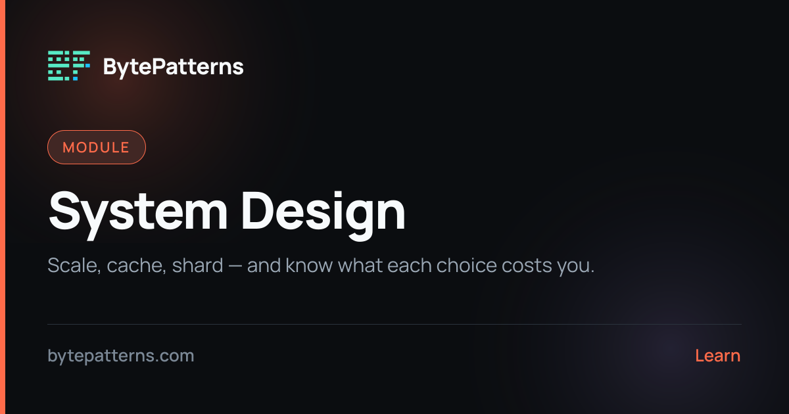](https://bytepatterns.com/learn/system-design?utm_source=github&utm_medium=readme&utm_campaign=visual-dsa-roadmap)

_Scale, cache, shard — and know what each choice costs you._ · 17 lessons · [open module](https://bytepatterns.com/learn/system-design?utm_source=github&utm_medium=readme&utm_campaign=visual-dsa-roadmap)

| # | Lesson | What you will see | Min |
|---|---|---|---|
| 1 | [What Is System Design](https://bytepatterns.com/learn/system-design/what-is-system-design?utm_source=github&utm_medium=readme&utm_campaign=visual-dsa-roadmap) | Choosing which constraint you refuse to break. | 5 |
| 2 | [Vertical vs Horizontal Scaling](https://bytepatterns.com/learn/system-design/vertical-vs-horizontal-scaling?utm_source=github&utm_medium=readme&utm_campaign=visual-dsa-roadmap) | Buy a bigger machine, or buy more of them. | 5 |
| 3 | [Load Balancing](https://bytepatterns.com/learn/system-design/load-balancing?utm_source=github&utm_medium=readme&utm_campaign=visual-dsa-roadmap) | One front door, many rooms behind it. | 5 |
| 4 | [Caching](https://bytepatterns.com/learn/system-design/caching?utm_source=github&utm_medium=readme&utm_campaign=visual-dsa-roadmap) | Keep the answer near whoever keeps asking. | 5 |
| 5 | [Invalidation and Eviction](https://bytepatterns.com/learn/system-design/cache-invalidation-and-eviction?utm_source=github&utm_medium=readme&utm_campaign=visual-dsa-roadmap) | Wrong answers age; small caches forget. | 6 |
| 6 | [Content Delivery Networks](https://bytepatterns.com/learn/system-design/cdn?utm_source=github&utm_medium=readme&utm_campaign=visual-dsa-roadmap) | Distance is latency you cannot optimise away. | 5 |
| 7 | [Database Replication](https://bytepatterns.com/learn/system-design/database-replication?utm_source=github&utm_medium=readme&utm_campaign=visual-dsa-roadmap) | One writer, many readers, a small delay. | 6 |
| 8 | [Database Sharding](https://bytepatterns.com/learn/system-design/database-sharding?utm_source=github&utm_medium=readme&utm_campaign=visual-dsa-roadmap) | Split the data itself when one box is full. | 6 |
| 9 | [SQL vs NoSQL](https://bytepatterns.com/learn/system-design/sql-vs-nosql?utm_source=github&utm_medium=readme&utm_campaign=visual-dsa-roadmap) | Fixed columns and joins, or flexible documents. | 6 |
| 10 | [Consistency and CAP](https://bytepatterns.com/learn/system-design/consistency-and-cap?utm_source=github&utm_medium=readme&utm_campaign=visual-dsa-roadmap) | When the network splits, you must pick a side. | 6 |
| 11 | [Message Queues](https://bytepatterns.com/learn/system-design/message-queues?utm_source=github&utm_medium=readme&utm_campaign=visual-dsa-roadmap) | Hand off the work instead of waiting for it. | 5 |
| 12 | [Rate Limiting](https://bytepatterns.com/learn/system-design/rate-limiting?utm_source=github&utm_medium=readme&utm_campaign=visual-dsa-roadmap) | Cap the flow before it caps your service. | 5 |
| 13 | [Designing a REST API](https://bytepatterns.com/learn/system-design/api-design-rest?utm_source=github&utm_medium=readme&utm_campaign=visual-dsa-roadmap) | Address the thing; let the method be the verb. | 6 |
| 14 | [WebSockets and Realtime](https://bytepatterns.com/learn/system-design/websockets-and-realtime?utm_source=github&utm_medium=readme&utm_campaign=visual-dsa-roadmap) | Keep the line open instead of redialling. | 5 |
| 15 | [Observability Basics](https://bytepatterns.com/learn/system-design/observability-basics?utm_source=github&utm_medium=readme&utm_campaign=visual-dsa-roadmap) | Metrics say something broke; traces say where. | 5 |
| 16 | [Consistency Models](https://bytepatterns.com/learn/system-design/consistency-models?utm_source=github&utm_medium=readme&utm_campaign=visual-dsa-roadmap) | Same data, different promises about what a read may see. | 6 |
| 17 | [Tracing a Request](https://bytepatterns.com/learn/system-design/tracing-a-request?utm_source=github&utm_medium=readme&utm_campaign=visual-dsa-roadmap) | One request, one tree of spans, one honest answer about the time. | 6 |

### System Design Cases

[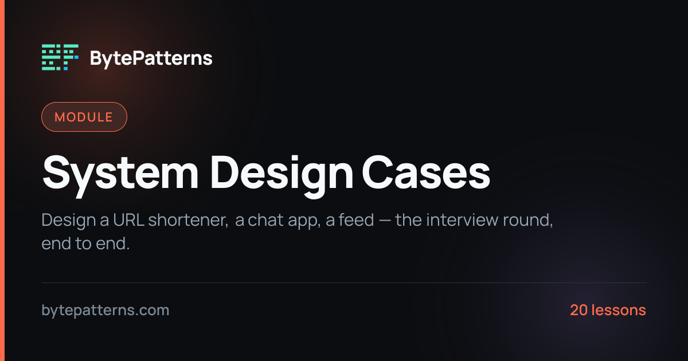](https://bytepatterns.com/learn/system-design-cases?utm_source=github&utm_medium=readme&utm_campaign=visual-dsa-roadmap)

_Design a URL shortener, a chat app, a feed — the interview round, end to end._ · 20 lessons · [open module](https://bytepatterns.com/learn/system-design-cases?utm_source=github&utm_medium=readme&utm_campaign=visual-dsa-roadmap)

| # | Lesson | What you will see | Min |
|---|---|---|---|
| 1 | [Design a URL Shortener](https://bytepatterns.com/learn/system-design-cases/design-a-url-shortener?utm_source=github&utm_medium=readme&utm_campaign=visual-dsa-roadmap) | One tiny key, a hundred million long links behind it. | 6 |
| 2 | [Design a Rate Limiter](https://bytepatterns.com/learn/system-design-cases/design-a-rate-limiter?utm_source=github&utm_medium=readme&utm_campaign=visual-dsa-roadmap) | The algorithm is easy; where the counter lives is the interview. | 6 |
| 3 | [Design a Chat App](https://bytepatterns.com/learn/system-design-cases/design-a-chat-app?utm_source=github&utm_medium=readme&utm_campaign=visual-dsa-roadmap) | Finding the socket is harder than sending the message. | 7 |
| 4 | [Design a News Feed](https://bytepatterns.com/learn/system-design-cases/design-a-news-feed?utm_source=github&utm_medium=readme&utm_campaign=visual-dsa-roadmap) | Pay at write time, at read time, or a little of both. | 7 |
| 5 | [Design a Notification System](https://bytepatterns.com/learn/system-design-cases/design-a-notification-system?utm_source=github&utm_medium=readme&utm_campaign=visual-dsa-roadmap) | One event, three channels, and never the same message twice. | 6 |
| 6 | [Design Search Autocomplete](https://bytepatterns.com/learn/system-design-cases/design-search-autocomplete?utm_source=github&utm_medium=readme&utm_campaign=visual-dsa-roadmap) | Not a search — a walk down a path somebody built last night. | 6 |
| 7 | [Design a File Storage Service](https://bytepatterns.com/learn/system-design-cases/design-a-file-storage-service?utm_source=github&utm_medium=readme&utm_campaign=visual-dsa-roadmap) | Upload the paragraph that changed, not the ten gigabytes. | 7 |
| 8 | [Design Video Streaming](https://bytepatterns.com/learn/system-design-cases/design-video-streaming?utm_source=github&utm_medium=readme&utm_campaign=visual-dsa-roadmap) | Transcode once, cut into segments, and let the edge carry it. | 7 |
| 9 | [Design Ride Matching](https://bytepatterns.com/learn/system-design-cases/design-ride-matching?utm_source=github&utm_medium=readme&utm_campaign=visual-dsa-roadmap) | The write rate is the problem; the search is one cell lookup. | 7 |
| 10 | [Design a Payment Ledger](https://bytepatterns.com/learn/system-design-cases/design-a-payment-ledger?utm_source=github&utm_medium=readme&utm_campaign=visual-dsa-roadmap) | Nothing is ever edited — a correction is one more line. | 7 |
| 11 | [Design a Job Scheduler](https://bytepatterns.com/learn/system-design-cases/design-a-job-scheduler?utm_source=github&utm_medium=readme&utm_campaign=visual-dsa-roadmap) | The worker died mid-job. The ticket goes back on the rail. | 7 |
| 12 | [Design Geo Proximity Search](https://bytepatterns.com/learn/system-design-cases/design-geo-proximity-search?utm_source=github&utm_medium=readme&utm_campaign=visual-dsa-roadmap) | Two numbers, one index: fold a map down into a sorted string. | 7 |
| 13 | [Design E-commerce Inventory](https://bytepatterns.com/learn/system-design-cases/design-ecommerce-inventory?utm_source=github&utm_medium=readme&utm_campaign=visual-dsa-roadmap) | One unit left, two carts, and only one of them may hear yes. | 7 |
| 14 | [Design Ad Click Aggregation](https://bytepatterns.com/learn/system-design-cases/design-ad-click-aggregation?utm_source=github&utm_medium=readme&utm_campaign=visual-dsa-roadmap) | The same click arrives twice, late, and out of order. | 7 |
| 15 | [Design a Distributed Cache](https://bytepatterns.com/learn/system-design-cases/design-a-distributed-cache?utm_source=github&utm_medium=readme&utm_campaign=visual-dsa-roadmap) | A ring of machines where losing one moves only its own arc. | 7 |
| 16 | [Design a Key-Value Store](https://bytepatterns.com/learn/system-design-cases/design-a-key-value-store?utm_source=github&utm_medium=readme&utm_campaign=visual-dsa-roadmap) | Three copies, two acks, two reads — the sets have to overlap. | 7 |
| 17 | [Design a Web Crawler](https://bytepatterns.com/learn/system-design-cases/design-a-web-crawler?utm_source=github&utm_medium=readme&utm_campaign=visual-dsa-roadmap) | A billion pages, one polite knock per host, nothing fetched twice. | 7 |
| 18 | [Design a Leaderboard](https://bytepatterns.com/learn/system-design-cases/design-a-leaderboard?utm_source=github&utm_medium=readme&utm_campaign=visual-dsa-roadmap) | Keep it sorted on the way in, and the top hundred is free. | 6 |
| 19 | [Design Hotel Booking](https://bytepatterns.com/learn/system-design-cases/design-hotel-booking?utm_source=github&utm_medium=readme&utm_campaign=visual-dsa-roadmap) | Four nights or none — a partial stay is not a booking. | 7 |
| 20 | [Design a Collaborative Editor](https://bytepatterns.com/learn/system-design-cases/design-a-collaborative-editor?utm_source=github&utm_medium=readme&utm_campaign=visual-dsa-roadmap) | Both typing in one paragraph, both landing on the same text. | 7 |

### AWS for Interviews

[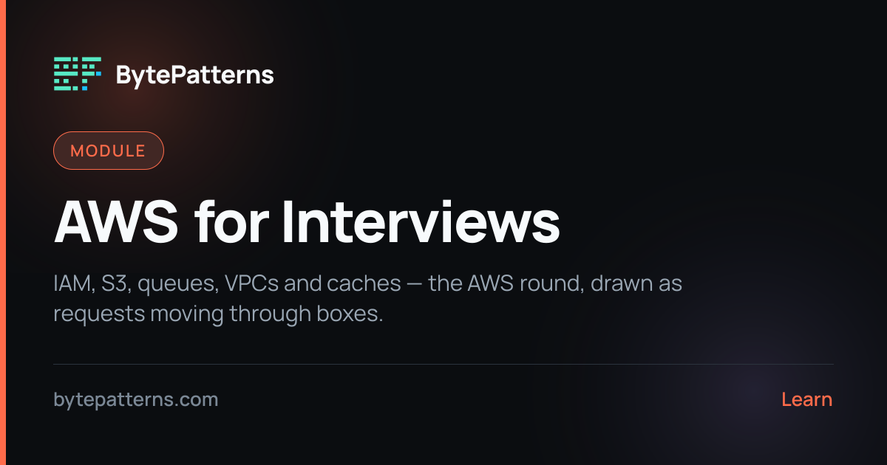](https://bytepatterns.com/learn/aws?utm_source=github&utm_medium=readme&utm_campaign=visual-dsa-roadmap)

_IAM, S3, queues, VPCs and caches — the AWS round, drawn as requests moving through boxes._ · 12 lessons · [open module](https://bytepatterns.com/learn/aws?utm_source=github&utm_medium=readme&utm_campaign=visual-dsa-roadmap)

| # | Lesson | What you will see | Min |
|---|---|---|---|
| 1 | [Shared Responsibility & IAM](https://bytepatterns.com/learn/aws/shared-responsibility-and-iam?utm_source=github&utm_medium=readme&utm_campaign=visual-dsa-roadmap) | AWS secures the cloud; you decide who may call what inside it. | 6 |
| 2 | [S3: Consistency, Classes, Lifecycle](https://bytepatterns.com/learn/aws/s3-storage-classes-and-lifecycle?utm_source=github&utm_medium=readme&utm_campaign=visual-dsa-roadmap) | Strong reads, a class per access pattern, and rules that age data out. | 6 |
| 3 | [EC2, Auto Scaling & Load Balancers](https://bytepatterns.com/learn/aws/ec2-auto-scaling-and-load-balancers?utm_source=github&utm_medium=readme&utm_campaign=visual-dsa-roadmap) | A fleet that grows with traffic and heals itself, behind one address. | 6 |
| 4 | [Lambda & Event-Driven Design](https://bytepatterns.com/learn/aws/lambda-and-event-driven?utm_source=github&utm_medium=readme&utm_campaign=visual-dsa-roadmap) | Cold starts, concurrency, and a queue that absorbs the burst. | 7 |
| 5 | [VPC: Subnets, NAT & Firewalls](https://bytepatterns.com/learn/aws/vpc-subnets-and-security-groups?utm_source=github&utm_medium=readme&utm_campaign=visual-dsa-roadmap) | Routes decide where a packet can go; firewalls decide whether it may. | 7 |
| 6 | [RDS vs DynamoDB](https://bytepatterns.com/learn/aws/rds-vs-dynamodb?utm_source=github&utm_medium=readme&utm_campaign=visual-dsa-roadmap) | Flexible SQL, or key lookups at any scale — if the keys spread. | 7 |
| 7 | [SQS vs SNS vs EventBridge](https://bytepatterns.com/learn/aws/sqs-vs-sns-vs-eventbridge?utm_source=github&utm_medium=readme&utm_campaign=visual-dsa-roadmap) | Pull from a queue, push to many, or route by what the event says. | 7 |
| 8 | [CloudFront & Caching Layers](https://bytepatterns.com/learn/aws/cloudfront-and-caching?utm_source=github&utm_medium=readme&utm_campaign=visual-dsa-roadmap) | Edge, regional cache, origin — and a cache key that decides it all. | 6 |
| 9 | [ECS vs EKS vs Fargate](https://bytepatterns.com/learn/aws/ecs-vs-eks-vs-fargate?utm_source=github&utm_medium=readme&utm_campaign=visual-dsa-roadmap) | Pick an orchestrator, then pick how much of the host you want to own. | 6 |
| 10 | [CloudWatch, Alarms & X-Ray](https://bytepatterns.com/learn/aws/cloudwatch-and-x-ray?utm_source=github&utm_medium=readme&utm_campaign=visual-dsa-roadmap) | Metrics say that, traces say where, logs say why. | 6 |
| 11 | [AWS Cost Levers](https://bytepatterns.com/learn/aws/aws-cost-levers?utm_source=github&utm_medium=readme&utm_campaign=visual-dsa-roadmap) | Right-size, scale, commit the floor, Spot the rest, watch the wires. | 6 |
| 12 | [Design a System on AWS](https://bytepatterns.com/learn/aws/design-a-system-on-aws?utm_source=github&utm_medium=readme&utm_campaign=visual-dsa-roadmap) | Draw the request path, then walk the six pillars as follow-ups. | 8 |

### Docker & Kubernetes for Interviews

[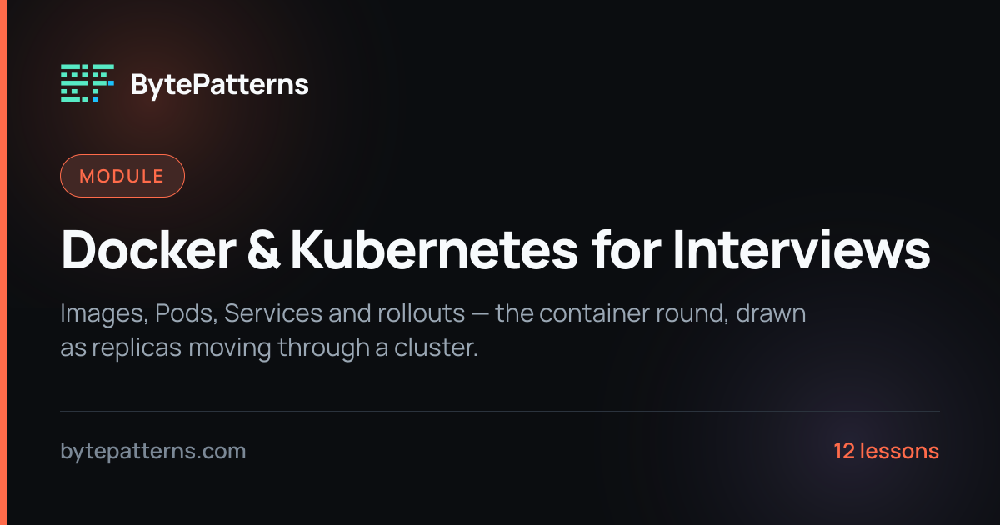](https://bytepatterns.com/learn/kubernetes?utm_source=github&utm_medium=readme&utm_campaign=visual-dsa-roadmap)

_Images, Pods, Services and rollouts — the container round, drawn as replicas moving through a cluster._ · 12 lessons · [open module](https://bytepatterns.com/learn/kubernetes?utm_source=github&utm_medium=readme&utm_campaign=visual-dsa-roadmap)

| # | Lesson | What you will see | Min |
|---|---|---|---|
| 1 | [Containers vs VMs](https://bytepatterns.com/learn/kubernetes/containers-vs-vms?utm_source=github&utm_medium=readme&utm_campaign=visual-dsa-roadmap) | A VM brings its own kernel. A container is a fenced-off process on yours. | 6 |
| 2 | [Images, Layers & Multi-Stage Builds](https://bytepatterns.com/learn/kubernetes/images-and-layers?utm_source=github&utm_medium=readme&utm_campaign=visual-dsa-roadmap) | Order the Dockerfile by how often each line changes, and ship only the output. | 7 |
| 3 | [Ports, Networks & Volumes](https://bytepatterns.com/learn/kubernetes/networking-and-volumes?utm_source=github&utm_medium=readme&utm_campaign=visual-dsa-roadmap) | Private names, one published port, and data that outlives the container. | 6 |
| 4 | [Docker Compose for Local Dev](https://bytepatterns.com/learn/kubernetes/docker-compose?utm_source=github&utm_medium=readme&utm_campaign=visual-dsa-roadmap) | One file, one command, a whole app — as long as it fits on one Docker host. | 6 |
| 5 | [Pods, ReplicaSets & Deployments](https://bytepatterns.com/learn/kubernetes/pods-replicasets-deployments?utm_source=github&utm_medium=readme&utm_campaign=visual-dsa-roadmap) | Declare how many and which version; three controllers keep reality matching it. | 7 |
| 6 | [Scheduling & Rolling Updates](https://bytepatterns.com/learn/kubernetes/scheduling-and-rolling-updates?utm_source=github&utm_medium=readme&utm_campaign=visual-dsa-roadmap) | Where a Pod lands, and how v1 becomes v2 without a gap in service. | 7 |
| 7 | [Services & Ingress](https://bytepatterns.com/learn/kubernetes/services-and-ingress?utm_source=github&utm_medium=readme&utm_campaign=visual-dsa-roadmap) | A stable name in front of Pods that come and go, and one front door for HTTP. | 7 |
| 8 | [ConfigMaps, Secrets & Env](https://bytepatterns.com/learn/kubernetes/configmaps-and-secrets?utm_source=github&utm_medium=readme&utm_campaign=visual-dsa-roadmap) | One image everywhere; the settings and the passwords live beside it, not in it. | 6 |
| 9 | [Probes & Self-Healing](https://bytepatterns.com/learn/kubernetes/probes-and-self-healing?utm_source=github&utm_medium=readme&utm_campaign=visual-dsa-roadmap) | Three questions the kubelet keeps asking: started? ready? still alive? | 6 |
| 10 | [Requests, Limits & HPA](https://bytepatterns.com/learn/kubernetes/requests-limits-and-hpa?utm_source=github&utm_medium=readme&utm_campaign=visual-dsa-roadmap) | Reserve what a Pod needs, cap what it takes, and scale out when it runs hot. | 7 |
| 11 | [Storage: PV, PVC & StatefulSet](https://bytepatterns.com/learn/kubernetes/persistent-volumes-and-statefulsets?utm_source=github&utm_medium=readme&utm_campaign=visual-dsa-roadmap) | Replicas with names that stick and disks that follow them. | 7 |
| 12 | [Design a Deployment on Kubernetes](https://bytepatterns.com/learn/kubernetes/design-a-deployment-on-kubernetes?utm_source=github&utm_medium=readme&utm_campaign=visual-dsa-roadmap) | Walk the request path, then name the failure each piece is there for. | 8 |

### Concurrency

[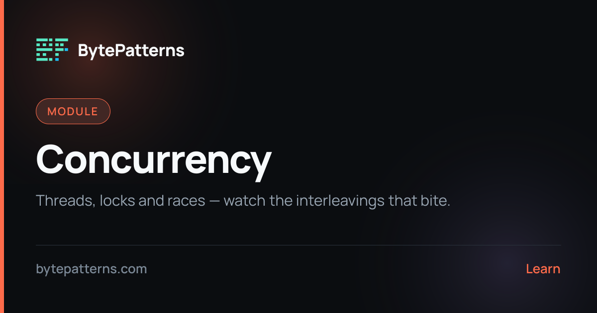](https://bytepatterns.com/learn/concurrency?utm_source=github&utm_medium=readme&utm_campaign=visual-dsa-roadmap)

_Threads, locks and races — watch the interleavings that bite._ · 15 lessons · [open module](https://bytepatterns.com/learn/concurrency?utm_source=github&utm_medium=readme&utm_campaign=visual-dsa-roadmap)

| # | Lesson | What you will see | Min |
|---|---|---|---|
| 1 | [Threads vs Processes](https://bytepatterns.com/learn/concurrency/threads-vs-processes?utm_source=github&utm_medium=readme&utm_campaign=visual-dsa-roadmap) | Shared memory, or a wall between you. | 4 |
| 2 | [Race Conditions](https://bytepatterns.com/learn/concurrency/race-conditions?utm_source=github&utm_medium=readme&utm_campaign=visual-dsa-roadmap) | Two readers, one write survives. | 5 |
| 3 | [Locks and Mutexes](https://bytepatterns.com/learn/concurrency/locks-and-mutexes?utm_source=github&utm_medium=readme&utm_campaign=visual-dsa-roadmap) | One thread inside, everybody else waits. | 5 |
| 4 | [Deadlock](https://bytepatterns.com/learn/concurrency/deadlock?utm_source=github&utm_medium=readme&utm_campaign=visual-dsa-roadmap) | Everyone holding what the next one needs. | 5 |
| 5 | [Thread Pools](https://bytepatterns.com/learn/concurrency/thread-pools?utm_source=github&utm_medium=readme&utm_campaign=visual-dsa-roadmap) | Hire the workers once, reuse them all day. | 4 |
| 6 | [Producer and Consumer](https://bytepatterns.com/learn/concurrency/producer-consumer?utm_source=github&utm_medium=readme&utm_campaign=visual-dsa-roadmap) | A bounded belt between the two sides. | 5 |
| 7 | [Async and the Event Loop](https://bytepatterns.com/learn/concurrency/async-await-event-loop?utm_source=github&utm_medium=readme&utm_campaign=visual-dsa-roadmap) | One thread, politely taking turns. | 5 |
| 8 | [Atomic Operations](https://bytepatterns.com/learn/concurrency/atomic-operations?utm_source=github&utm_medium=readme&utm_campaign=visual-dsa-roadmap) | Indivisible: nobody sees it half-done. | 4 |
| 9 | [Semaphores](https://bytepatterns.com/learn/concurrency/semaphores?utm_source=github&utm_medium=readme&utm_campaign=visual-dsa-roadmap) | Count the permits, not the holders. | 4 |
| 10 | [Designing Thread-Safe Code](https://bytepatterns.com/learn/concurrency/designing-thread-safe-code?utm_source=github&utm_medium=readme&utm_campaign=visual-dsa-roadmap) | Don't share, freeze it, or guard it. | 5 |
| 11 | [Backpressure](https://bytepatterns.com/learn/concurrency/backpressure?utm_source=github&utm_medium=readme&utm_campaign=visual-dsa-roadmap) | An unbounded queue is not a buffer, it is a delayed crash. | 5 |
| 12 | [Detecting Deadlock](https://bytepatterns.com/learn/concurrency/detecting-deadlock?utm_source=github&utm_medium=readme&utm_campaign=visual-dsa-roadmap) | Draw who waits for whom; a closed ring is the proof. | 5 |
| 13 | [Sizing a Thread Pool](https://bytepatterns.com/learn/concurrency/sizing-a-thread-pool?utm_source=github&utm_medium=readme&utm_campaign=visual-dsa-roadmap) | More threads stop helping the moment the work stops waiting. | 5 |
| 14 | [Blocking the Event Loop](https://bytepatterns.com/learn/concurrency/blocking-the-event-loop?utm_source=github&utm_medium=readme&utm_campaign=visual-dsa-roadmap) | One thread runs everything, so one rude call stops the world. | 5 |
| 15 | [Compare-and-Swap](https://bytepatterns.com/learn/concurrency/compare-and-swap?utm_source=github&utm_medium=readme&utm_campaign=visual-dsa-roadmap) | Publish the new value only if nobody changed the old one. | 5 |

### SQL

[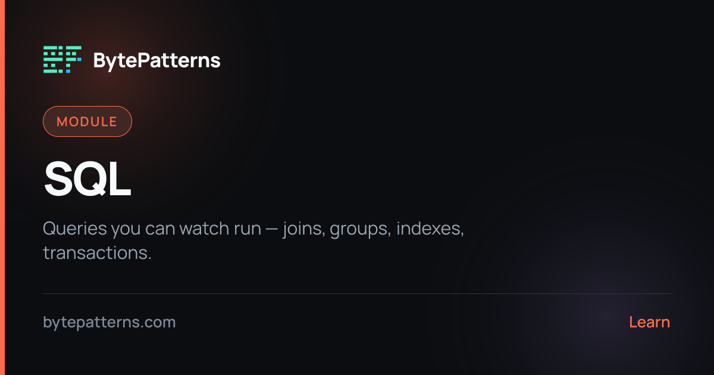](https://bytepatterns.com/learn/sql?utm_source=github&utm_medium=readme&utm_campaign=visual-dsa-roadmap)

_Queries you can watch run — joins, groups, indexes, transactions._ · 15 lessons · [open module](https://bytepatterns.com/learn/sql?utm_source=github&utm_medium=readme&utm_campaign=visual-dsa-roadmap)

| # | Lesson | What you will see | Min |
|---|---|---|---|
| 1 | [SELECT Basics](https://bytepatterns.com/learn/sql/select-basics?utm_source=github&utm_medium=readme&utm_campaign=visual-dsa-roadmap) | Name the columns you want; the table hands them back. | 4 |
| 2 | [WHERE and Filtering](https://bytepatterns.com/learn/sql/where-and-filtering?utm_source=github&utm_medium=readme&utm_campaign=visual-dsa-roadmap) | Filter in the database, not in your application loop. | 4 |
| 3 | [ORDER BY and LIMIT](https://bytepatterns.com/learn/sql/order-and-limit?utm_source=github&utm_medium=readme&utm_campaign=visual-dsa-roadmap) | Sort once in the engine, then take only the slice you show. | 4 |
| 4 | [Aggregations & GROUP BY](https://bytepatterns.com/learn/sql/aggregations-group-by?utm_source=github&utm_medium=readme&utm_campaign=visual-dsa-roadmap) | Fold many rows into one number per group. | 5 |
| 5 | [INNER and OUTER JOINs](https://bytepatterns.com/learn/sql/joins-inner-outer?utm_source=github&utm_medium=readme&utm_campaign=visual-dsa-roadmap) | Match rows across tables — and decide who survives a miss. | 6 |
| 6 | [Subqueries](https://bytepatterns.com/learn/sql/subqueries?utm_source=github&utm_medium=readme&utm_campaign=visual-dsa-roadmap) | A query inside a query, answered before the outer one runs. | 5 |
| 7 | [Indexes](https://bytepatterns.com/learn/sql/indexes?utm_source=github&utm_medium=readme&utm_campaign=visual-dsa-roadmap) | A second, sorted copy of one column that ends the full scan. | 6 |
| 8 | [Transactions & ACID](https://bytepatterns.com/learn/sql/transactions-acid?utm_source=github&utm_medium=readme&utm_campaign=visual-dsa-roadmap) | All of the writes land, or none of them do. | 6 |
| 9 | [Query Execution Order](https://bytepatterns.com/learn/sql/query-execution-order?utm_source=github&utm_medium=readme&utm_campaign=visual-dsa-roadmap) | SQL is written top-down but evaluated in a different order. | 5 |
| 10 | [The N+1 Query Problem](https://bytepatterns.com/learn/sql/n-plus-one-problem?utm_source=github&utm_medium=readme&utm_campaign=visual-dsa-roadmap) | One query for the list, then one more for every single row. | 5 |
| 11 | [Window Functions](https://bytepatterns.com/learn/sql/window-functions?utm_source=github&utm_medium=readme&utm_campaign=visual-dsa-roadmap) | Aggregate across rows without collapsing them. | 6 |
| 12 | [CTEs and Recursion](https://bytepatterns.com/learn/sql/ctes-and-recursion?utm_source=github&utm_medium=readme&utm_campaign=visual-dsa-roadmap) | Name a result, then build the next one on top of it. | 6 |
| 13 | [Composite Indexes](https://bytepatterns.com/learn/sql/composite-and-covering-indexes?utm_source=github&utm_medium=readme&utm_campaign=visual-dsa-roadmap) | Column order decides which queries the index can serve. | 6 |
| 14 | [Isolation Levels](https://bytepatterns.com/learn/sql/isolation-levels?utm_source=github&utm_medium=readme&utm_campaign=visual-dsa-roadmap) | How much of another transaction's mess you are allowed to see. | 6 |
| 15 | [Reading a Query Plan](https://bytepatterns.com/learn/sql/reading-a-query-plan?utm_source=github&utm_medium=readme&utm_campaign=visual-dsa-roadmap) | Stop guessing why it is slow — ask the engine what it did. | 6 |

## The Rest of the Loop

_The two rounds that are not about algorithms: object design, and telling a true story well._

### Low-Level Design

[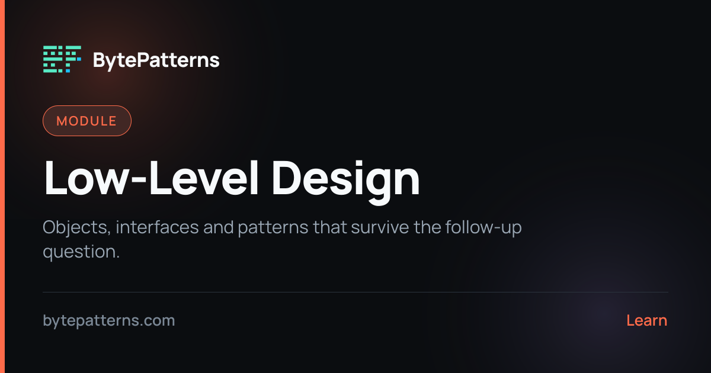](https://bytepatterns.com/learn/lld?utm_source=github&utm_medium=readme&utm_campaign=visual-dsa-roadmap)

_Objects, interfaces and patterns that survive the follow-up question._ · 15 lessons · [open module](https://bytepatterns.com/learn/lld?utm_source=github&utm_medium=readme&utm_campaign=visual-dsa-roadmap)

| # | Lesson | What you will see | Min |
|---|---|---|---|
| 1 | [What Is Low-Level Design](https://bytepatterns.com/learn/lld/what-is-lld?utm_source=github&utm_medium=readme&utm_campaign=visual-dsa-roadmap) | Below the boxes and arrows sit the classes that do the work. | 4 |
| 2 | [Encapsulation and Invariants](https://bytepatterns.com/learn/lld/encapsulation-and-invariants?utm_source=github&utm_medium=readme&utm_campaign=visual-dsa-roadmap) | Hide the state so the object can never be caught in a bad one. | 5 |
| 3 | [Composition vs Inheritance](https://bytepatterns.com/learn/lld/composition-vs-inheritance?utm_source=github&utm_medium=readme&utm_campaign=visual-dsa-roadmap) | Assemble behaviour from parts instead of freezing it in a family tree. | 5 |
| 4 | [Interfaces and Polymorphism](https://bytepatterns.com/learn/lld/interfaces-and-polymorphism?utm_source=github&utm_medium=readme&utm_campaign=visual-dsa-roadmap) | Call one method name and let each type answer in its own way. | 5 |
| 5 | [SOLID in One Pass](https://bytepatterns.com/learn/lld/solid-overview?utm_source=github&utm_medium=readme&utm_campaign=visual-dsa-roadmap) | Five habits that stop tomorrow's change from touching twenty files. | 5 |
| 6 | [Strategy Pattern](https://bytepatterns.com/learn/lld/strategy-pattern?utm_source=github&utm_medium=readme&utm_campaign=visual-dsa-roadmap) | Put the part that varies in its own object and swap it at runtime. | 5 |
| 7 | [Observer Pattern](https://bytepatterns.com/learn/lld/observer-pattern?utm_source=github&utm_medium=readme&utm_campaign=visual-dsa-roadmap) | One event, many reactions, and the source knows none of them. | 5 |
| 8 | [Factory Pattern](https://bytepatterns.com/learn/lld/factory-pattern?utm_source=github&utm_medium=readme&utm_campaign=visual-dsa-roadmap) | Ask for what you want; one place decides which class to build. | 4 |
| 9 | [State Pattern](https://bytepatterns.com/learn/lld/state-pattern?utm_source=github&utm_medium=readme&utm_campaign=visual-dsa-roadmap) | Same method call, different answer, because the object moved on. | 5 |
| 10 | [Designing a Parking Lot](https://bytepatterns.com/learn/lld/designing-a-parking-lot?utm_source=github&utm_medium=readme&utm_campaign=visual-dsa-roadmap) | The classic interview warm-up, answered in objects rather than adjectives. | 6 |
| 11 | [Designing a File System](https://bytepatterns.com/learn/lld/designing-a-file-system?utm_source=github&utm_medium=readme&utm_campaign=visual-dsa-roadmap) | One contract answered by both a leaf and a whole subtree. | 6 |
| 12 | [Elevator Controller](https://bytepatterns.com/learn/lld/elevator-controller?utm_source=github&utm_medium=readme&utm_campaign=visual-dsa-roadmap) | The car has a direction, and the direction answers the buttons. | 6 |
| 13 | [LRU Cache](https://bytepatterns.com/learn/lld/lru-cache-design?utm_source=github&utm_medium=readme&utm_campaign=visual-dsa-roadmap) | A map that can find, a list that can reorder, one object. | 6 |
| 14 | [Vending Machine](https://bytepatterns.com/learn/lld/vending-machine-design?utm_source=github&utm_medium=readme&utm_campaign=visual-dsa-roadmap) | Four small objects, each one only answering for its own moment. | 6 |
| 15 | [Chess Board Model](https://bytepatterns.com/learn/lld/chess-board-model?utm_source=github&utm_medium=readme&utm_campaign=visual-dsa-roadmap) | The piece owns its shape; the board owns who is standing where. | 7 |

### Behavioral

[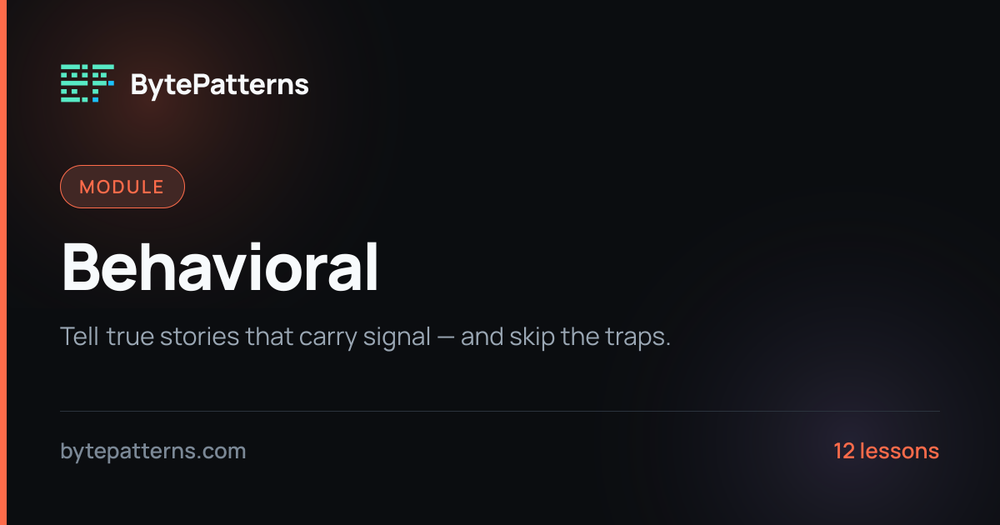](https://bytepatterns.com/learn/behavioral?utm_source=github&utm_medium=readme&utm_campaign=visual-dsa-roadmap)

_Tell true stories that carry signal — and skip the traps._ · 12 lessons · [open module](https://bytepatterns.com/learn/behavioral?utm_source=github&utm_medium=readme&utm_campaign=visual-dsa-roadmap)

| # | Lesson | What you will see | Min |
|---|---|---|---|
| 1 | [Why Behavioral Matters](https://bytepatterns.com/learn/behavioral/why-behavioral-matters?utm_source=github&utm_medium=readme&utm_campaign=visual-dsa-roadmap) | The round that separates two equally good coders. | 4 |
| 2 | [The STAR Method](https://bytepatterns.com/learn/behavioral/star-method?utm_source=github&utm_medium=readme&utm_campaign=visual-dsa-roadmap) | Four blocks that make a story scoreable. | 5 |
| 3 | [Conflict Stories](https://bytepatterns.com/learn/behavioral/conflict-stories?utm_source=github&utm_medium=readme&utm_campaign=visual-dsa-roadmap) | Disagree hard, keep the relationship. | 5 |
| 4 | [Failure Stories](https://bytepatterns.com/learn/behavioral/failure-stories?utm_source=github&utm_medium=readme&utm_campaign=visual-dsa-roadmap) | Own it, cost it, then show what changed. | 5 |
| 5 | [Leadership and Ownership](https://bytepatterns.com/learn/behavioral/leadership-and-ownership?utm_source=github&utm_medium=readme&utm_campaign=visual-dsa-roadmap) | Authority optional; follow-through is not. | 5 |
| 6 | [Questions to Ask](https://bytepatterns.com/learn/behavioral/questions-to-ask?utm_source=github&utm_medium=readme&utm_campaign=visual-dsa-roadmap) | Your questions are part of the interview. | 4 |
| 7 | [Negotiation Basics](https://bytepatterns.com/learn/behavioral/negotiation-basics?utm_source=github&utm_medium=readme&utm_campaign=visual-dsa-roadmap) | Know your number before the call starts. | 5 |
| 8 | [Red Flags and Antipatterns](https://bytepatterns.com/learn/behavioral/red-flags-and-antipatterns?utm_source=github&utm_medium=readme&utm_campaign=visual-dsa-roadmap) | The habits that sink otherwise good candidates. | 4 |
| 9 | [Cross-Team Conflict](https://bytepatterns.com/learn/behavioral/cross-team-conflict?utm_source=github&utm_medium=readme&utm_campaign=visual-dsa-roadmap) | Nobody is wrong; two teams are graded on different numbers. | 5 |
| 10 | [The Outage Story](https://bytepatterns.com/learn/behavioral/the-outage-story?utm_source=github&utm_medium=readme&utm_campaign=visual-dsa-roadmap) | What you did in the first ten minutes, and what you changed after. | 5 |
| 11 | [Influence Without Authority](https://bytepatterns.com/learn/behavioral/influence-without-authority?utm_source=github&utm_medium=readme&utm_campaign=visual-dsa-roadmap) | You cannot tell anyone to do it, and it happened anyway. | 5 |
| 12 | [Why This Team](https://bytepatterns.com/learn/behavioral/why-this-team?utm_source=github&utm_medium=readme&utm_campaign=visual-dsa-roadmap) | An answer that could be about anyone is an answer about nobody. | 5 |

## AI & ML

_Embeddings, retrieval, evaluation, agents — the round that did not exist five years ago._

### AI & ML

[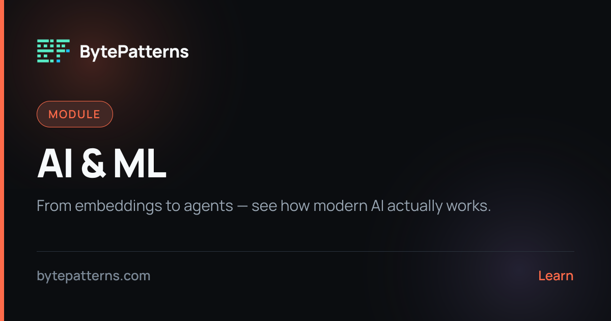](https://bytepatterns.com/learn/ai-ml?utm_source=github&utm_medium=readme&utm_campaign=visual-dsa-roadmap)

_From embeddings to agents — see how modern AI actually works._ · 25 lessons · [open module](https://bytepatterns.com/learn/ai-ml?utm_source=github&utm_medium=readme&utm_campaign=visual-dsa-roadmap)

| # | Lesson | What you will see | Min |
|---|---|---|---|
| 1 | [What Is Machine Learning](https://bytepatterns.com/learn/ai-ml/what-is-machine-learning?utm_source=github&utm_medium=readme&utm_campaign=visual-dsa-roadmap) | Learn the rule from examples instead of writing it. | 4 |
| 2 | [Training vs Inference](https://bytepatterns.com/learn/ai-ml/training-vs-inference?utm_source=github&utm_medium=readme&utm_campaign=visual-dsa-roadmap) | Learn once, slowly. Answer many times, fast. | 4 |
| 3 | [Embeddings](https://bytepatterns.com/learn/ai-ml/embeddings?utm_source=github&utm_medium=readme&utm_campaign=visual-dsa-roadmap) | Meaning turned into a fixed list of numbers. | 5 |
| 4 | [Cosine Similarity](https://bytepatterns.com/learn/ai-ml/cosine-similarity?utm_source=github&utm_medium=readme&utm_campaign=visual-dsa-roadmap) | Compare direction, ignore magnitude. | 5 |
| 5 | [Tokenization](https://bytepatterns.com/learn/ai-ml/tokenization?utm_source=github&utm_medium=readme&utm_campaign=visual-dsa-roadmap) | Models read chunks, not letters or words. | 5 |
| 6 | [Attention, Intuitively](https://bytepatterns.com/learn/ai-ml/attention-intuition?utm_source=github&utm_medium=readme&utm_campaign=visual-dsa-roadmap) | Every position decides which others to listen to. | 5 |
| 7 | [Transformers: Big Picture](https://bytepatterns.com/learn/ai-ml/transformers-big-picture?utm_source=github&utm_medium=readme&utm_campaign=visual-dsa-roadmap) | A stack of identical blocks refining one sequence. | 5 |
| 8 | [What Is an LLM](https://bytepatterns.com/learn/ai-ml/what-is-an-llm?utm_source=github&utm_medium=readme&utm_campaign=visual-dsa-roadmap) | A next-token predictor trained on a lot of text. | 5 |
| 9 | [Temperature and Sampling](https://bytepatterns.com/learn/ai-ml/temperature-and-sampling?utm_source=github&utm_medium=readme&utm_campaign=visual-dsa-roadmap) | One distribution, many possible answers. | 5 |
| 10 | [Context Windows](https://bytepatterns.com/learn/ai-ml/context-windows?utm_source=github&utm_medium=readme&utm_campaign=visual-dsa-roadmap) | A hard limit on what the model can see at once. | 4 |
| 11 | [Retrieval-Augmented Generation](https://bytepatterns.com/learn/ai-ml/rag-basics?utm_source=github&utm_medium=readme&utm_campaign=visual-dsa-roadmap) | Fetch the facts first, then let the model write. | 5 |
| 12 | [Vector Databases](https://bytepatterns.com/learn/ai-ml/vector-databases?utm_source=github&utm_medium=readme&utm_campaign=visual-dsa-roadmap) | Nearest-neighbour search that stays fast at scale. | 5 |
| 13 | [Fine-Tuning vs Prompting](https://bytepatterns.com/learn/ai-ml/fine-tuning-vs-prompting?utm_source=github&utm_medium=readme&utm_campaign=visual-dsa-roadmap) | Change the instructions, or change the weights. | 5 |
| 14 | [Agents and Tools](https://bytepatterns.com/learn/ai-ml/agents-and-tools?utm_source=github&utm_medium=readme&utm_campaign=visual-dsa-roadmap) | A model in a loop that can act and try again. | 5 |
| 15 | [Evaluating LLMs](https://bytepatterns.com/learn/ai-ml/evaluating-llms?utm_source=github&utm_medium=readme&utm_campaign=visual-dsa-roadmap) | If you cannot score it, you cannot improve it. | 5 |
| 16 | [Chunking and Reranking](https://bytepatterns.com/learn/ai-ml/chunking-and-reranking?utm_source=github&utm_medium=readme&utm_campaign=visual-dsa-roadmap) | Retrieval quality is decided before the model reads a word. | 5 |
| 17 | [Adapters and LoRA](https://bytepatterns.com/learn/ai-ml/adapters-and-lora?utm_source=github&utm_medium=readme&utm_campaign=visual-dsa-roadmap) | Train a thin correction instead of the whole weight matrix. | 5 |
| 18 | [Quantization](https://bytepatterns.com/learn/ai-ml/quantization?utm_source=github&utm_medium=readme&utm_campaign=visual-dsa-roadmap) | Store the weights in fewer bits and buy back memory bandwidth. | 5 |
| 19 | [Approximate Neighbours](https://bytepatterns.com/learn/ai-ml/approximate-nearest-neighbours?utm_source=github&utm_medium=readme&utm_campaign=visual-dsa-roadmap) | Walk a graph of vectors instead of comparing all of them. | 5 |
| 20 | [LLM as a Judge](https://bytepatterns.com/learn/ai-ml/llm-as-a-judge?utm_source=github&utm_medium=readme&utm_campaign=visual-dsa-roadmap) | A model can grade answers — and quietly grade the wrong thing. | 5 |
| 21 | [The Tool-Use Loop](https://bytepatterns.com/learn/ai-ml/the-tool-use-loop?utm_source=github&utm_medium=readme&utm_campaign=visual-dsa-roadmap) | The model proposes a call; your code decides whether it runs. | 5 |
| 22 | [Guardrails](https://bytepatterns.com/learn/ai-ml/guardrails?utm_source=github&utm_medium=readme&utm_campaign=visual-dsa-roadmap) | Checks around the model, because the model is not the boundary. | 5 |
| 23 | [BPE vs WordPiece](https://bytepatterns.com/learn/ai-ml/bpe-vs-wordpiece?utm_source=github&utm_medium=readme&utm_campaign=visual-dsa-roadmap) | Two ways to decide which pair of pieces becomes one piece. | 5 |
| 24 | [The KV Cache](https://bytepatterns.com/learn/ai-ml/the-kv-cache?utm_source=github&utm_medium=readme&utm_campaign=visual-dsa-roadmap) | Keep the past keys and values so each new token is cheap. | 5 |
| 25 | [Speculative Decoding](https://bytepatterns.com/learn/ai-ml/speculative-decoding?utm_source=github&utm_medium=readme&utm_campaign=visual-dsa-roadmap) | A small model guesses ahead; the big one checks in one pass. | 5 |

## Browse by topic

The same lessons, grouped by the idea they use instead of the module they sit in. A lesson that uses several ideas is listed under each.

[Two pointers](#topic-two-pointers) (22) · [Sliding window](#topic-sliding-window) (5) · [Prefix sum](#topic-prefix-sum) (6) · [Binary search](#topic-binary-search) (11) · [Sorting](#topic-sorting) (29) · [Hashing](#topic-hashing) (28) · [Stack](#topic-stack) (8) · [Monotonic stack](#topic-monotonic-stack) (3) · [Queue](#topic-queue) (20) · [Heap](#topic-heap) (15) · [Tree](#topic-tree) (23) · [BST](#topic-bst) (4) · [Trie](#topic-trie) (5) · [Graph](#topic-graph) (22) · [BFS](#topic-bfs) (9) · [DFS](#topic-dfs) (13) · [Topological sort](#topic-topological-sort) (1) · [Shortest path](#topic-shortest-path) (3) · [Union-find](#topic-union-find) (5) · [Dynamic programming](#topic-dp) (22) · [Memoization](#topic-memoization) (5) · [Recursion](#topic-recursion) (25) · [Backtracking](#topic-backtracking) (9) · [Greedy](#topic-greedy) (14) · [Intervals](#topic-intervals) (6) · [Bit manipulation](#topic-bit-manipulation) (6) · [Matrix](#topic-matrix) (13) · [Linked list](#topic-linked-list) (11) · [Strings](#topic-strings) (23) · [Math](#topic-math) (5) · [System design](#topic-system-design) (26) · [Caching](#topic-caching) (13) · [Rate limiting](#topic-rate-limiting) (4) · [Distributed](#topic-distributed) (32) · [Machine learning](#topic-ml) (22) · [Embeddings](#topic-embeddings) (6) · [Attention](#topic-attention) (4) · [Complexity](#topic-complexity) (18) · [OOP](#topic-oop) (15) · [Concurrency](#topic-concurrency) (21)

### Two pointers

22 lessons

- **Arrays:** [Two Pointers](https://bytepatterns.com/learn/arrays/two-pointers?utm_source=github&utm_medium=readme&utm_campaign=visual-dsa-roadmap) · [Sliding Window](https://bytepatterns.com/learn/arrays/sliding-window?utm_source=github&utm_medium=readme&utm_campaign=visual-dsa-roadmap) · [In-Place Reversal](https://bytepatterns.com/learn/arrays/in-place-reversal?utm_source=github&utm_medium=readme&utm_campaign=visual-dsa-roadmap) · [Move Zeroes](https://bytepatterns.com/learn/arrays/move-zeroes?utm_source=github&utm_medium=readme&utm_campaign=visual-dsa-roadmap) · [Container With Most Water](https://bytepatterns.com/learn/arrays/container-with-most-water?utm_source=github&utm_medium=readme&utm_campaign=visual-dsa-roadmap) · [Merge Sorted Arrays](https://bytepatterns.com/learn/arrays/merge-sorted-arrays?utm_source=github&utm_medium=readme&utm_campaign=visual-dsa-roadmap) · [Dutch National Flag](https://bytepatterns.com/learn/arrays/dutch-national-flag?utm_source=github&utm_medium=readme&utm_campaign=visual-dsa-roadmap) · [Rotate an Array](https://bytepatterns.com/learn/arrays/rotate-array?utm_source=github&utm_medium=readme&utm_campaign=visual-dsa-roadmap)
- **Strings:** [Valid Palindrome](https://bytepatterns.com/learn/strings/valid-palindrome?utm_source=github&utm_medium=readme&utm_campaign=visual-dsa-roadmap) · [Reverse Words](https://bytepatterns.com/learn/strings/reverse-words?utm_source=github&utm_medium=readme&utm_campaign=visual-dsa-roadmap) · [Longest Palindromic Substring](https://bytepatterns.com/learn/strings/longest-palindromic-substring?utm_source=github&utm_medium=readme&utm_campaign=visual-dsa-roadmap) · [String Matching Intuition](https://bytepatterns.com/learn/strings/string-matching-intuition?utm_source=github&utm_medium=readme&utm_campaign=visual-dsa-roadmap) · [Z-Algorithm Intuition](https://bytepatterns.com/learn/strings/z-algorithm?utm_source=github&utm_medium=readme&utm_campaign=visual-dsa-roadmap) · [String Compression](https://bytepatterns.com/learn/strings/string-compression?utm_source=github&utm_medium=readme&utm_campaign=visual-dsa-roadmap)
- **Searching:** [Search a 2D Matrix](https://bytepatterns.com/learn/searching/search-2d-matrix?utm_source=github&utm_medium=readme&utm_campaign=visual-dsa-roadmap)
- **Sorting:** [Merge Sort](https://bytepatterns.com/learn/sorting/merge-sort?utm_source=github&utm_medium=readme&utm_campaign=visual-dsa-roadmap) · [Quick Sort](https://bytepatterns.com/learn/sorting/quick-sort?utm_source=github&utm_medium=readme&utm_campaign=visual-dsa-roadmap)
- **Linked Lists:** [Fast and Slow Pointers](https://bytepatterns.com/learn/linked-lists/fast-and-slow-pointers?utm_source=github&utm_medium=readme&utm_campaign=visual-dsa-roadmap) · [Detect a Cycle](https://bytepatterns.com/learn/linked-lists/detect-cycle?utm_source=github&utm_medium=readme&utm_campaign=visual-dsa-roadmap) · [Find the Cycle Start](https://bytepatterns.com/learn/linked-lists/find-the-cycle-start?utm_source=github&utm_medium=readme&utm_campaign=visual-dsa-roadmap) · [Merge Two Sorted Lists](https://bytepatterns.com/learn/linked-lists/merge-two-sorted-lists?utm_source=github&utm_medium=readme&utm_campaign=visual-dsa-roadmap)
- **Matrix & Grid:** [Rotate In Place](https://bytepatterns.com/learn/matrix-grid/rotate-in-place?utm_source=github&utm_medium=readme&utm_campaign=visual-dsa-roadmap)

### Sliding window

5 lessons

- **Arrays:** [Sliding Window](https://bytepatterns.com/learn/arrays/sliding-window?utm_source=github&utm_medium=readme&utm_campaign=visual-dsa-roadmap)
- **Strings:** [Longest Unique Substring](https://bytepatterns.com/learn/strings/longest-substring-without-repeats?utm_source=github&utm_medium=readme&utm_campaign=visual-dsa-roadmap) · [Rabin-Karp Rolling Hash](https://bytepatterns.com/learn/strings/rabin-karp-rolling-hash?utm_source=github&utm_medium=readme&utm_campaign=visual-dsa-roadmap)
- **Stacks & Queues:** [Sliding Window Maximum](https://bytepatterns.com/learn/stacks-queues/sliding-window-maximum?utm_source=github&utm_medium=readme&utm_campaign=visual-dsa-roadmap)
- **Two Heaps & K-Way Merge:** [Sliding Window Median](https://bytepatterns.com/learn/two-heaps-k-way/sliding-window-median?utm_source=github&utm_medium=readme&utm_campaign=visual-dsa-roadmap)

### Prefix sum

6 lessons

- **Arrays:** [Prefix Sums](https://bytepatterns.com/learn/arrays/prefix-sums?utm_source=github&utm_medium=readme&utm_campaign=visual-dsa-roadmap) · [Product Except Self](https://bytepatterns.com/learn/arrays/product-except-self?utm_source=github&utm_medium=readme&utm_campaign=visual-dsa-roadmap)
- **Hash Tables:** [Subarray Sums With a Map](https://bytepatterns.com/learn/hash-tables/subarray-sum-map?utm_source=github&utm_medium=readme&utm_campaign=visual-dsa-roadmap)
- **Greedy:** [Gas Station](https://bytepatterns.com/learn/greedy/gas-station?utm_source=github&utm_medium=readme&utm_campaign=visual-dsa-roadmap)
- **Trees & BST:** [Path Sum Variants](https://bytepatterns.com/learn/trees/path-sum-variants?utm_source=github&utm_medium=readme&utm_campaign=visual-dsa-roadmap)
- **SQL:** [Window Functions](https://bytepatterns.com/learn/sql/window-functions?utm_source=github&utm_medium=readme&utm_campaign=visual-dsa-roadmap)

### Binary search

11 lessons

- **Big-O:** [O(log n) and Halving](https://bytepatterns.com/learn/big-o/ologn-halving?utm_source=github&utm_medium=readme&utm_campaign=visual-dsa-roadmap)
- **Searching:** [Binary Search](https://bytepatterns.com/learn/searching/binary-search?utm_source=github&utm_medium=readme&utm_campaign=visual-dsa-roadmap) · [Binary Search Variants](https://bytepatterns.com/learn/searching/binary-search-variants?utm_source=github&utm_medium=readme&utm_campaign=visual-dsa-roadmap) · [Search in Rotated Array](https://bytepatterns.com/learn/searching/search-in-rotated-array?utm_source=github&utm_medium=readme&utm_campaign=visual-dsa-roadmap) · [Binary Search on Answer](https://bytepatterns.com/learn/searching/binary-search-on-answer?utm_source=github&utm_medium=readme&utm_campaign=visual-dsa-roadmap) · [Find a Peak](https://bytepatterns.com/learn/searching/find-peak-element?utm_source=github&utm_medium=readme&utm_campaign=visual-dsa-roadmap) · [Kth Smallest in a Matrix](https://bytepatterns.com/learn/searching/kth-smallest-matrix?utm_source=github&utm_medium=readme&utm_campaign=visual-dsa-roadmap)
- **Trees & BST:** [BST Insert and Search](https://bytepatterns.com/learn/trees/bst-insert-and-search?utm_source=github&utm_medium=readme&utm_campaign=visual-dsa-roadmap)
- **Dynamic Programming:** [LIS in O(n log n)](https://bytepatterns.com/learn/dynamic-programming/lis-patience-tails?utm_source=github&utm_medium=readme&utm_campaign=visual-dsa-roadmap)
- **SQL:** [Indexes](https://bytepatterns.com/learn/sql/indexes?utm_source=github&utm_medium=readme&utm_campaign=visual-dsa-roadmap) · [Composite Indexes](https://bytepatterns.com/learn/sql/composite-and-covering-indexes?utm_source=github&utm_medium=readme&utm_campaign=visual-dsa-roadmap)

### Sorting

29 lessons

- **Arrays:** [Cyclic Sort](https://bytepatterns.com/learn/arrays/cyclic-sort?utm_source=github&utm_medium=readme&utm_campaign=visual-dsa-roadmap) · [Merge Sorted Arrays](https://bytepatterns.com/learn/arrays/merge-sorted-arrays?utm_source=github&utm_medium=readme&utm_campaign=visual-dsa-roadmap) · [Dutch National Flag](https://bytepatterns.com/learn/arrays/dutch-national-flag?utm_source=github&utm_medium=readme&utm_campaign=visual-dsa-roadmap)
- **Sorting:** [Sorting Basics](https://bytepatterns.com/learn/sorting/sorting-basics?utm_source=github&utm_medium=readme&utm_campaign=visual-dsa-roadmap) · [Bubble Sort](https://bytepatterns.com/learn/sorting/bubble-sort?utm_source=github&utm_medium=readme&utm_campaign=visual-dsa-roadmap) · [Selection Sort](https://bytepatterns.com/learn/sorting/selection-sort?utm_source=github&utm_medium=readme&utm_campaign=visual-dsa-roadmap) · [Insertion Sort](https://bytepatterns.com/learn/sorting/insertion-sort?utm_source=github&utm_medium=readme&utm_campaign=visual-dsa-roadmap) · [Merge Sort](https://bytepatterns.com/learn/sorting/merge-sort?utm_source=github&utm_medium=readme&utm_campaign=visual-dsa-roadmap) · [Quick Sort](https://bytepatterns.com/learn/sorting/quick-sort?utm_source=github&utm_medium=readme&utm_campaign=visual-dsa-roadmap) · [Counting Sort](https://bytepatterns.com/learn/sorting/counting-sort?utm_source=github&utm_medium=readme&utm_campaign=visual-dsa-roadmap) · [Which Sort When?](https://bytepatterns.com/learn/sorting/which-sort-when?utm_source=github&utm_medium=readme&utm_campaign=visual-dsa-roadmap) · [Heap Sort](https://bytepatterns.com/learn/sorting/heap-sort?utm_source=github&utm_medium=readme&utm_campaign=visual-dsa-roadmap) · [Radix Sort](https://bytepatterns.com/learn/sorting/radix-sort?utm_source=github&utm_medium=readme&utm_campaign=visual-dsa-roadmap)
- **Hash Tables:** [Group Anagrams](https://bytepatterns.com/learn/hash-tables/group-anagrams?utm_source=github&utm_medium=readme&utm_campaign=visual-dsa-roadmap) · [Top K Without a Heap](https://bytepatterns.com/learn/hash-tables/top-k-buckets?utm_source=github&utm_medium=readme&utm_campaign=visual-dsa-roadmap)
- **Greedy:** [What Makes Greedy Work](https://bytepatterns.com/learn/greedy/what-makes-greedy-work?utm_source=github&utm_medium=readme&utm_campaign=visual-dsa-roadmap) · [Interval Scheduling](https://bytepatterns.com/learn/greedy/interval-scheduling?utm_source=github&utm_medium=readme&utm_campaign=visual-dsa-roadmap)
- **Heaps:** [K Closest Points](https://bytepatterns.com/learn/heaps/k-closest-points?utm_source=github&utm_medium=readme&utm_campaign=visual-dsa-roadmap)
- **Two Heaps & K-Way Merge:** [K-Way Merge](https://bytepatterns.com/learn/two-heaps-k-way/k-way-merge?utm_source=github&utm_medium=readme&utm_campaign=visual-dsa-roadmap)
- **Graphs:** [Kruskal's Spanning Tree](https://bytepatterns.com/learn/graphs/kruskal-mst?utm_source=github&utm_medium=readme&utm_campaign=visual-dsa-roadmap)
- **Intervals:** [Interval Basics & Sorting](https://bytepatterns.com/learn/intervals/interval-basics-and-sorting?utm_source=github&utm_medium=readme&utm_campaign=visual-dsa-roadmap) · [Merge Intervals](https://bytepatterns.com/learn/intervals/merge-intervals?utm_source=github&utm_medium=readme&utm_campaign=visual-dsa-roadmap) · [Meeting Rooms](https://bytepatterns.com/learn/intervals/meeting-rooms?utm_source=github&utm_medium=readme&utm_campaign=visual-dsa-roadmap)
- **System Design Cases:** [Design Geo Proximity Search](https://bytepatterns.com/learn/system-design-cases/design-geo-proximity-search?utm_source=github&utm_medium=readme&utm_campaign=visual-dsa-roadmap) · [Design a Leaderboard](https://bytepatterns.com/learn/system-design-cases/design-a-leaderboard?utm_source=github&utm_medium=readme&utm_campaign=visual-dsa-roadmap)
- **SQL:** [ORDER BY and LIMIT](https://bytepatterns.com/learn/sql/order-and-limit?utm_source=github&utm_medium=readme&utm_campaign=visual-dsa-roadmap) · [Indexes](https://bytepatterns.com/learn/sql/indexes?utm_source=github&utm_medium=readme&utm_campaign=visual-dsa-roadmap) · [Window Functions](https://bytepatterns.com/learn/sql/window-functions?utm_source=github&utm_medium=readme&utm_campaign=visual-dsa-roadmap) · [Composite Indexes](https://bytepatterns.com/learn/sql/composite-and-covering-indexes?utm_source=github&utm_medium=readme&utm_campaign=visual-dsa-roadmap)

### Hashing

28 lessons

- **Strings:** [Longest Unique Substring](https://bytepatterns.com/learn/strings/longest-substring-without-repeats?utm_source=github&utm_medium=readme&utm_campaign=visual-dsa-roadmap) · [Rabin-Karp Rolling Hash](https://bytepatterns.com/learn/strings/rabin-karp-rolling-hash?utm_source=github&utm_medium=readme&utm_campaign=visual-dsa-roadmap)
- **Sorting:** [Counting Sort](https://bytepatterns.com/learn/sorting/counting-sort?utm_source=github&utm_medium=readme&utm_campaign=visual-dsa-roadmap)
- **Linked Lists:** [Copy a List With Random Links](https://bytepatterns.com/learn/linked-lists/copy-list-with-random-pointer?utm_source=github&utm_medium=readme&utm_campaign=visual-dsa-roadmap)
- **Hash Tables:** [Hash Table Basics](https://bytepatterns.com/learn/hash-tables/hash-table-basics?utm_source=github&utm_medium=readme&utm_campaign=visual-dsa-roadmap) · [Two Sum](https://bytepatterns.com/learn/hash-tables/two-sum?utm_source=github&utm_medium=readme&utm_campaign=visual-dsa-roadmap) · [Frequency Counting](https://bytepatterns.com/learn/hash-tables/frequency-counting?utm_source=github&utm_medium=readme&utm_campaign=visual-dsa-roadmap) · [Group Anagrams](https://bytepatterns.com/learn/hash-tables/group-anagrams?utm_source=github&utm_medium=readme&utm_campaign=visual-dsa-roadmap) · [When Hashing Fails](https://bytepatterns.com/learn/hash-tables/when-hashing-fails?utm_source=github&utm_medium=readme&utm_campaign=visual-dsa-roadmap) · [Subarray Sums With a Map](https://bytepatterns.com/learn/hash-tables/subarray-sum-map?utm_source=github&utm_medium=readme&utm_campaign=visual-dsa-roadmap) · [Top K Without a Heap](https://bytepatterns.com/learn/hash-tables/top-k-buckets?utm_source=github&utm_medium=readme&utm_campaign=visual-dsa-roadmap) · [LFU: Frequency Buckets](https://bytepatterns.com/learn/hash-tables/lfu-frequency-buckets?utm_source=github&utm_medium=readme&utm_campaign=visual-dsa-roadmap)
- **Trees & BST:** [Vertical Order Traversal](https://bytepatterns.com/learn/trees/vertical-order-traversal?utm_source=github&utm_medium=readme&utm_campaign=visual-dsa-roadmap)
- **Tries:** [Trie vs Hash Set](https://bytepatterns.com/learn/tries/trie-vs-hash-set?utm_source=github&utm_medium=readme&utm_campaign=visual-dsa-roadmap)
- **Two Heaps & K-Way Merge:** [Top K in a Stream](https://bytepatterns.com/learn/two-heaps-k-way/top-k-frequent-stream?utm_source=github&utm_medium=readme&utm_campaign=visual-dsa-roadmap) · [Sliding Window Median](https://bytepatterns.com/learn/two-heaps-k-way/sliding-window-median?utm_source=github&utm_medium=readme&utm_campaign=visual-dsa-roadmap)
- **System Design:** [Load Balancing](https://bytepatterns.com/learn/system-design/load-balancing?utm_source=github&utm_medium=readme&utm_campaign=visual-dsa-roadmap) · [Database Sharding](https://bytepatterns.com/learn/system-design/database-sharding?utm_source=github&utm_medium=readme&utm_campaign=visual-dsa-roadmap)
- **System Design Cases:** [Design a URL Shortener](https://bytepatterns.com/learn/system-design-cases/design-a-url-shortener?utm_source=github&utm_medium=readme&utm_campaign=visual-dsa-roadmap) · [Design a File Storage Service](https://bytepatterns.com/learn/system-design-cases/design-a-file-storage-service?utm_source=github&utm_medium=readme&utm_campaign=visual-dsa-roadmap) · [Design Ride Matching](https://bytepatterns.com/learn/system-design-cases/design-ride-matching?utm_source=github&utm_medium=readme&utm_campaign=visual-dsa-roadmap) · [Design Ad Click Aggregation](https://bytepatterns.com/learn/system-design-cases/design-ad-click-aggregation?utm_source=github&utm_medium=readme&utm_campaign=visual-dsa-roadmap) · [Design a Distributed Cache](https://bytepatterns.com/learn/system-design-cases/design-a-distributed-cache?utm_source=github&utm_medium=readme&utm_campaign=visual-dsa-roadmap) · [Design a Key-Value Store](https://bytepatterns.com/learn/system-design-cases/design-a-key-value-store?utm_source=github&utm_medium=readme&utm_campaign=visual-dsa-roadmap) · [Design a Web Crawler](https://bytepatterns.com/learn/system-design-cases/design-a-web-crawler?utm_source=github&utm_medium=readme&utm_campaign=visual-dsa-roadmap)
- **Low-Level Design:** [LRU Cache](https://bytepatterns.com/learn/lld/lru-cache-design?utm_source=github&utm_medium=readme&utm_campaign=visual-dsa-roadmap)
- **SQL:** [Aggregations & GROUP BY](https://bytepatterns.com/learn/sql/aggregations-group-by?utm_source=github&utm_medium=readme&utm_campaign=visual-dsa-roadmap)
- **AWS for Interviews:** [RDS vs DynamoDB](https://bytepatterns.com/learn/aws/rds-vs-dynamodb?utm_source=github&utm_medium=readme&utm_campaign=visual-dsa-roadmap)

### Stack

8 lessons

- **Stacks & Queues:** [Stack Basics](https://bytepatterns.com/learn/stacks-queues/stack-basics?utm_source=github&utm_medium=readme&utm_campaign=visual-dsa-roadmap) · [Valid Parentheses](https://bytepatterns.com/learn/stacks-queues/valid-parentheses?utm_source=github&utm_medium=readme&utm_campaign=visual-dsa-roadmap) · [Queue From Two Stacks](https://bytepatterns.com/learn/stacks-queues/queue-with-two-stacks?utm_source=github&utm_medium=readme&utm_campaign=visual-dsa-roadmap) · [Monotonic Stack](https://bytepatterns.com/learn/stacks-queues/monotonic-stack?utm_source=github&utm_medium=readme&utm_campaign=visual-dsa-roadmap) · [Min Stack](https://bytepatterns.com/learn/stacks-queues/min-stack?utm_source=github&utm_medium=readme&utm_campaign=visual-dsa-roadmap) · [Largest Rectangle](https://bytepatterns.com/learn/stacks-queues/largest-rectangle?utm_source=github&utm_medium=readme&utm_campaign=visual-dsa-roadmap)
- **Recursion:** [The Call Stack](https://bytepatterns.com/learn/recursion/call-stack-visualized?utm_source=github&utm_medium=readme&utm_campaign=visual-dsa-roadmap) · [Your Own Call Stack](https://bytepatterns.com/learn/recursion/your-own-call-stack?utm_source=github&utm_medium=readme&utm_campaign=visual-dsa-roadmap)

### Monotonic stack

3 lessons

- **Stacks & Queues:** [Monotonic Stack](https://bytepatterns.com/learn/stacks-queues/monotonic-stack?utm_source=github&utm_medium=readme&utm_campaign=visual-dsa-roadmap) · [Sliding Window Maximum](https://bytepatterns.com/learn/stacks-queues/sliding-window-maximum?utm_source=github&utm_medium=readme&utm_campaign=visual-dsa-roadmap) · [Largest Rectangle](https://bytepatterns.com/learn/stacks-queues/largest-rectangle?utm_source=github&utm_medium=readme&utm_campaign=visual-dsa-roadmap)

### Queue

20 lessons

- **Stacks & Queues:** [Queue Basics](https://bytepatterns.com/learn/stacks-queues/queue-basics?utm_source=github&utm_medium=readme&utm_campaign=visual-dsa-roadmap) · [Queue From Two Stacks](https://bytepatterns.com/learn/stacks-queues/queue-with-two-stacks?utm_source=github&utm_medium=readme&utm_campaign=visual-dsa-roadmap) · [Sliding Window Maximum](https://bytepatterns.com/learn/stacks-queues/sliding-window-maximum?utm_source=github&utm_medium=readme&utm_campaign=visual-dsa-roadmap) · [Circular Queue](https://bytepatterns.com/learn/stacks-queues/circular-queue?utm_source=github&utm_medium=readme&utm_campaign=visual-dsa-roadmap)
- **Trees & BST:** [Level Order Traversal](https://bytepatterns.com/learn/trees/level-order-traversal?utm_source=github&utm_medium=readme&utm_campaign=visual-dsa-roadmap)
- **Heaps:** [Priority Queue](https://bytepatterns.com/learn/heaps/priority-queue?utm_source=github&utm_medium=readme&utm_campaign=visual-dsa-roadmap) · [Task Scheduler](https://bytepatterns.com/learn/heaps/task-scheduler?utm_source=github&utm_medium=readme&utm_campaign=visual-dsa-roadmap)
- **Graphs:** [Breadth-First Search](https://bytepatterns.com/learn/graphs/breadth-first-search?utm_source=github&utm_medium=readme&utm_campaign=visual-dsa-roadmap)
- **System Design:** [Message Queues](https://bytepatterns.com/learn/system-design/message-queues?utm_source=github&utm_medium=readme&utm_campaign=visual-dsa-roadmap)
- **System Design Cases:** [Design a Chat App](https://bytepatterns.com/learn/system-design-cases/design-a-chat-app?utm_source=github&utm_medium=readme&utm_campaign=visual-dsa-roadmap) · [Design a Notification System](https://bytepatterns.com/learn/system-design-cases/design-a-notification-system?utm_source=github&utm_medium=readme&utm_campaign=visual-dsa-roadmap) · [Design a Job Scheduler](https://bytepatterns.com/learn/system-design-cases/design-a-job-scheduler?utm_source=github&utm_medium=readme&utm_campaign=visual-dsa-roadmap) · [Design a Web Crawler](https://bytepatterns.com/learn/system-design-cases/design-a-web-crawler?utm_source=github&utm_medium=readme&utm_campaign=visual-dsa-roadmap)
- **Concurrency:** [Thread Pools](https://bytepatterns.com/learn/concurrency/thread-pools?utm_source=github&utm_medium=readme&utm_campaign=visual-dsa-roadmap) · [Producer and Consumer](https://bytepatterns.com/learn/concurrency/producer-consumer?utm_source=github&utm_medium=readme&utm_campaign=visual-dsa-roadmap) · [Async and the Event Loop](https://bytepatterns.com/learn/concurrency/async-await-event-loop?utm_source=github&utm_medium=readme&utm_campaign=visual-dsa-roadmap) · [Backpressure](https://bytepatterns.com/learn/concurrency/backpressure?utm_source=github&utm_medium=readme&utm_campaign=visual-dsa-roadmap)
- **AWS for Interviews:** [Lambda & Event-Driven Design](https://bytepatterns.com/learn/aws/lambda-and-event-driven?utm_source=github&utm_medium=readme&utm_campaign=visual-dsa-roadmap) · [SQS vs SNS vs EventBridge](https://bytepatterns.com/learn/aws/sqs-vs-sns-vs-eventbridge?utm_source=github&utm_medium=readme&utm_campaign=visual-dsa-roadmap) · [Design a System on AWS](https://bytepatterns.com/learn/aws/design-a-system-on-aws?utm_source=github&utm_medium=readme&utm_campaign=visual-dsa-roadmap)

### Heap

15 lessons

- **Sorting:** [Heap Sort](https://bytepatterns.com/learn/sorting/heap-sort?utm_source=github&utm_medium=readme&utm_campaign=visual-dsa-roadmap)
- **Greedy:** [Huffman Intuition](https://bytepatterns.com/learn/greedy/huffman-intuition?utm_source=github&utm_medium=readme&utm_campaign=visual-dsa-roadmap)
- **Heaps:** [Heap Basics](https://bytepatterns.com/learn/heaps/heap-basics?utm_source=github&utm_medium=readme&utm_campaign=visual-dsa-roadmap) · [Heapify and Sift](https://bytepatterns.com/learn/heaps/heapify-and-sift?utm_source=github&utm_medium=readme&utm_campaign=visual-dsa-roadmap) · [Priority Queue](https://bytepatterns.com/learn/heaps/priority-queue?utm_source=github&utm_medium=readme&utm_campaign=visual-dsa-roadmap) · [Top K Elements](https://bytepatterns.com/learn/heaps/top-k-elements?utm_source=github&utm_medium=readme&utm_campaign=visual-dsa-roadmap) · [K Closest Points](https://bytepatterns.com/learn/heaps/k-closest-points?utm_source=github&utm_medium=readme&utm_campaign=visual-dsa-roadmap) · [Reorganize a String](https://bytepatterns.com/learn/heaps/reorganize-a-string?utm_source=github&utm_medium=readme&utm_campaign=visual-dsa-roadmap) · [Task Scheduler](https://bytepatterns.com/learn/heaps/task-scheduler?utm_source=github&utm_medium=readme&utm_campaign=visual-dsa-roadmap)
- **Two Heaps & K-Way Merge:** [Two Heaps: Running Median](https://bytepatterns.com/learn/two-heaps-k-way/two-heaps-running-median?utm_source=github&utm_medium=readme&utm_campaign=visual-dsa-roadmap) · [K-Way Merge](https://bytepatterns.com/learn/two-heaps-k-way/k-way-merge?utm_source=github&utm_medium=readme&utm_campaign=visual-dsa-roadmap) · [Top K in a Stream](https://bytepatterns.com/learn/two-heaps-k-way/top-k-frequent-stream?utm_source=github&utm_medium=readme&utm_campaign=visual-dsa-roadmap) · [Sliding Window Median](https://bytepatterns.com/learn/two-heaps-k-way/sliding-window-median?utm_source=github&utm_medium=readme&utm_campaign=visual-dsa-roadmap)
- **Graphs:** [Dijkstra's Algorithm](https://bytepatterns.com/learn/graphs/dijkstra-intro?utm_source=github&utm_medium=readme&utm_campaign=visual-dsa-roadmap) · [Prim's Spanning Tree](https://bytepatterns.com/learn/graphs/prim-mst?utm_source=github&utm_medium=readme&utm_campaign=visual-dsa-roadmap)

### Tree

23 lessons

- **Recursion:** [Return Up or Pass Down](https://bytepatterns.com/learn/recursion/return-up-or-pass-down?utm_source=github&utm_medium=readme&utm_campaign=visual-dsa-roadmap) · [Your Own Call Stack](https://bytepatterns.com/learn/recursion/your-own-call-stack?utm_source=github&utm_medium=readme&utm_campaign=visual-dsa-roadmap)
- **Greedy:** [Huffman Intuition](https://bytepatterns.com/learn/greedy/huffman-intuition?utm_source=github&utm_medium=readme&utm_campaign=visual-dsa-roadmap)
- **Trees & BST:** [Tree Basics](https://bytepatterns.com/learn/trees/tree-basics?utm_source=github&utm_medium=readme&utm_campaign=visual-dsa-roadmap) · [Binary Trees](https://bytepatterns.com/learn/trees/binary-trees?utm_source=github&utm_medium=readme&utm_campaign=visual-dsa-roadmap) · [Tree Traversals](https://bytepatterns.com/learn/trees/tree-traversals?utm_source=github&utm_medium=readme&utm_campaign=visual-dsa-roadmap) · [BST Basics](https://bytepatterns.com/learn/trees/bst-basics?utm_source=github&utm_medium=readme&utm_campaign=visual-dsa-roadmap) · [Tree Depth and Balance](https://bytepatterns.com/learn/trees/tree-depth-and-balance?utm_source=github&utm_medium=readme&utm_campaign=visual-dsa-roadmap) · [Lowest Common Ancestor](https://bytepatterns.com/learn/trees/lowest-common-ancestor?utm_source=github&utm_medium=readme&utm_campaign=visual-dsa-roadmap) · [Level Order Traversal](https://bytepatterns.com/learn/trees/level-order-traversal?utm_source=github&utm_medium=readme&utm_campaign=visual-dsa-roadmap) · [Diameter of a Tree](https://bytepatterns.com/learn/trees/tree-diameter?utm_source=github&utm_medium=readme&utm_campaign=visual-dsa-roadmap) · [Path Sum Variants](https://bytepatterns.com/learn/trees/path-sum-variants?utm_source=github&utm_medium=readme&utm_campaign=visual-dsa-roadmap) · [Serialize a Tree](https://bytepatterns.com/learn/trees/serialize-and-deserialize?utm_source=github&utm_medium=readme&utm_campaign=visual-dsa-roadmap) · [Vertical Order Traversal](https://bytepatterns.com/learn/trees/vertical-order-traversal?utm_source=github&utm_medium=readme&utm_campaign=visual-dsa-roadmap) · [Rebuild From Traversals](https://bytepatterns.com/learn/trees/build-tree-from-traversals?utm_source=github&utm_medium=readme&utm_campaign=visual-dsa-roadmap)
- **Tries:** [Trie Basics](https://bytepatterns.com/learn/tries/trie-basics?utm_source=github&utm_medium=readme&utm_campaign=visual-dsa-roadmap)
- **Heaps:** [Heap Basics](https://bytepatterns.com/learn/heaps/heap-basics?utm_source=github&utm_medium=readme&utm_campaign=visual-dsa-roadmap)
- **Union-Find:** [Path Compression](https://bytepatterns.com/learn/union-find/path-compression?utm_source=github&utm_medium=readme&utm_campaign=visual-dsa-roadmap) · [Union by Rank or Size](https://bytepatterns.com/learn/union-find/union-by-size?utm_source=github&utm_medium=readme&utm_campaign=visual-dsa-roadmap)
- **Dynamic Programming:** [DP on Trees](https://bytepatterns.com/learn/dynamic-programming/dp-on-trees?utm_source=github&utm_medium=readme&utm_campaign=visual-dsa-roadmap)
- **System Design:** [Tracing a Request](https://bytepatterns.com/learn/system-design/tracing-a-request?utm_source=github&utm_medium=readme&utm_campaign=visual-dsa-roadmap)
- **System Design Cases:** [Design Geo Proximity Search](https://bytepatterns.com/learn/system-design-cases/design-geo-proximity-search?utm_source=github&utm_medium=readme&utm_campaign=visual-dsa-roadmap)
- **Low-Level Design:** [Designing a File System](https://bytepatterns.com/learn/lld/designing-a-file-system?utm_source=github&utm_medium=readme&utm_campaign=visual-dsa-roadmap)

### BST

4 lessons

- **Trees & BST:** [BST Basics](https://bytepatterns.com/learn/trees/bst-basics?utm_source=github&utm_medium=readme&utm_campaign=visual-dsa-roadmap) · [BST Insert and Search](https://bytepatterns.com/learn/trees/bst-insert-and-search?utm_source=github&utm_medium=readme&utm_campaign=visual-dsa-roadmap) · [Validate a BST](https://bytepatterns.com/learn/trees/validate-bst?utm_source=github&utm_medium=readme&utm_campaign=visual-dsa-roadmap) · [Lowest Common Ancestor](https://bytepatterns.com/learn/trees/lowest-common-ancestor?utm_source=github&utm_medium=readme&utm_campaign=visual-dsa-roadmap)

### Trie

5 lessons

- **Tries:** [Trie Basics](https://bytepatterns.com/learn/tries/trie-basics?utm_source=github&utm_medium=readme&utm_campaign=visual-dsa-roadmap) · [Prefix Search](https://bytepatterns.com/learn/tries/prefix-search-and-autocomplete?utm_source=github&utm_medium=readme&utm_campaign=visual-dsa-roadmap) · [Word Search With a Trie](https://bytepatterns.com/learn/tries/word-search-with-a-trie?utm_source=github&utm_medium=readme&utm_campaign=visual-dsa-roadmap) · [Trie vs Hash Set](https://bytepatterns.com/learn/tries/trie-vs-hash-set?utm_source=github&utm_medium=readme&utm_campaign=visual-dsa-roadmap)
- **System Design Cases:** [Design Search Autocomplete](https://bytepatterns.com/learn/system-design-cases/design-search-autocomplete?utm_source=github&utm_medium=readme&utm_campaign=visual-dsa-roadmap)

### Graph

22 lessons

- **Graphs:** [Graph Basics](https://bytepatterns.com/learn/graphs/graph-basics?utm_source=github&utm_medium=readme&utm_campaign=visual-dsa-roadmap) · [List vs Matrix](https://bytepatterns.com/learn/graphs/adjacency-representations?utm_source=github&utm_medium=readme&utm_campaign=visual-dsa-roadmap) · [Breadth-First Search](https://bytepatterns.com/learn/graphs/breadth-first-search?utm_source=github&utm_medium=readme&utm_campaign=visual-dsa-roadmap) · [Depth-First Search](https://bytepatterns.com/learn/graphs/depth-first-search?utm_source=github&utm_medium=readme&utm_campaign=visual-dsa-roadmap) · [Connected Components](https://bytepatterns.com/learn/graphs/connected-components?utm_source=github&utm_medium=readme&utm_campaign=visual-dsa-roadmap) · [Shortest Path, Unweighted](https://bytepatterns.com/learn/graphs/shortest-path-unweighted?utm_source=github&utm_medium=readme&utm_campaign=visual-dsa-roadmap) · [Dijkstra's Algorithm](https://bytepatterns.com/learn/graphs/dijkstra-intro?utm_source=github&utm_medium=readme&utm_campaign=visual-dsa-roadmap) · [Topological Sort](https://bytepatterns.com/learn/graphs/topological-sort?utm_source=github&utm_medium=readme&utm_campaign=visual-dsa-roadmap) · [Bellman-Ford](https://bytepatterns.com/learn/graphs/bellman-ford?utm_source=github&utm_medium=readme&utm_campaign=visual-dsa-roadmap) · [Kruskal's Spanning Tree](https://bytepatterns.com/learn/graphs/kruskal-mst?utm_source=github&utm_medium=readme&utm_campaign=visual-dsa-roadmap) · [Prim's Spanning Tree](https://bytepatterns.com/learn/graphs/prim-mst?utm_source=github&utm_medium=readme&utm_campaign=visual-dsa-roadmap) · [Bipartite Check](https://bytepatterns.com/learn/graphs/bipartite-check?utm_source=github&utm_medium=readme&utm_campaign=visual-dsa-roadmap) · [Cycles in a Directed Graph](https://bytepatterns.com/learn/graphs/directed-cycle-colours?utm_source=github&utm_medium=readme&utm_campaign=visual-dsa-roadmap) · [Graphs You Never Build](https://bytepatterns.com/learn/graphs/implicit-graph-bfs?utm_source=github&utm_medium=readme&utm_campaign=visual-dsa-roadmap) · [Multi-Source BFS](https://bytepatterns.com/learn/graphs/multi-source-bfs?utm_source=github&utm_medium=readme&utm_campaign=visual-dsa-roadmap) · [Strongly Connected Parts](https://bytepatterns.com/learn/graphs/strongly-connected-components?utm_source=github&utm_medium=readme&utm_campaign=visual-dsa-roadmap)
- **Matrix & Grid:** [Grid Traversal](https://bytepatterns.com/learn/matrix-grid/grid-traversal-and-neighbours?utm_source=github&utm_medium=readme&utm_campaign=visual-dsa-roadmap)
- **Union-Find:** [Disjoint Sets Basics](https://bytepatterns.com/learn/union-find/disjoint-sets-basics?utm_source=github&utm_medium=readme&utm_campaign=visual-dsa-roadmap) · [Components & Cycles](https://bytepatterns.com/learn/union-find/components-and-cycles?utm_source=github&utm_medium=readme&utm_campaign=visual-dsa-roadmap)
- **Concurrency:** [Deadlock](https://bytepatterns.com/learn/concurrency/deadlock?utm_source=github&utm_medium=readme&utm_campaign=visual-dsa-roadmap) · [Detecting Deadlock](https://bytepatterns.com/learn/concurrency/detecting-deadlock?utm_source=github&utm_medium=readme&utm_campaign=visual-dsa-roadmap)
- **SQL:** [CTEs and Recursion](https://bytepatterns.com/learn/sql/ctes-and-recursion?utm_source=github&utm_medium=readme&utm_campaign=visual-dsa-roadmap)

### BFS

9 lessons

- **Trees & BST:** [Level Order Traversal](https://bytepatterns.com/learn/trees/level-order-traversal?utm_source=github&utm_medium=readme&utm_campaign=visual-dsa-roadmap) · [Vertical Order Traversal](https://bytepatterns.com/learn/trees/vertical-order-traversal?utm_source=github&utm_medium=readme&utm_campaign=visual-dsa-roadmap)
- **Graphs:** [Breadth-First Search](https://bytepatterns.com/learn/graphs/breadth-first-search?utm_source=github&utm_medium=readme&utm_campaign=visual-dsa-roadmap) · [Shortest Path, Unweighted](https://bytepatterns.com/learn/graphs/shortest-path-unweighted?utm_source=github&utm_medium=readme&utm_campaign=visual-dsa-roadmap) · [Bipartite Check](https://bytepatterns.com/learn/graphs/bipartite-check?utm_source=github&utm_medium=readme&utm_campaign=visual-dsa-roadmap) · [Graphs You Never Build](https://bytepatterns.com/learn/graphs/implicit-graph-bfs?utm_source=github&utm_medium=readme&utm_campaign=visual-dsa-roadmap) · [Multi-Source BFS](https://bytepatterns.com/learn/graphs/multi-source-bfs?utm_source=github&utm_medium=readme&utm_campaign=visual-dsa-roadmap)
- **Matrix & Grid:** [Number of Islands](https://bytepatterns.com/learn/matrix-grid/number-of-islands?utm_source=github&utm_medium=readme&utm_campaign=visual-dsa-roadmap)
- **System Design Cases:** [Design a Web Crawler](https://bytepatterns.com/learn/system-design-cases/design-a-web-crawler?utm_source=github&utm_medium=readme&utm_campaign=visual-dsa-roadmap)

### DFS

13 lessons

- **Backtracking:** [The Decision Tree](https://bytepatterns.com/learn/backtracking/the-decision-tree?utm_source=github&utm_medium=readme&utm_campaign=visual-dsa-roadmap) · [Word Search & Pruning](https://bytepatterns.com/learn/backtracking/word-search-and-pruning?utm_source=github&utm_medium=readme&utm_campaign=visual-dsa-roadmap)
- **Trees & BST:** [Tree Traversals](https://bytepatterns.com/learn/trees/tree-traversals?utm_source=github&utm_medium=readme&utm_campaign=visual-dsa-roadmap) · [Tree Depth and Balance](https://bytepatterns.com/learn/trees/tree-depth-and-balance?utm_source=github&utm_medium=readme&utm_campaign=visual-dsa-roadmap) · [Diameter of a Tree](https://bytepatterns.com/learn/trees/tree-diameter?utm_source=github&utm_medium=readme&utm_campaign=visual-dsa-roadmap) · [Path Sum Variants](https://bytepatterns.com/learn/trees/path-sum-variants?utm_source=github&utm_medium=readme&utm_campaign=visual-dsa-roadmap)
- **Graphs:** [Depth-First Search](https://bytepatterns.com/learn/graphs/depth-first-search?utm_source=github&utm_medium=readme&utm_campaign=visual-dsa-roadmap) · [Connected Components](https://bytepatterns.com/learn/graphs/connected-components?utm_source=github&utm_medium=readme&utm_campaign=visual-dsa-roadmap) · [Cycles in a Directed Graph](https://bytepatterns.com/learn/graphs/directed-cycle-colours?utm_source=github&utm_medium=readme&utm_campaign=visual-dsa-roadmap) · [Strongly Connected Parts](https://bytepatterns.com/learn/graphs/strongly-connected-components?utm_source=github&utm_medium=readme&utm_campaign=visual-dsa-roadmap)
- **Matrix & Grid:** [Number of Islands](https://bytepatterns.com/learn/matrix-grid/number-of-islands?utm_source=github&utm_medium=readme&utm_campaign=visual-dsa-roadmap) · [Flood Fill](https://bytepatterns.com/learn/matrix-grid/flood-fill?utm_source=github&utm_medium=readme&utm_campaign=visual-dsa-roadmap)
- **Concurrency:** [Detecting Deadlock](https://bytepatterns.com/learn/concurrency/detecting-deadlock?utm_source=github&utm_medium=readme&utm_campaign=visual-dsa-roadmap)

### Topological sort

1 lesson

- **Graphs:** [Topological Sort](https://bytepatterns.com/learn/graphs/topological-sort?utm_source=github&utm_medium=readme&utm_campaign=visual-dsa-roadmap)

### Shortest path

3 lessons

- **Graphs:** [Shortest Path, Unweighted](https://bytepatterns.com/learn/graphs/shortest-path-unweighted?utm_source=github&utm_medium=readme&utm_campaign=visual-dsa-roadmap) · [Dijkstra's Algorithm](https://bytepatterns.com/learn/graphs/dijkstra-intro?utm_source=github&utm_medium=readme&utm_campaign=visual-dsa-roadmap) · [Bellman-Ford](https://bytepatterns.com/learn/graphs/bellman-ford?utm_source=github&utm_medium=readme&utm_campaign=visual-dsa-roadmap)

### Union-find

5 lessons

- **Graphs:** [Kruskal's Spanning Tree](https://bytepatterns.com/learn/graphs/kruskal-mst?utm_source=github&utm_medium=readme&utm_campaign=visual-dsa-roadmap)
- **Union-Find:** [Disjoint Sets Basics](https://bytepatterns.com/learn/union-find/disjoint-sets-basics?utm_source=github&utm_medium=readme&utm_campaign=visual-dsa-roadmap) · [Path Compression](https://bytepatterns.com/learn/union-find/path-compression?utm_source=github&utm_medium=readme&utm_campaign=visual-dsa-roadmap) · [Union by Rank or Size](https://bytepatterns.com/learn/union-find/union-by-size?utm_source=github&utm_medium=readme&utm_campaign=visual-dsa-roadmap) · [Components & Cycles](https://bytepatterns.com/learn/union-find/components-and-cycles?utm_source=github&utm_medium=readme&utm_campaign=visual-dsa-roadmap)

### Dynamic programming

22 lessons

- **Arrays:** [Kadane's Algorithm](https://bytepatterns.com/learn/arrays/kadanes-algorithm?utm_source=github&utm_medium=readme&utm_campaign=visual-dsa-roadmap)
- **Recursion:** [Memoization](https://bytepatterns.com/learn/recursion/memoization-intro?utm_source=github&utm_medium=readme&utm_campaign=visual-dsa-roadmap)
- **Dynamic Programming:** [What Is Dynamic Programming?](https://bytepatterns.com/learn/dynamic-programming/what-is-dp?utm_source=github&utm_medium=readme&utm_campaign=visual-dsa-roadmap) · [Top-Down vs Bottom-Up](https://bytepatterns.com/learn/dynamic-programming/top-down-vs-bottom-up?utm_source=github&utm_medium=readme&utm_campaign=visual-dsa-roadmap) · [Climbing Stairs](https://bytepatterns.com/learn/dynamic-programming/climbing-stairs?utm_source=github&utm_medium=readme&utm_campaign=visual-dsa-roadmap) · [House Robber](https://bytepatterns.com/learn/dynamic-programming/house-robber?utm_source=github&utm_medium=readme&utm_campaign=visual-dsa-roadmap) · [Coin Change](https://bytepatterns.com/learn/dynamic-programming/coin-change?utm_source=github&utm_medium=readme&utm_campaign=visual-dsa-roadmap) · [Longest Common Subsequence](https://bytepatterns.com/learn/dynamic-programming/longest-common-subsequence?utm_source=github&utm_medium=readme&utm_campaign=visual-dsa-roadmap) · [0/1 Knapsack](https://bytepatterns.com/learn/dynamic-programming/knapsack-01?utm_source=github&utm_medium=readme&utm_campaign=visual-dsa-roadmap) · [Edit Distance](https://bytepatterns.com/learn/dynamic-programming/edit-distance?utm_source=github&utm_medium=readme&utm_campaign=visual-dsa-roadmap) · [Longest Increasing Subsequence](https://bytepatterns.com/learn/dynamic-programming/longest-increasing-subsequence?utm_source=github&utm_medium=readme&utm_campaign=visual-dsa-roadmap) · [DP on Grids](https://bytepatterns.com/learn/dynamic-programming/dp-on-grids?utm_source=github&utm_medium=readme&utm_campaign=visual-dsa-roadmap) · [Unbounded Knapsack](https://bytepatterns.com/learn/dynamic-programming/unbounded-knapsack?utm_source=github&utm_medium=readme&utm_campaign=visual-dsa-roadmap) · [Counting Ways, Not Coins](https://bytepatterns.com/learn/dynamic-programming/coin-change-ways?utm_source=github&utm_medium=readme&utm_campaign=visual-dsa-roadmap) · [Equal Split](https://bytepatterns.com/learn/dynamic-programming/partition-equal-subset?utm_source=github&utm_medium=readme&utm_campaign=visual-dsa-roadmap) · [House Robber in a Circle](https://bytepatterns.com/learn/dynamic-programming/house-robber-circle?utm_source=github&utm_medium=readme&utm_campaign=visual-dsa-roadmap) · [LIS in O(n log n)](https://bytepatterns.com/learn/dynamic-programming/lis-patience-tails?utm_source=github&utm_medium=readme&utm_campaign=visual-dsa-roadmap) · [Interval DP](https://bytepatterns.com/learn/dynamic-programming/matrix-chain-order?utm_source=github&utm_medium=readme&utm_campaign=visual-dsa-roadmap) · [DP on Trees](https://bytepatterns.com/learn/dynamic-programming/dp-on-trees?utm_source=github&utm_medium=readme&utm_campaign=visual-dsa-roadmap) · [Word Break](https://bytepatterns.com/learn/dynamic-programming/word-break-dp?utm_source=github&utm_medium=readme&utm_campaign=visual-dsa-roadmap) · [Reading the Answer Back](https://bytepatterns.com/learn/dynamic-programming/reading-the-answer-back?utm_source=github&utm_medium=readme&utm_campaign=visual-dsa-roadmap) · [DP as a State Machine](https://bytepatterns.com/learn/dynamic-programming/stock-state-machine?utm_source=github&utm_medium=readme&utm_campaign=visual-dsa-roadmap)

### Memoization

5 lessons

- **Recursion:** [Factorial and Fibonacci](https://bytepatterns.com/learn/recursion/factorial-and-fibonacci?utm_source=github&utm_medium=readme&utm_campaign=visual-dsa-roadmap) · [Memoization](https://bytepatterns.com/learn/recursion/memoization-intro?utm_source=github&utm_medium=readme&utm_campaign=visual-dsa-roadmap)
- **Dynamic Programming:** [What Is Dynamic Programming?](https://bytepatterns.com/learn/dynamic-programming/what-is-dp?utm_source=github&utm_medium=readme&utm_campaign=visual-dsa-roadmap) · [Top-Down vs Bottom-Up](https://bytepatterns.com/learn/dynamic-programming/top-down-vs-bottom-up?utm_source=github&utm_medium=readme&utm_campaign=visual-dsa-roadmap)
- **AI & ML:** [The KV Cache](https://bytepatterns.com/learn/ai-ml/the-kv-cache?utm_source=github&utm_medium=readme&utm_campaign=visual-dsa-roadmap)

### Recursion

25 lessons

- **Sorting:** [Merge Sort](https://bytepatterns.com/learn/sorting/merge-sort?utm_source=github&utm_medium=readme&utm_campaign=visual-dsa-roadmap) · [Quick Sort](https://bytepatterns.com/learn/sorting/quick-sort?utm_source=github&utm_medium=readme&utm_campaign=visual-dsa-roadmap)
- **Recursion:** [Recursion Basics](https://bytepatterns.com/learn/recursion/recursion-basics?utm_source=github&utm_medium=readme&utm_campaign=visual-dsa-roadmap) · [The Call Stack](https://bytepatterns.com/learn/recursion/call-stack-visualized?utm_source=github&utm_medium=readme&utm_campaign=visual-dsa-roadmap) · [Factorial and Fibonacci](https://bytepatterns.com/learn/recursion/factorial-and-fibonacci?utm_source=github&utm_medium=readme&utm_campaign=visual-dsa-roadmap) · [Memoization](https://bytepatterns.com/learn/recursion/memoization-intro?utm_source=github&utm_medium=readme&utm_campaign=visual-dsa-roadmap) · [Backtracking](https://bytepatterns.com/learn/recursion/backtracking-intro?utm_source=github&utm_medium=readme&utm_campaign=visual-dsa-roadmap) · [Return Up or Pass Down](https://bytepatterns.com/learn/recursion/return-up-or-pass-down?utm_source=github&utm_medium=readme&utm_campaign=visual-dsa-roadmap) · [Tail Calls and Loops](https://bytepatterns.com/learn/recursion/tail-recursion?utm_source=github&utm_medium=readme&utm_campaign=visual-dsa-roadmap) · [Your Own Call Stack](https://bytepatterns.com/learn/recursion/your-own-call-stack?utm_source=github&utm_medium=readme&utm_campaign=visual-dsa-roadmap)
- **Backtracking:** [The Decision Tree](https://bytepatterns.com/learn/backtracking/the-decision-tree?utm_source=github&utm_medium=readme&utm_campaign=visual-dsa-roadmap) · [Subsets](https://bytepatterns.com/learn/backtracking/subsets?utm_source=github&utm_medium=readme&utm_campaign=visual-dsa-roadmap) · [Permutations](https://bytepatterns.com/learn/backtracking/permutations?utm_source=github&utm_medium=readme&utm_campaign=visual-dsa-roadmap)
- **Trees & BST:** [Tree Traversals](https://bytepatterns.com/learn/trees/tree-traversals?utm_source=github&utm_medium=readme&utm_campaign=visual-dsa-roadmap) · [Validate a BST](https://bytepatterns.com/learn/trees/validate-bst?utm_source=github&utm_medium=readme&utm_campaign=visual-dsa-roadmap) · [Tree Depth and Balance](https://bytepatterns.com/learn/trees/tree-depth-and-balance?utm_source=github&utm_medium=readme&utm_campaign=visual-dsa-roadmap) · [Diameter of a Tree](https://bytepatterns.com/learn/trees/tree-diameter?utm_source=github&utm_medium=readme&utm_campaign=visual-dsa-roadmap) · [Serialize a Tree](https://bytepatterns.com/learn/trees/serialize-and-deserialize?utm_source=github&utm_medium=readme&utm_campaign=visual-dsa-roadmap) · [Rebuild From Traversals](https://bytepatterns.com/learn/trees/build-tree-from-traversals?utm_source=github&utm_medium=readme&utm_campaign=visual-dsa-roadmap)
- **Graphs:** [Depth-First Search](https://bytepatterns.com/learn/graphs/depth-first-search?utm_source=github&utm_medium=readme&utm_campaign=visual-dsa-roadmap)
- **Math & Number Theory:** [GCD and Euclid](https://bytepatterns.com/learn/math-number-theory/gcd-and-euclid?utm_source=github&utm_medium=readme&utm_campaign=visual-dsa-roadmap)
- **Dynamic Programming:** [What Is Dynamic Programming?](https://bytepatterns.com/learn/dynamic-programming/what-is-dp?utm_source=github&utm_medium=readme&utm_campaign=visual-dsa-roadmap) · [DP on Trees](https://bytepatterns.com/learn/dynamic-programming/dp-on-trees?utm_source=github&utm_medium=readme&utm_campaign=visual-dsa-roadmap)
- **Low-Level Design:** [Designing a File System](https://bytepatterns.com/learn/lld/designing-a-file-system?utm_source=github&utm_medium=readme&utm_campaign=visual-dsa-roadmap)
- **SQL:** [CTEs and Recursion](https://bytepatterns.com/learn/sql/ctes-and-recursion?utm_source=github&utm_medium=readme&utm_campaign=visual-dsa-roadmap)

### Backtracking

9 lessons

- **Recursion:** [Backtracking](https://bytepatterns.com/learn/recursion/backtracking-intro?utm_source=github&utm_medium=readme&utm_campaign=visual-dsa-roadmap)
- **Backtracking:** [The Decision Tree](https://bytepatterns.com/learn/backtracking/the-decision-tree?utm_source=github&utm_medium=readme&utm_campaign=visual-dsa-roadmap) · [Subsets](https://bytepatterns.com/learn/backtracking/subsets?utm_source=github&utm_medium=readme&utm_campaign=visual-dsa-roadmap) · [Permutations](https://bytepatterns.com/learn/backtracking/permutations?utm_source=github&utm_medium=readme&utm_campaign=visual-dsa-roadmap) · [N-Queens](https://bytepatterns.com/learn/backtracking/n-queens?utm_source=github&utm_medium=readme&utm_campaign=visual-dsa-roadmap) · [Word Search & Pruning](https://bytepatterns.com/learn/backtracking/word-search-and-pruning?utm_source=github&utm_medium=readme&utm_campaign=visual-dsa-roadmap)
- **Tries:** [Word Search With a Trie](https://bytepatterns.com/learn/tries/word-search-with-a-trie?utm_source=github&utm_medium=readme&utm_campaign=visual-dsa-roadmap)
- **Bit Manipulation:** [Bitmask as a Set](https://bytepatterns.com/learn/bit-manipulation/bitmask-as-a-set?utm_source=github&utm_medium=readme&utm_campaign=visual-dsa-roadmap)
- **Math & Number Theory:** [Permutations vs Combinations](https://bytepatterns.com/learn/math-number-theory/counting-permutations-combinations?utm_source=github&utm_medium=readme&utm_campaign=visual-dsa-roadmap)

### Greedy

14 lessons

- **Arrays:** [Container With Most Water](https://bytepatterns.com/learn/arrays/container-with-most-water?utm_source=github&utm_medium=readme&utm_campaign=visual-dsa-roadmap) · [Kadane's Algorithm](https://bytepatterns.com/learn/arrays/kadanes-algorithm?utm_source=github&utm_medium=readme&utm_campaign=visual-dsa-roadmap)
- **Searching:** [Binary Search on Answer](https://bytepatterns.com/learn/searching/binary-search-on-answer?utm_source=github&utm_medium=readme&utm_campaign=visual-dsa-roadmap)
- **Greedy:** [What Makes Greedy Work](https://bytepatterns.com/learn/greedy/what-makes-greedy-work?utm_source=github&utm_medium=readme&utm_campaign=visual-dsa-roadmap) · [Interval Scheduling](https://bytepatterns.com/learn/greedy/interval-scheduling?utm_source=github&utm_medium=readme&utm_campaign=visual-dsa-roadmap) · [Jump Game](https://bytepatterns.com/learn/greedy/jump-game?utm_source=github&utm_medium=readme&utm_campaign=visual-dsa-roadmap) · [Gas Station](https://bytepatterns.com/learn/greedy/gas-station?utm_source=github&utm_medium=readme&utm_campaign=visual-dsa-roadmap) · [Huffman Intuition](https://bytepatterns.com/learn/greedy/huffman-intuition?utm_source=github&utm_medium=readme&utm_campaign=visual-dsa-roadmap)
- **Heaps:** [Reorganize a String](https://bytepatterns.com/learn/heaps/reorganize-a-string?utm_source=github&utm_medium=readme&utm_campaign=visual-dsa-roadmap) · [Task Scheduler](https://bytepatterns.com/learn/heaps/task-scheduler?utm_source=github&utm_medium=readme&utm_campaign=visual-dsa-roadmap)
- **Graphs:** [Dijkstra's Algorithm](https://bytepatterns.com/learn/graphs/dijkstra-intro?utm_source=github&utm_medium=readme&utm_campaign=visual-dsa-roadmap) · [Kruskal's Spanning Tree](https://bytepatterns.com/learn/graphs/kruskal-mst?utm_source=github&utm_medium=readme&utm_campaign=visual-dsa-roadmap) · [Prim's Spanning Tree](https://bytepatterns.com/learn/graphs/prim-mst?utm_source=github&utm_medium=readme&utm_campaign=visual-dsa-roadmap)
- **AI & ML:** [BPE vs WordPiece](https://bytepatterns.com/learn/ai-ml/bpe-vs-wordpiece?utm_source=github&utm_medium=readme&utm_campaign=visual-dsa-roadmap)

### Intervals

6 lessons

- **Greedy:** [Interval Scheduling](https://bytepatterns.com/learn/greedy/interval-scheduling?utm_source=github&utm_medium=readme&utm_campaign=visual-dsa-roadmap)
- **Intervals:** [Interval Basics & Sorting](https://bytepatterns.com/learn/intervals/interval-basics-and-sorting?utm_source=github&utm_medium=readme&utm_campaign=visual-dsa-roadmap) · [Merge Intervals](https://bytepatterns.com/learn/intervals/merge-intervals?utm_source=github&utm_medium=readme&utm_campaign=visual-dsa-roadmap) · [Insert Interval](https://bytepatterns.com/learn/intervals/insert-interval?utm_source=github&utm_medium=readme&utm_campaign=visual-dsa-roadmap) · [Meeting Rooms](https://bytepatterns.com/learn/intervals/meeting-rooms?utm_source=github&utm_medium=readme&utm_campaign=visual-dsa-roadmap)
- **System Design Cases:** [Design Hotel Booking](https://bytepatterns.com/learn/system-design-cases/design-hotel-booking?utm_source=github&utm_medium=readme&utm_campaign=visual-dsa-roadmap)

### Bit manipulation

6 lessons

- **Bit Manipulation:** [Binary and Bitwise Ops](https://bytepatterns.com/learn/bit-manipulation/binary-and-bitwise-ops?utm_source=github&utm_medium=readme&utm_campaign=visual-dsa-roadmap) · [XOR Tricks](https://bytepatterns.com/learn/bit-manipulation/xor-tricks?utm_source=github&utm_medium=readme&utm_campaign=visual-dsa-roadmap) · [Counting Set Bits](https://bytepatterns.com/learn/bit-manipulation/counting-set-bits?utm_source=github&utm_medium=readme&utm_campaign=visual-dsa-roadmap) · [Masks and Power of Two](https://bytepatterns.com/learn/bit-manipulation/masks-and-power-of-two?utm_source=github&utm_medium=readme&utm_campaign=visual-dsa-roadmap) · [Bitmask as a Set](https://bytepatterns.com/learn/bit-manipulation/bitmask-as-a-set?utm_source=github&utm_medium=readme&utm_campaign=visual-dsa-roadmap)
- **Math & Number Theory:** [Fast Exponentiation](https://bytepatterns.com/learn/math-number-theory/fast-exponentiation?utm_source=github&utm_medium=readme&utm_campaign=visual-dsa-roadmap)

### Matrix

13 lessons

- **Searching:** [Search a 2D Matrix](https://bytepatterns.com/learn/searching/search-2d-matrix?utm_source=github&utm_medium=readme&utm_campaign=visual-dsa-roadmap) · [Kth Smallest in a Matrix](https://bytepatterns.com/learn/searching/kth-smallest-matrix?utm_source=github&utm_medium=readme&utm_campaign=visual-dsa-roadmap)
- **Backtracking:** [N-Queens](https://bytepatterns.com/learn/backtracking/n-queens?utm_source=github&utm_medium=readme&utm_campaign=visual-dsa-roadmap) · [Word Search & Pruning](https://bytepatterns.com/learn/backtracking/word-search-and-pruning?utm_source=github&utm_medium=readme&utm_campaign=visual-dsa-roadmap)
- **Tries:** [Word Search With a Trie](https://bytepatterns.com/learn/tries/word-search-with-a-trie?utm_source=github&utm_medium=readme&utm_campaign=visual-dsa-roadmap)
- **Graphs:** [Multi-Source BFS](https://bytepatterns.com/learn/graphs/multi-source-bfs?utm_source=github&utm_medium=readme&utm_campaign=visual-dsa-roadmap)
- **Matrix & Grid:** [Grid Traversal](https://bytepatterns.com/learn/matrix-grid/grid-traversal-and-neighbours?utm_source=github&utm_medium=readme&utm_campaign=visual-dsa-roadmap) · [Spiral Order](https://bytepatterns.com/learn/matrix-grid/spiral-order?utm_source=github&utm_medium=readme&utm_campaign=visual-dsa-roadmap) · [Rotate In Place](https://bytepatterns.com/learn/matrix-grid/rotate-in-place?utm_source=github&utm_medium=readme&utm_campaign=visual-dsa-roadmap) · [Number of Islands](https://bytepatterns.com/learn/matrix-grid/number-of-islands?utm_source=github&utm_medium=readme&utm_campaign=visual-dsa-roadmap) · [Flood Fill](https://bytepatterns.com/learn/matrix-grid/flood-fill?utm_source=github&utm_medium=readme&utm_campaign=visual-dsa-roadmap)
- **Dynamic Programming:** [DP on Grids](https://bytepatterns.com/learn/dynamic-programming/dp-on-grids?utm_source=github&utm_medium=readme&utm_campaign=visual-dsa-roadmap)
- **Low-Level Design:** [Chess Board Model](https://bytepatterns.com/learn/lld/chess-board-model?utm_source=github&utm_medium=readme&utm_campaign=visual-dsa-roadmap)

### Linked list

11 lessons

- **Linked Lists:** [Singly Linked List Basics](https://bytepatterns.com/learn/linked-lists/singly-linked-list-basics?utm_source=github&utm_medium=readme&utm_campaign=visual-dsa-roadmap) · [Traversal and Search](https://bytepatterns.com/learn/linked-lists/traversal-and-search?utm_source=github&utm_medium=readme&utm_campaign=visual-dsa-roadmap) · [Insert and Delete](https://bytepatterns.com/learn/linked-lists/insert-and-delete?utm_source=github&utm_medium=readme&utm_campaign=visual-dsa-roadmap) · [Reverse a Linked List](https://bytepatterns.com/learn/linked-lists/reverse-linked-list?utm_source=github&utm_medium=readme&utm_campaign=visual-dsa-roadmap) · [Fast and Slow Pointers](https://bytepatterns.com/learn/linked-lists/fast-and-slow-pointers?utm_source=github&utm_medium=readme&utm_campaign=visual-dsa-roadmap) · [Detect a Cycle](https://bytepatterns.com/learn/linked-lists/detect-cycle?utm_source=github&utm_medium=readme&utm_campaign=visual-dsa-roadmap) · [Find the Cycle Start](https://bytepatterns.com/learn/linked-lists/find-the-cycle-start?utm_source=github&utm_medium=readme&utm_campaign=visual-dsa-roadmap) · [Merge Two Sorted Lists](https://bytepatterns.com/learn/linked-lists/merge-two-sorted-lists?utm_source=github&utm_medium=readme&utm_campaign=visual-dsa-roadmap) · [Copy a List With Random Links](https://bytepatterns.com/learn/linked-lists/copy-list-with-random-pointer?utm_source=github&utm_medium=readme&utm_campaign=visual-dsa-roadmap) · [Doubly Linked Lists](https://bytepatterns.com/learn/linked-lists/doubly-linked-lists?utm_source=github&utm_medium=readme&utm_campaign=visual-dsa-roadmap)
- **Low-Level Design:** [LRU Cache](https://bytepatterns.com/learn/lld/lru-cache-design?utm_source=github&utm_medium=readme&utm_campaign=visual-dsa-roadmap)

### Strings

23 lessons

- **Strings:** [String Basics](https://bytepatterns.com/learn/strings/string-basics?utm_source=github&utm_medium=readme&utm_campaign=visual-dsa-roadmap) · [Valid Palindrome](https://bytepatterns.com/learn/strings/valid-palindrome?utm_source=github&utm_medium=readme&utm_campaign=visual-dsa-roadmap) · [Reverse Words](https://bytepatterns.com/learn/strings/reverse-words?utm_source=github&utm_medium=readme&utm_campaign=visual-dsa-roadmap) · [Longest Unique Substring](https://bytepatterns.com/learn/strings/longest-substring-without-repeats?utm_source=github&utm_medium=readme&utm_campaign=visual-dsa-roadmap) · [Longest Palindromic Substring](https://bytepatterns.com/learn/strings/longest-palindromic-substring?utm_source=github&utm_medium=readme&utm_campaign=visual-dsa-roadmap) · [Rabin-Karp Rolling Hash](https://bytepatterns.com/learn/strings/rabin-karp-rolling-hash?utm_source=github&utm_medium=readme&utm_campaign=visual-dsa-roadmap) · [String Matching Intuition](https://bytepatterns.com/learn/strings/string-matching-intuition?utm_source=github&utm_medium=readme&utm_campaign=visual-dsa-roadmap) · [Build the KMP Table](https://bytepatterns.com/learn/strings/kmp-failure-table?utm_source=github&utm_medium=readme&utm_campaign=visual-dsa-roadmap) · [Z-Algorithm Intuition](https://bytepatterns.com/learn/strings/z-algorithm?utm_source=github&utm_medium=readme&utm_campaign=visual-dsa-roadmap) · [String Compression](https://bytepatterns.com/learn/strings/string-compression?utm_source=github&utm_medium=readme&utm_campaign=visual-dsa-roadmap) · [Encode and Decode Strings](https://bytepatterns.com/learn/strings/encode-decode-strings?utm_source=github&utm_medium=readme&utm_campaign=visual-dsa-roadmap)
- **Stacks & Queues:** [Valid Parentheses](https://bytepatterns.com/learn/stacks-queues/valid-parentheses?utm_source=github&utm_medium=readme&utm_campaign=visual-dsa-roadmap)
- **Hash Tables:** [Group Anagrams](https://bytepatterns.com/learn/hash-tables/group-anagrams?utm_source=github&utm_medium=readme&utm_campaign=visual-dsa-roadmap)
- **Trees & BST:** [Serialize a Tree](https://bytepatterns.com/learn/trees/serialize-and-deserialize?utm_source=github&utm_medium=readme&utm_campaign=visual-dsa-roadmap)
- **Tries:** [Trie Basics](https://bytepatterns.com/learn/tries/trie-basics?utm_source=github&utm_medium=readme&utm_campaign=visual-dsa-roadmap) · [Prefix Search](https://bytepatterns.com/learn/tries/prefix-search-and-autocomplete?utm_source=github&utm_medium=readme&utm_campaign=visual-dsa-roadmap)
- **Heaps:** [Reorganize a String](https://bytepatterns.com/learn/heaps/reorganize-a-string?utm_source=github&utm_medium=readme&utm_campaign=visual-dsa-roadmap)
- **Dynamic Programming:** [Longest Common Subsequence](https://bytepatterns.com/learn/dynamic-programming/longest-common-subsequence?utm_source=github&utm_medium=readme&utm_campaign=visual-dsa-roadmap) · [Edit Distance](https://bytepatterns.com/learn/dynamic-programming/edit-distance?utm_source=github&utm_medium=readme&utm_campaign=visual-dsa-roadmap) · [Word Break](https://bytepatterns.com/learn/dynamic-programming/word-break-dp?utm_source=github&utm_medium=readme&utm_campaign=visual-dsa-roadmap) · [Reading the Answer Back](https://bytepatterns.com/learn/dynamic-programming/reading-the-answer-back?utm_source=github&utm_medium=readme&utm_campaign=visual-dsa-roadmap)
- **AI & ML:** [Tokenization](https://bytepatterns.com/learn/ai-ml/tokenization?utm_source=github&utm_medium=readme&utm_campaign=visual-dsa-roadmap) · [BPE vs WordPiece](https://bytepatterns.com/learn/ai-ml/bpe-vs-wordpiece?utm_source=github&utm_medium=readme&utm_campaign=visual-dsa-roadmap)

### Math

5 lessons

- **Math & Number Theory:** [Modular Arithmetic](https://bytepatterns.com/learn/math-number-theory/modular-arithmetic?utm_source=github&utm_medium=readme&utm_campaign=visual-dsa-roadmap) · [GCD and Euclid](https://bytepatterns.com/learn/math-number-theory/gcd-and-euclid?utm_source=github&utm_medium=readme&utm_campaign=visual-dsa-roadmap) · [Sieve of Eratosthenes](https://bytepatterns.com/learn/math-number-theory/sieve-of-eratosthenes?utm_source=github&utm_medium=readme&utm_campaign=visual-dsa-roadmap) · [Fast Exponentiation](https://bytepatterns.com/learn/math-number-theory/fast-exponentiation?utm_source=github&utm_medium=readme&utm_campaign=visual-dsa-roadmap) · [Permutations vs Combinations](https://bytepatterns.com/learn/math-number-theory/counting-permutations-combinations?utm_source=github&utm_medium=readme&utm_campaign=visual-dsa-roadmap)

### System design

26 lessons

- **System Design:** [What Is System Design](https://bytepatterns.com/learn/system-design/what-is-system-design?utm_source=github&utm_medium=readme&utm_campaign=visual-dsa-roadmap) · [Designing a REST API](https://bytepatterns.com/learn/system-design/api-design-rest?utm_source=github&utm_medium=readme&utm_campaign=visual-dsa-roadmap)
- **AWS for Interviews:** [Shared Responsibility & IAM](https://bytepatterns.com/learn/aws/shared-responsibility-and-iam?utm_source=github&utm_medium=readme&utm_campaign=visual-dsa-roadmap) · [S3: Consistency, Classes, Lifecycle](https://bytepatterns.com/learn/aws/s3-storage-classes-and-lifecycle?utm_source=github&utm_medium=readme&utm_campaign=visual-dsa-roadmap) · [EC2, Auto Scaling & Load Balancers](https://bytepatterns.com/learn/aws/ec2-auto-scaling-and-load-balancers?utm_source=github&utm_medium=readme&utm_campaign=visual-dsa-roadmap) · [Lambda & Event-Driven Design](https://bytepatterns.com/learn/aws/lambda-and-event-driven?utm_source=github&utm_medium=readme&utm_campaign=visual-dsa-roadmap) · [VPC: Subnets, NAT & Firewalls](https://bytepatterns.com/learn/aws/vpc-subnets-and-security-groups?utm_source=github&utm_medium=readme&utm_campaign=visual-dsa-roadmap) · [RDS vs DynamoDB](https://bytepatterns.com/learn/aws/rds-vs-dynamodb?utm_source=github&utm_medium=readme&utm_campaign=visual-dsa-roadmap) · [SQS vs SNS vs EventBridge](https://bytepatterns.com/learn/aws/sqs-vs-sns-vs-eventbridge?utm_source=github&utm_medium=readme&utm_campaign=visual-dsa-roadmap) · [CloudFront & Caching Layers](https://bytepatterns.com/learn/aws/cloudfront-and-caching?utm_source=github&utm_medium=readme&utm_campaign=visual-dsa-roadmap) · [ECS vs EKS vs Fargate](https://bytepatterns.com/learn/aws/ecs-vs-eks-vs-fargate?utm_source=github&utm_medium=readme&utm_campaign=visual-dsa-roadmap) · [CloudWatch, Alarms & X-Ray](https://bytepatterns.com/learn/aws/cloudwatch-and-x-ray?utm_source=github&utm_medium=readme&utm_campaign=visual-dsa-roadmap) · [AWS Cost Levers](https://bytepatterns.com/learn/aws/aws-cost-levers?utm_source=github&utm_medium=readme&utm_campaign=visual-dsa-roadmap) · [Design a System on AWS](https://bytepatterns.com/learn/aws/design-a-system-on-aws?utm_source=github&utm_medium=readme&utm_campaign=visual-dsa-roadmap)
- **Docker & Kubernetes for Interviews:** [Containers vs VMs](https://bytepatterns.com/learn/kubernetes/containers-vs-vms?utm_source=github&utm_medium=readme&utm_campaign=visual-dsa-roadmap) · [Images, Layers & Multi-Stage Builds](https://bytepatterns.com/learn/kubernetes/images-and-layers?utm_source=github&utm_medium=readme&utm_campaign=visual-dsa-roadmap) · [Ports, Networks & Volumes](https://bytepatterns.com/learn/kubernetes/networking-and-volumes?utm_source=github&utm_medium=readme&utm_campaign=visual-dsa-roadmap) · [Docker Compose for Local Dev](https://bytepatterns.com/learn/kubernetes/docker-compose?utm_source=github&utm_medium=readme&utm_campaign=visual-dsa-roadmap) · [Pods, ReplicaSets & Deployments](https://bytepatterns.com/learn/kubernetes/pods-replicasets-deployments?utm_source=github&utm_medium=readme&utm_campaign=visual-dsa-roadmap) · [Scheduling & Rolling Updates](https://bytepatterns.com/learn/kubernetes/scheduling-and-rolling-updates?utm_source=github&utm_medium=readme&utm_campaign=visual-dsa-roadmap) · [Services & Ingress](https://bytepatterns.com/learn/kubernetes/services-and-ingress?utm_source=github&utm_medium=readme&utm_campaign=visual-dsa-roadmap) · [ConfigMaps, Secrets & Env](https://bytepatterns.com/learn/kubernetes/configmaps-and-secrets?utm_source=github&utm_medium=readme&utm_campaign=visual-dsa-roadmap) · [Probes & Self-Healing](https://bytepatterns.com/learn/kubernetes/probes-and-self-healing?utm_source=github&utm_medium=readme&utm_campaign=visual-dsa-roadmap) · [Requests, Limits & HPA](https://bytepatterns.com/learn/kubernetes/requests-limits-and-hpa?utm_source=github&utm_medium=readme&utm_campaign=visual-dsa-roadmap) · [Storage: PV, PVC & StatefulSet](https://bytepatterns.com/learn/kubernetes/persistent-volumes-and-statefulsets?utm_source=github&utm_medium=readme&utm_campaign=visual-dsa-roadmap) · [Design a Deployment on Kubernetes](https://bytepatterns.com/learn/kubernetes/design-a-deployment-on-kubernetes?utm_source=github&utm_medium=readme&utm_campaign=visual-dsa-roadmap)

### Caching

13 lessons

- **Hash Tables:** [LFU: Frequency Buckets](https://bytepatterns.com/learn/hash-tables/lfu-frequency-buckets?utm_source=github&utm_medium=readme&utm_campaign=visual-dsa-roadmap)
- **System Design:** [Caching](https://bytepatterns.com/learn/system-design/caching?utm_source=github&utm_medium=readme&utm_campaign=visual-dsa-roadmap) · [Invalidation and Eviction](https://bytepatterns.com/learn/system-design/cache-invalidation-and-eviction?utm_source=github&utm_medium=readme&utm_campaign=visual-dsa-roadmap) · [Content Delivery Networks](https://bytepatterns.com/learn/system-design/cdn?utm_source=github&utm_medium=readme&utm_campaign=visual-dsa-roadmap)
- **System Design Cases:** [Design a URL Shortener](https://bytepatterns.com/learn/system-design-cases/design-a-url-shortener?utm_source=github&utm_medium=readme&utm_campaign=visual-dsa-roadmap) · [Design a News Feed](https://bytepatterns.com/learn/system-design-cases/design-a-news-feed?utm_source=github&utm_medium=readme&utm_campaign=visual-dsa-roadmap) · [Design Search Autocomplete](https://bytepatterns.com/learn/system-design-cases/design-search-autocomplete?utm_source=github&utm_medium=readme&utm_campaign=visual-dsa-roadmap) · [Design Video Streaming](https://bytepatterns.com/learn/system-design-cases/design-video-streaming?utm_source=github&utm_medium=readme&utm_campaign=visual-dsa-roadmap) · [Design a Distributed Cache](https://bytepatterns.com/learn/system-design-cases/design-a-distributed-cache?utm_source=github&utm_medium=readme&utm_campaign=visual-dsa-roadmap)
- **Low-Level Design:** [LRU Cache](https://bytepatterns.com/learn/lld/lru-cache-design?utm_source=github&utm_medium=readme&utm_campaign=visual-dsa-roadmap)
- **AWS for Interviews:** [CloudFront & Caching Layers](https://bytepatterns.com/learn/aws/cloudfront-and-caching?utm_source=github&utm_medium=readme&utm_campaign=visual-dsa-roadmap) · [Design a System on AWS](https://bytepatterns.com/learn/aws/design-a-system-on-aws?utm_source=github&utm_medium=readme&utm_campaign=visual-dsa-roadmap)
- **Docker & Kubernetes for Interviews:** [Images, Layers & Multi-Stage Builds](https://bytepatterns.com/learn/kubernetes/images-and-layers?utm_source=github&utm_medium=readme&utm_campaign=visual-dsa-roadmap)

### Rate limiting

4 lessons

- **System Design:** [Rate Limiting](https://bytepatterns.com/learn/system-design/rate-limiting?utm_source=github&utm_medium=readme&utm_campaign=visual-dsa-roadmap)
- **System Design Cases:** [Design a Rate Limiter](https://bytepatterns.com/learn/system-design-cases/design-a-rate-limiter?utm_source=github&utm_medium=readme&utm_campaign=visual-dsa-roadmap)
- **Concurrency:** [Semaphores](https://bytepatterns.com/learn/concurrency/semaphores?utm_source=github&utm_medium=readme&utm_campaign=visual-dsa-roadmap) · [Backpressure](https://bytepatterns.com/learn/concurrency/backpressure?utm_source=github&utm_medium=readme&utm_campaign=visual-dsa-roadmap)

### Distributed

32 lessons

- **System Design:** [Vertical vs Horizontal Scaling](https://bytepatterns.com/learn/system-design/vertical-vs-horizontal-scaling?utm_source=github&utm_medium=readme&utm_campaign=visual-dsa-roadmap) · [Load Balancing](https://bytepatterns.com/learn/system-design/load-balancing?utm_source=github&utm_medium=readme&utm_campaign=visual-dsa-roadmap) · [Database Replication](https://bytepatterns.com/learn/system-design/database-replication?utm_source=github&utm_medium=readme&utm_campaign=visual-dsa-roadmap) · [Database Sharding](https://bytepatterns.com/learn/system-design/database-sharding?utm_source=github&utm_medium=readme&utm_campaign=visual-dsa-roadmap) · [SQL vs NoSQL](https://bytepatterns.com/learn/system-design/sql-vs-nosql?utm_source=github&utm_medium=readme&utm_campaign=visual-dsa-roadmap) · [Consistency and CAP](https://bytepatterns.com/learn/system-design/consistency-and-cap?utm_source=github&utm_medium=readme&utm_campaign=visual-dsa-roadmap) · [Message Queues](https://bytepatterns.com/learn/system-design/message-queues?utm_source=github&utm_medium=readme&utm_campaign=visual-dsa-roadmap) · [WebSockets and Realtime](https://bytepatterns.com/learn/system-design/websockets-and-realtime?utm_source=github&utm_medium=readme&utm_campaign=visual-dsa-roadmap) · [Observability Basics](https://bytepatterns.com/learn/system-design/observability-basics?utm_source=github&utm_medium=readme&utm_campaign=visual-dsa-roadmap) · [Consistency Models](https://bytepatterns.com/learn/system-design/consistency-models?utm_source=github&utm_medium=readme&utm_campaign=visual-dsa-roadmap) · [Tracing a Request](https://bytepatterns.com/learn/system-design/tracing-a-request?utm_source=github&utm_medium=readme&utm_campaign=visual-dsa-roadmap)
- **System Design Cases:** [Design a Rate Limiter](https://bytepatterns.com/learn/system-design-cases/design-a-rate-limiter?utm_source=github&utm_medium=readme&utm_campaign=visual-dsa-roadmap) · [Design a Chat App](https://bytepatterns.com/learn/system-design-cases/design-a-chat-app?utm_source=github&utm_medium=readme&utm_campaign=visual-dsa-roadmap) · [Design a News Feed](https://bytepatterns.com/learn/system-design-cases/design-a-news-feed?utm_source=github&utm_medium=readme&utm_campaign=visual-dsa-roadmap) · [Design a Payment Ledger](https://bytepatterns.com/learn/system-design-cases/design-a-payment-ledger?utm_source=github&utm_medium=readme&utm_campaign=visual-dsa-roadmap) · [Design a Job Scheduler](https://bytepatterns.com/learn/system-design-cases/design-a-job-scheduler?utm_source=github&utm_medium=readme&utm_campaign=visual-dsa-roadmap) · [Design Ad Click Aggregation](https://bytepatterns.com/learn/system-design-cases/design-ad-click-aggregation?utm_source=github&utm_medium=readme&utm_campaign=visual-dsa-roadmap) · [Design a Distributed Cache](https://bytepatterns.com/learn/system-design-cases/design-a-distributed-cache?utm_source=github&utm_medium=readme&utm_campaign=visual-dsa-roadmap) · [Design a Key-Value Store](https://bytepatterns.com/learn/system-design-cases/design-a-key-value-store?utm_source=github&utm_medium=readme&utm_campaign=visual-dsa-roadmap) · [Design a Collaborative Editor](https://bytepatterns.com/learn/system-design-cases/design-a-collaborative-editor?utm_source=github&utm_medium=readme&utm_campaign=visual-dsa-roadmap)
- **AWS for Interviews:** [S3: Consistency, Classes, Lifecycle](https://bytepatterns.com/learn/aws/s3-storage-classes-and-lifecycle?utm_source=github&utm_medium=readme&utm_campaign=visual-dsa-roadmap) · [EC2, Auto Scaling & Load Balancers](https://bytepatterns.com/learn/aws/ec2-auto-scaling-and-load-balancers?utm_source=github&utm_medium=readme&utm_campaign=visual-dsa-roadmap) · [RDS vs DynamoDB](https://bytepatterns.com/learn/aws/rds-vs-dynamodb?utm_source=github&utm_medium=readme&utm_campaign=visual-dsa-roadmap) · [SQS vs SNS vs EventBridge](https://bytepatterns.com/learn/aws/sqs-vs-sns-vs-eventbridge?utm_source=github&utm_medium=readme&utm_campaign=visual-dsa-roadmap) · [CloudWatch, Alarms & X-Ray](https://bytepatterns.com/learn/aws/cloudwatch-and-x-ray?utm_source=github&utm_medium=readme&utm_campaign=visual-dsa-roadmap)
- **Docker & Kubernetes for Interviews:** [Pods, ReplicaSets & Deployments](https://bytepatterns.com/learn/kubernetes/pods-replicasets-deployments?utm_source=github&utm_medium=readme&utm_campaign=visual-dsa-roadmap) · [Scheduling & Rolling Updates](https://bytepatterns.com/learn/kubernetes/scheduling-and-rolling-updates?utm_source=github&utm_medium=readme&utm_campaign=visual-dsa-roadmap) · [Services & Ingress](https://bytepatterns.com/learn/kubernetes/services-and-ingress?utm_source=github&utm_medium=readme&utm_campaign=visual-dsa-roadmap) · [Probes & Self-Healing](https://bytepatterns.com/learn/kubernetes/probes-and-self-healing?utm_source=github&utm_medium=readme&utm_campaign=visual-dsa-roadmap) · [Requests, Limits & HPA](https://bytepatterns.com/learn/kubernetes/requests-limits-and-hpa?utm_source=github&utm_medium=readme&utm_campaign=visual-dsa-roadmap) · [Storage: PV, PVC & StatefulSet](https://bytepatterns.com/learn/kubernetes/persistent-volumes-and-statefulsets?utm_source=github&utm_medium=readme&utm_campaign=visual-dsa-roadmap) · [Design a Deployment on Kubernetes](https://bytepatterns.com/learn/kubernetes/design-a-deployment-on-kubernetes?utm_source=github&utm_medium=readme&utm_campaign=visual-dsa-roadmap)

### Machine learning

22 lessons

- **AI & ML:** [What Is Machine Learning](https://bytepatterns.com/learn/ai-ml/what-is-machine-learning?utm_source=github&utm_medium=readme&utm_campaign=visual-dsa-roadmap) · [Training vs Inference](https://bytepatterns.com/learn/ai-ml/training-vs-inference?utm_source=github&utm_medium=readme&utm_campaign=visual-dsa-roadmap) · [Embeddings](https://bytepatterns.com/learn/ai-ml/embeddings?utm_source=github&utm_medium=readme&utm_campaign=visual-dsa-roadmap) · [Tokenization](https://bytepatterns.com/learn/ai-ml/tokenization?utm_source=github&utm_medium=readme&utm_campaign=visual-dsa-roadmap) · [Attention, Intuitively](https://bytepatterns.com/learn/ai-ml/attention-intuition?utm_source=github&utm_medium=readme&utm_campaign=visual-dsa-roadmap) · [Transformers: Big Picture](https://bytepatterns.com/learn/ai-ml/transformers-big-picture?utm_source=github&utm_medium=readme&utm_campaign=visual-dsa-roadmap) · [What Is an LLM](https://bytepatterns.com/learn/ai-ml/what-is-an-llm?utm_source=github&utm_medium=readme&utm_campaign=visual-dsa-roadmap) · [Temperature and Sampling](https://bytepatterns.com/learn/ai-ml/temperature-and-sampling?utm_source=github&utm_medium=readme&utm_campaign=visual-dsa-roadmap) · [Context Windows](https://bytepatterns.com/learn/ai-ml/context-windows?utm_source=github&utm_medium=readme&utm_campaign=visual-dsa-roadmap) · [Retrieval-Augmented Generation](https://bytepatterns.com/learn/ai-ml/rag-basics?utm_source=github&utm_medium=readme&utm_campaign=visual-dsa-roadmap) · [Fine-Tuning vs Prompting](https://bytepatterns.com/learn/ai-ml/fine-tuning-vs-prompting?utm_source=github&utm_medium=readme&utm_campaign=visual-dsa-roadmap) · [Agents and Tools](https://bytepatterns.com/learn/ai-ml/agents-and-tools?utm_source=github&utm_medium=readme&utm_campaign=visual-dsa-roadmap) · [Evaluating LLMs](https://bytepatterns.com/learn/ai-ml/evaluating-llms?utm_source=github&utm_medium=readme&utm_campaign=visual-dsa-roadmap) · [Chunking and Reranking](https://bytepatterns.com/learn/ai-ml/chunking-and-reranking?utm_source=github&utm_medium=readme&utm_campaign=visual-dsa-roadmap) · [Adapters and LoRA](https://bytepatterns.com/learn/ai-ml/adapters-and-lora?utm_source=github&utm_medium=readme&utm_campaign=visual-dsa-roadmap) · [Quantization](https://bytepatterns.com/learn/ai-ml/quantization?utm_source=github&utm_medium=readme&utm_campaign=visual-dsa-roadmap) · [LLM as a Judge](https://bytepatterns.com/learn/ai-ml/llm-as-a-judge?utm_source=github&utm_medium=readme&utm_campaign=visual-dsa-roadmap) · [The Tool-Use Loop](https://bytepatterns.com/learn/ai-ml/the-tool-use-loop?utm_source=github&utm_medium=readme&utm_campaign=visual-dsa-roadmap) · [Guardrails](https://bytepatterns.com/learn/ai-ml/guardrails?utm_source=github&utm_medium=readme&utm_campaign=visual-dsa-roadmap) · [BPE vs WordPiece](https://bytepatterns.com/learn/ai-ml/bpe-vs-wordpiece?utm_source=github&utm_medium=readme&utm_campaign=visual-dsa-roadmap) · [The KV Cache](https://bytepatterns.com/learn/ai-ml/the-kv-cache?utm_source=github&utm_medium=readme&utm_campaign=visual-dsa-roadmap) · [Speculative Decoding](https://bytepatterns.com/learn/ai-ml/speculative-decoding?utm_source=github&utm_medium=readme&utm_campaign=visual-dsa-roadmap)

### Embeddings

6 lessons

- **AI & ML:** [Embeddings](https://bytepatterns.com/learn/ai-ml/embeddings?utm_source=github&utm_medium=readme&utm_campaign=visual-dsa-roadmap) · [Cosine Similarity](https://bytepatterns.com/learn/ai-ml/cosine-similarity?utm_source=github&utm_medium=readme&utm_campaign=visual-dsa-roadmap) · [Retrieval-Augmented Generation](https://bytepatterns.com/learn/ai-ml/rag-basics?utm_source=github&utm_medium=readme&utm_campaign=visual-dsa-roadmap) · [Vector Databases](https://bytepatterns.com/learn/ai-ml/vector-databases?utm_source=github&utm_medium=readme&utm_campaign=visual-dsa-roadmap) · [Chunking and Reranking](https://bytepatterns.com/learn/ai-ml/chunking-and-reranking?utm_source=github&utm_medium=readme&utm_campaign=visual-dsa-roadmap) · [Approximate Neighbours](https://bytepatterns.com/learn/ai-ml/approximate-nearest-neighbours?utm_source=github&utm_medium=readme&utm_campaign=visual-dsa-roadmap)

### Attention

4 lessons

- **AI & ML:** [Attention, Intuitively](https://bytepatterns.com/learn/ai-ml/attention-intuition?utm_source=github&utm_medium=readme&utm_campaign=visual-dsa-roadmap) · [Transformers: Big Picture](https://bytepatterns.com/learn/ai-ml/transformers-big-picture?utm_source=github&utm_medium=readme&utm_campaign=visual-dsa-roadmap) · [Context Windows](https://bytepatterns.com/learn/ai-ml/context-windows?utm_source=github&utm_medium=readme&utm_campaign=visual-dsa-roadmap) · [The KV Cache](https://bytepatterns.com/learn/ai-ml/the-kv-cache?utm_source=github&utm_medium=readme&utm_campaign=visual-dsa-roadmap)

### Complexity

18 lessons

- **Big-O:** [What Is Big-O?](https://bytepatterns.com/learn/big-o/what-is-big-o?utm_source=github&utm_medium=readme&utm_campaign=visual-dsa-roadmap) · [O(1) and O(n)](https://bytepatterns.com/learn/big-o/o1-and-on?utm_source=github&utm_medium=readme&utm_campaign=visual-dsa-roadmap) · [O(n²) and Nested Loops](https://bytepatterns.com/learn/big-o/on2-and-nested-loops?utm_source=github&utm_medium=readme&utm_campaign=visual-dsa-roadmap) · [O(log n) and Halving](https://bytepatterns.com/learn/big-o/ologn-halving?utm_source=github&utm_medium=readme&utm_campaign=visual-dsa-roadmap) · [Comparing Complexities](https://bytepatterns.com/learn/big-o/comparing-complexities?utm_source=github&utm_medium=readme&utm_campaign=visual-dsa-roadmap)
- **Arrays:** [Array Basics](https://bytepatterns.com/learn/arrays/array-basics?utm_source=github&utm_medium=readme&utm_campaign=visual-dsa-roadmap)
- **Strings:** [String Basics](https://bytepatterns.com/learn/strings/string-basics?utm_source=github&utm_medium=readme&utm_campaign=visual-dsa-roadmap)
- **Searching:** [Linear Search](https://bytepatterns.com/learn/searching/linear-search?utm_source=github&utm_medium=readme&utm_campaign=visual-dsa-roadmap)
- **Sorting:** [Sorting Basics](https://bytepatterns.com/learn/sorting/sorting-basics?utm_source=github&utm_medium=readme&utm_campaign=visual-dsa-roadmap) · [Bubble Sort](https://bytepatterns.com/learn/sorting/bubble-sort?utm_source=github&utm_medium=readme&utm_campaign=visual-dsa-roadmap) · [Selection Sort](https://bytepatterns.com/learn/sorting/selection-sort?utm_source=github&utm_medium=readme&utm_campaign=visual-dsa-roadmap) · [Insertion Sort](https://bytepatterns.com/learn/sorting/insertion-sort?utm_source=github&utm_medium=readme&utm_campaign=visual-dsa-roadmap) · [Which Sort When?](https://bytepatterns.com/learn/sorting/which-sort-when?utm_source=github&utm_medium=readme&utm_campaign=visual-dsa-roadmap)
- **Hash Tables:** [When Hashing Fails](https://bytepatterns.com/learn/hash-tables/when-hashing-fails?utm_source=github&utm_medium=readme&utm_campaign=visual-dsa-roadmap)
- **Recursion:** [Factorial and Fibonacci](https://bytepatterns.com/learn/recursion/factorial-and-fibonacci?utm_source=github&utm_medium=readme&utm_campaign=visual-dsa-roadmap)
- **SQL:** [Subqueries](https://bytepatterns.com/learn/sql/subqueries?utm_source=github&utm_medium=readme&utm_campaign=visual-dsa-roadmap) · [The N+1 Query Problem](https://bytepatterns.com/learn/sql/n-plus-one-problem?utm_source=github&utm_medium=readme&utm_campaign=visual-dsa-roadmap) · [Reading a Query Plan](https://bytepatterns.com/learn/sql/reading-a-query-plan?utm_source=github&utm_medium=readme&utm_campaign=visual-dsa-roadmap)

### OOP

15 lessons

- **Low-Level Design:** [What Is Low-Level Design](https://bytepatterns.com/learn/lld/what-is-lld?utm_source=github&utm_medium=readme&utm_campaign=visual-dsa-roadmap) · [Encapsulation and Invariants](https://bytepatterns.com/learn/lld/encapsulation-and-invariants?utm_source=github&utm_medium=readme&utm_campaign=visual-dsa-roadmap) · [Composition vs Inheritance](https://bytepatterns.com/learn/lld/composition-vs-inheritance?utm_source=github&utm_medium=readme&utm_campaign=visual-dsa-roadmap) · [Interfaces and Polymorphism](https://bytepatterns.com/learn/lld/interfaces-and-polymorphism?utm_source=github&utm_medium=readme&utm_campaign=visual-dsa-roadmap) · [SOLID in One Pass](https://bytepatterns.com/learn/lld/solid-overview?utm_source=github&utm_medium=readme&utm_campaign=visual-dsa-roadmap) · [Strategy Pattern](https://bytepatterns.com/learn/lld/strategy-pattern?utm_source=github&utm_medium=readme&utm_campaign=visual-dsa-roadmap) · [Observer Pattern](https://bytepatterns.com/learn/lld/observer-pattern?utm_source=github&utm_medium=readme&utm_campaign=visual-dsa-roadmap) · [Factory Pattern](https://bytepatterns.com/learn/lld/factory-pattern?utm_source=github&utm_medium=readme&utm_campaign=visual-dsa-roadmap) · [State Pattern](https://bytepatterns.com/learn/lld/state-pattern?utm_source=github&utm_medium=readme&utm_campaign=visual-dsa-roadmap) · [Designing a Parking Lot](https://bytepatterns.com/learn/lld/designing-a-parking-lot?utm_source=github&utm_medium=readme&utm_campaign=visual-dsa-roadmap) · [Designing a File System](https://bytepatterns.com/learn/lld/designing-a-file-system?utm_source=github&utm_medium=readme&utm_campaign=visual-dsa-roadmap) · [Elevator Controller](https://bytepatterns.com/learn/lld/elevator-controller?utm_source=github&utm_medium=readme&utm_campaign=visual-dsa-roadmap) · [LRU Cache](https://bytepatterns.com/learn/lld/lru-cache-design?utm_source=github&utm_medium=readme&utm_campaign=visual-dsa-roadmap) · [Vending Machine](https://bytepatterns.com/learn/lld/vending-machine-design?utm_source=github&utm_medium=readme&utm_campaign=visual-dsa-roadmap) · [Chess Board Model](https://bytepatterns.com/learn/lld/chess-board-model?utm_source=github&utm_medium=readme&utm_campaign=visual-dsa-roadmap)

### Concurrency

21 lessons

- **System Design Cases:** [Design E-commerce Inventory](https://bytepatterns.com/learn/system-design-cases/design-ecommerce-inventory?utm_source=github&utm_medium=readme&utm_campaign=visual-dsa-roadmap) · [Design Hotel Booking](https://bytepatterns.com/learn/system-design-cases/design-hotel-booking?utm_source=github&utm_medium=readme&utm_campaign=visual-dsa-roadmap) · [Design a Collaborative Editor](https://bytepatterns.com/learn/system-design-cases/design-a-collaborative-editor?utm_source=github&utm_medium=readme&utm_campaign=visual-dsa-roadmap)
- **Concurrency:** [Threads vs Processes](https://bytepatterns.com/learn/concurrency/threads-vs-processes?utm_source=github&utm_medium=readme&utm_campaign=visual-dsa-roadmap) · [Race Conditions](https://bytepatterns.com/learn/concurrency/race-conditions?utm_source=github&utm_medium=readme&utm_campaign=visual-dsa-roadmap) · [Locks and Mutexes](https://bytepatterns.com/learn/concurrency/locks-and-mutexes?utm_source=github&utm_medium=readme&utm_campaign=visual-dsa-roadmap) · [Deadlock](https://bytepatterns.com/learn/concurrency/deadlock?utm_source=github&utm_medium=readme&utm_campaign=visual-dsa-roadmap) · [Thread Pools](https://bytepatterns.com/learn/concurrency/thread-pools?utm_source=github&utm_medium=readme&utm_campaign=visual-dsa-roadmap) · [Producer and Consumer](https://bytepatterns.com/learn/concurrency/producer-consumer?utm_source=github&utm_medium=readme&utm_campaign=visual-dsa-roadmap) · [Async and the Event Loop](https://bytepatterns.com/learn/concurrency/async-await-event-loop?utm_source=github&utm_medium=readme&utm_campaign=visual-dsa-roadmap) · [Atomic Operations](https://bytepatterns.com/learn/concurrency/atomic-operations?utm_source=github&utm_medium=readme&utm_campaign=visual-dsa-roadmap) · [Semaphores](https://bytepatterns.com/learn/concurrency/semaphores?utm_source=github&utm_medium=readme&utm_campaign=visual-dsa-roadmap) · [Designing Thread-Safe Code](https://bytepatterns.com/learn/concurrency/designing-thread-safe-code?utm_source=github&utm_medium=readme&utm_campaign=visual-dsa-roadmap) · [Backpressure](https://bytepatterns.com/learn/concurrency/backpressure?utm_source=github&utm_medium=readme&utm_campaign=visual-dsa-roadmap) · [Detecting Deadlock](https://bytepatterns.com/learn/concurrency/detecting-deadlock?utm_source=github&utm_medium=readme&utm_campaign=visual-dsa-roadmap) · [Sizing a Thread Pool](https://bytepatterns.com/learn/concurrency/sizing-a-thread-pool?utm_source=github&utm_medium=readme&utm_campaign=visual-dsa-roadmap) · [Blocking the Event Loop](https://bytepatterns.com/learn/concurrency/blocking-the-event-loop?utm_source=github&utm_medium=readme&utm_campaign=visual-dsa-roadmap) · [Compare-and-Swap](https://bytepatterns.com/learn/concurrency/compare-and-swap?utm_source=github&utm_medium=readme&utm_campaign=visual-dsa-roadmap)
- **SQL:** [Transactions & ACID](https://bytepatterns.com/learn/sql/transactions-acid?utm_source=github&utm_medium=readme&utm_campaign=visual-dsa-roadmap) · [Isolation Levels](https://bytepatterns.com/learn/sql/isolation-levels?utm_source=github&utm_medium=readme&utm_campaign=visual-dsa-roadmap)
- **AWS for Interviews:** [Lambda & Event-Driven Design](https://bytepatterns.com/learn/aws/lambda-and-event-driven?utm_source=github&utm_medium=readme&utm_campaign=visual-dsa-roadmap)

## Practice problems

Original problems, each tied to the lesson that teaches its pattern. Company tags are deliberately absent — they cannot be verified.

| Topic | Problem | Difficulty | Patterns | Min |
|---|---|---|---|---|
| Arrays | [Single Stock Trade](https://bytepatterns.com/practice/arrays/single-stock-trade?utm_source=github&utm_medium=readme&utm_campaign=visual-dsa-roadmap) | easy | `single-pass` `running-minimum` | 15 |
| Arrays | [Drop Sorted Duplicates](https://bytepatterns.com/practice/arrays/drop-sorted-duplicates?utm_source=github&utm_medium=readme&utm_campaign=visual-dsa-roadmap) | easy | `two-pointers` `in-place` | 15 |
| Arrays | [Product Of Others](https://bytepatterns.com/practice/arrays/product-of-others?utm_source=github&utm_medium=readme&utm_campaign=visual-dsa-roadmap) | medium | `prefix-products` `two-pass` | 25 |
| Arrays | [Longest Distinct Run](https://bytepatterns.com/practice/arrays/longest-distinct-run?utm_source=github&utm_medium=readme&utm_campaign=visual-dsa-roadmap) | medium | `sliding-window` `hash-map` | 25 |
| Arrays | [Window Maximums](https://bytepatterns.com/practice/arrays/window-maximums?utm_source=github&utm_medium=readme&utm_campaign=visual-dsa-roadmap) | hard | `sliding-window` `monotonic-deque` | 40 |
| Arrays | [Majority Value](https://bytepatterns.com/practice/arrays/majority-value?utm_source=github&utm_medium=readme&utm_campaign=visual-dsa-roadmap) | easy | `counting` `single-pass` | 15 |
| Arrays | [Rotate Right By K](https://bytepatterns.com/practice/arrays/rotate-right-by-k?utm_source=github&utm_medium=readme&utm_campaign=visual-dsa-roadmap) | medium | `in-place` `reversal` | 25 |
| Arrays | [Spiral Grid Walk](https://bytepatterns.com/practice/arrays/spiral-grid-walk?utm_source=github&utm_medium=readme&utm_campaign=visual-dsa-roadmap) | medium | `matrix-traversal` `boundary-shrinking` | 25 |
| Arrays | [Push Target Values Back](https://bytepatterns.com/practice/arrays/push-target-values-back?utm_source=github&utm_medium=readme&utm_campaign=visual-dsa-roadmap) | easy | `two-pointers` `write-pointer` | 15 |
| Arrays | [Subarray Sums Divisible by K](https://bytepatterns.com/practice/arrays/sums-divisible-by-k?utm_source=github&utm_medium=readme&utm_campaign=visual-dsa-roadmap) | medium | `prefix-sums` `hash-map` `modular-arithmetic` | 25 |
| Arrays | [Smallest Absent Positive](https://bytepatterns.com/practice/arrays/smallest-absent-positive?utm_source=github&utm_medium=readme&utm_campaign=visual-dsa-roadmap) | hard | `cyclic-sort` `index-as-home` | 35 |
| Arrays | [Water Held Between Bars](https://bytepatterns.com/practice/arrays/water-held-between-bars?utm_source=github&utm_medium=readme&utm_campaign=visual-dsa-roadmap) | hard | `two-pointers` `running-maximum` | 35 |
| Arrays | [Squares of a Sorted List](https://bytepatterns.com/practice/arrays/squares-of-a-sorted-list?utm_source=github&utm_medium=readme&utm_campaign=visual-dsa-roadmap) | easy | `two-pointers` `merge-from-back` | 15 |
| Arrays | [Reverse Every K Block](https://bytepatterns.com/practice/arrays/reverse-every-k-block?utm_source=github&utm_medium=readme&utm_campaign=visual-dsa-roadmap) | easy | `in-place-reversal` `two-pointers` | 15 |
| Arrays | [Balance Point Index](https://bytepatterns.com/practice/arrays/balance-point-index?utm_source=github&utm_medium=readme&utm_campaign=visual-dsa-roadmap) | easy | `prefix-sums` `running-sum` | 15 |
| Arrays | [Longest Window Within Budget](https://bytepatterns.com/practice/arrays/longest-window-within-budget?utm_source=github&utm_medium=readme&utm_campaign=visual-dsa-roadmap) | medium | `sliding-window` `two-pointers` | 25 |
| Arrays | [Taller Than Everything After](https://bytepatterns.com/practice/arrays/taller-than-everything-after?utm_source=github&utm_medium=readme&utm_campaign=visual-dsa-roadmap) | easy | `running-maximum` `linear-scan` | 15 |
| Strings | [Longest Shared Prefix](https://bytepatterns.com/practice/strings/longest-shared-prefix?utm_source=github&utm_medium=readme&utm_campaign=visual-dsa-roadmap) | easy | `column-scan` `string-comparison` | 15 |
| Strings | [First Unique Character](https://bytepatterns.com/practice/strings/first-unique-character?utm_source=github&utm_medium=readme&utm_campaign=visual-dsa-roadmap) | easy | `hash-map` `two-pass` | 15 |
| Strings | [Run Length Compression](https://bytepatterns.com/practice/strings/run-length-compression?utm_source=github&utm_medium=readme&utm_campaign=visual-dsa-roadmap) | medium | `two-pointers` `run-length-encoding` | 25 |
| Strings | [Multiply Digit Strings](https://bytepatterns.com/practice/strings/multiply-digit-strings?utm_source=github&utm_medium=readme&utm_campaign=visual-dsa-roadmap) | medium | `digit-arithmetic` `carry-propagation` | 30 |
| Strings | [Minimum Window Cover](https://bytepatterns.com/practice/strings/minimum-window-cover?utm_source=github&utm_medium=readme&utm_campaign=visual-dsa-roadmap) | hard | `sliding-window` `hash-map` | 45 |
| Strings | [Group Anagrams Together](https://bytepatterns.com/practice/strings/group-anagrams-together?utm_source=github&utm_medium=readme&utm_campaign=visual-dsa-roadmap) | medium | `hash-map` `canonical-form` | 20 |
| Strings | [Repeated DNA Sequences](https://bytepatterns.com/practice/strings/repeated-dna-sequences?utm_source=github&utm_medium=readme&utm_campaign=visual-dsa-roadmap) | medium | `rolling-hash` `hash-set` | 30 |
| Strings | [Palindrome After One Deletion](https://bytepatterns.com/practice/strings/palindrome-after-one-deletion?utm_source=github&utm_medium=readme&utm_campaign=visual-dsa-roadmap) | easy | `two-pointers` `greedy` | 20 |
| Strings | [Reverse the Word Order](https://bytepatterns.com/practice/strings/reverse-the-word-order?utm_source=github&utm_medium=readme&utm_campaign=visual-dsa-roadmap) | easy | `two-pointers` `word-split` | 10 |
| Strings | [Shortest Palindrome by Prepending](https://bytepatterns.com/practice/strings/shortest-palindrome-by-prepending?utm_source=github&utm_medium=readme&utm_campaign=visual-dsa-roadmap) | hard | `kmp` `palindrome` | 40 |
| Strings | [Count Palindromic Substrings](https://bytepatterns.com/practice/strings/count-palindromic-substrings?utm_source=github&utm_medium=readme&utm_campaign=visual-dsa-roadmap) | medium | `expand-around-center` `palindrome` | 25 |
| Strings | [Smallest Repeating Unit](https://bytepatterns.com/practice/strings/smallest-repeating-unit?utm_source=github&utm_medium=readme&utm_campaign=visual-dsa-roadmap) | medium | `kmp` `string-period` | 25 |
| Strings | [How Often Each Prefix Appears](https://bytepatterns.com/practice/strings/how-often-each-prefix-appears?utm_source=github&utm_medium=readme&utm_campaign=visual-dsa-roadmap) | hard | `z-algorithm` `suffix-sums` | 40 |
| Strings | [Pack a Word List Into One String](https://bytepatterns.com/practice/strings/pack-a-word-list?utm_source=github&utm_medium=readme&utm_campaign=visual-dsa-roadmap) | easy | `length-prefix` `string-parsing` | 20 |
| Searching | [Integer Square Root](https://bytepatterns.com/practice/searching/integer-square-root?utm_source=github&utm_medium=readme&utm_campaign=visual-dsa-roadmap) | easy | `binary-search` `monotonic-predicate` | 20 |
| Searching | [Peak In Bumpy List](https://bytepatterns.com/practice/searching/peak-in-bumpy-list?utm_source=github&utm_medium=readme&utm_campaign=visual-dsa-roadmap) | medium | `binary-search` `slope-following` | 30 |
| Searching | [Median Of Two Sorted Lists](https://bytepatterns.com/practice/searching/median-of-two-sorted-lists?utm_source=github&utm_medium=readme&utm_campaign=visual-dsa-roadmap) | hard | `binary-search` `partitioning` | 50 |
| Searching | [First And Last Occurrence](https://bytepatterns.com/practice/searching/first-and-last-occurrence?utm_source=github&utm_medium=readme&utm_campaign=visual-dsa-roadmap) | medium | `binary-search` `boundary-search` | 25 |
| Searching | [Minimum Daily Capacity](https://bytepatterns.com/practice/searching/minimum-daily-capacity?utm_source=github&utm_medium=readme&utm_campaign=visual-dsa-roadmap) | medium | `binary-search-on-answer` `greedy-check` | 30 |
| Searching | [Nearest Two Words](https://bytepatterns.com/practice/searching/nearest-two-words?utm_source=github&utm_medium=readme&utm_campaign=visual-dsa-roadmap) | easy | `single-pass` `linear-scan` | 15 |
| Searching | [Count the Rotations](https://bytepatterns.com/practice/searching/count-the-rotations?utm_source=github&utm_medium=readme&utm_campaign=visual-dsa-roadmap) | medium | `binary-search` `boundary-search` | 20 |
| Searching | [Search a List of Unknown Length](https://bytepatterns.com/practice/searching/search-a-list-of-unknown-length?utm_source=github&utm_medium=readme&utm_campaign=visual-dsa-roadmap) | medium | `binary-search` `exponential-search` | 25 |
| Searching | [Kth Number Missing From a List](https://bytepatterns.com/practice/searching/kth-number-missing-from-a-list?utm_source=github&utm_medium=readme&utm_campaign=visual-dsa-roadmap) | easy | `binary-search` `counting` | 20 |
| Searching | [Value at a Point in Time](https://bytepatterns.com/practice/searching/value-at-a-point-in-time?utm_source=github&utm_medium=readme&utm_campaign=visual-dsa-roadmap) | medium | `binary-search` `upper-bound` `versioned-store` | 25 |
| Searching | [Next Letter After the Target](https://bytepatterns.com/practice/searching/next-letter-after-the-target?utm_source=github&utm_medium=readme&utm_campaign=visual-dsa-roadmap) | easy | `binary-search` `upper-bound` | 15 |
| Sorting | [Out Of Place Count](https://bytepatterns.com/practice/sorting/out-of-place-count?utm_source=github&utm_medium=readme&utm_campaign=visual-dsa-roadmap) | easy | `sorting` `pairwise-comparison` | 15 |
| Sorting | [Three Way Flag Sort](https://bytepatterns.com/practice/sorting/three-way-flag-sort?utm_source=github&utm_medium=readme&utm_campaign=visual-dsa-roadmap) | medium | `dutch-national-flag` `in-place` | 30 |
| Sorting | [Largest Number Arrangement](https://bytepatterns.com/practice/sorting/largest-number-arrangement?utm_source=github&utm_medium=readme&utm_campaign=visual-dsa-roadmap) | medium | `custom-comparator` `sorting` | 30 |
| Sorting | [H Index From Citations](https://bytepatterns.com/practice/sorting/h-index-from-citations?utm_source=github&utm_medium=readme&utm_campaign=visual-dsa-roadmap) | medium | `sorting` `counting` | 20 |
| Sorting | [Maximum Gap Buckets](https://bytepatterns.com/practice/sorting/maximum-gap-buckets?utm_source=github&utm_medium=readme&utm_campaign=visual-dsa-roadmap) | hard | `bucket-sort` `pigeonhole` | 40 |
| Sorting | [Insertion Sort Shift Count](https://bytepatterns.com/practice/sorting/insertion-sort-shift-count?utm_source=github&utm_medium=readme&utm_campaign=visual-dsa-roadmap) | easy | `insertion-sort` `stable-sort` | 15 |
| Sorting | [Sort a Linked Chain](https://bytepatterns.com/practice/sorting/sort-a-linked-chain?utm_source=github&utm_medium=readme&utm_campaign=visual-dsa-roadmap) | medium | `divide-and-conquer` `fast-slow-pointers` | 30 |
| Sorting | [Fewest Swaps to Sort](https://bytepatterns.com/practice/sorting/fewest-swaps-to-sort?utm_source=github&utm_medium=readme&utm_campaign=visual-dsa-roadmap) | medium | `cycle-decomposition` `selection-sort` | 25 |
| Sorting | [Kth Smallest by Partitioning](https://bytepatterns.com/practice/sorting/kth-smallest-by-partitioning?utm_source=github&utm_medium=readme&utm_campaign=visual-dsa-roadmap) | medium | `quickselect` `three-way-partition` | 30 |
| Sorting | [Pairs Below a Budget](https://bytepatterns.com/practice/sorting/pairs-below-a-budget?utm_source=github&utm_medium=readme&utm_campaign=visual-dsa-roadmap) | easy | `sorting` `two-pointers` | 20 |
| Sorting | [Order After K Digit Passes](https://bytepatterns.com/practice/sorting/order-after-k-digit-passes?utm_source=github&utm_medium=readme&utm_campaign=visual-dsa-roadmap) | medium | `radix-sort` `stable-sort` `bucket-sort` | 25 |
| Sorting | [Count Out-of-Order Pairs](https://bytepatterns.com/practice/sorting/count-out-of-order-pairs?utm_source=github&utm_medium=readme&utm_campaign=visual-dsa-roadmap) | hard | `merge-sort` `divide-and-conquer` `inversion-count` | 35 |
| Sorting | [Sort by Another List's Order](https://bytepatterns.com/practice/sorting/sort-by-another-lists-order?utm_source=github&utm_medium=readme&utm_campaign=visual-dsa-roadmap) | easy | `counting-sort` `custom-order` | 15 |
| Linked Lists | [Merge Sorted Chains](https://bytepatterns.com/practice/linked-lists/merge-sorted-chains?utm_source=github&utm_medium=readme&utm_campaign=visual-dsa-roadmap) | easy | `two-pointers` `dummy-node` | 20 |
| Linked Lists | [Drop Nth From End](https://bytepatterns.com/practice/linked-lists/drop-nth-from-end?utm_source=github&utm_medium=readme&utm_campaign=visual-dsa-roadmap) | medium | `fast-slow-pointers` `dummy-node` | 25 |
| Linked Lists | [Weave List Halves](https://bytepatterns.com/practice/linked-lists/weave-list-halves?utm_source=github&utm_medium=readme&utm_campaign=visual-dsa-roadmap) | medium | `fast-slow-pointers` `list-reversal` | 35 |
| Linked Lists | [Remove Value Nodes](https://bytepatterns.com/practice/linked-lists/remove-value-nodes?utm_source=github&utm_medium=readme&utm_campaign=visual-dsa-roadmap) | easy | `dummy-node` `pointer-relinking` | 15 |
| Linked Lists | [Add Two Digit Chains](https://bytepatterns.com/practice/linked-lists/add-two-digit-chains?utm_source=github&utm_medium=readme&utm_campaign=visual-dsa-roadmap) | medium | `dummy-node` `carry-propagation` | 25 |
| Linked Lists | [Partition Around Value](https://bytepatterns.com/practice/linked-lists/partition-around-value?utm_source=github&utm_medium=readme&utm_campaign=visual-dsa-roadmap) | medium | `dummy-node` `list-splitting` | 30 |
| Linked Lists | [Loop in a Chain](https://bytepatterns.com/practice/linked-lists/chain-loop-check?utm_source=github&utm_medium=readme&utm_campaign=visual-dsa-roadmap) | easy | `fast-slow-pointers` `cycle-detection` | 15 |
| Linked Lists | [Back and Forward History](https://bytepatterns.com/practice/linked-lists/back-forward-history?utm_source=github&utm_medium=readme&utm_campaign=visual-dsa-roadmap) | easy | `doubly-linked-list` `design` | 20 |
| Linked Lists | [Where the Loop Begins](https://bytepatterns.com/practice/linked-lists/loop-entry-node?utm_source=github&utm_medium=readme&utm_campaign=visual-dsa-roadmap) | medium | `fast-slow-pointers` `cycle-detection` | 30 |
| Linked Lists | [Clone a Chain With Jump Links](https://bytepatterns.com/practice/linked-lists/clone-a-chain-with-jump-links?utm_source=github&utm_medium=readme&utm_campaign=visual-dsa-roadmap) | medium | `pointer-relinking` `in-place` | 30 |
| Linked Lists | [Chain Reads the Same Backwards](https://bytepatterns.com/practice/linked-lists/chain-reads-the-same-backwards?utm_source=github&utm_medium=readme&utm_campaign=visual-dsa-roadmap) | easy | `fast-slow-pointers` `in-place-reversal` | 20 |
| Linked Lists | [Least Recently Used Cache](https://bytepatterns.com/practice/linked-lists/least-recently-used-cache?utm_source=github&utm_medium=readme&utm_campaign=visual-dsa-roadmap) | medium | `doubly-linked-list` `hash-map` `sentinel-nodes` | 35 |
| Stacks & Queues | [Constant Time Min Stack](https://bytepatterns.com/practice/stacks-queues/constant-time-min-stack?utm_source=github&utm_medium=readme&utm_campaign=visual-dsa-roadmap) | easy | `stack` `auxiliary-stack` | 20 |
| Stacks & Queues | [Days Until Warmer](https://bytepatterns.com/practice/stacks-queues/days-until-warmer?utm_source=github&utm_medium=readme&utm_campaign=visual-dsa-roadmap) | medium | `monotonic-stack` | 30 |
| Stacks & Queues | [Collapse Adjacent Pairs](https://bytepatterns.com/practice/stacks-queues/collapse-adjacent-pairs?utm_source=github&utm_medium=readme&utm_campaign=visual-dsa-roadmap) | easy | `stack` `string-scan` | 15 |
| Stacks & Queues | [Decode Nested Repeats](https://bytepatterns.com/practice/stacks-queues/decode-nested-repeats?utm_source=github&utm_medium=readme&utm_campaign=visual-dsa-roadmap) | medium | `stack` `string-parsing` | 30 |
| Stacks & Queues | [Largest Bar Rectangle](https://bytepatterns.com/practice/stacks-queues/largest-bar-rectangle?utm_source=github&utm_medium=readme&utm_campaign=visual-dsa-roadmap) | hard | `monotonic-stack` | 45 |
| Stacks & Queues | [Requests in the Last Window](https://bytepatterns.com/practice/stacks-queues/requests-in-the-last-window?utm_source=github&utm_medium=readme&utm_campaign=visual-dsa-roadmap) | easy | `queue` `sliding-window` | 15 |
| Stacks & Queues | [Two-Stack Queue Operations](https://bytepatterns.com/practice/stacks-queues/two-stack-queue-operations?utm_source=github&utm_medium=readme&utm_campaign=visual-dsa-roadmap) | easy | `two-stacks` `amortized` | 15 |
| Stacks & Queues | [Ring Buffer Deque](https://bytepatterns.com/practice/stacks-queues/ring-buffer-deque?utm_source=github&utm_medium=readme&utm_campaign=visual-dsa-roadmap) | medium | `circular-buffer` `design` | 25 |
| Stacks & Queues | [Evaluate Postfix Tokens](https://bytepatterns.com/practice/stacks-queues/evaluate-postfix-tokens?utm_source=github&utm_medium=readme&utm_campaign=visual-dsa-roadmap) | easy | `stack` `expression-evaluation` | 15 |
| Stacks & Queues | [Colliding Rocks in a Row](https://bytepatterns.com/practice/stacks-queues/colliding-rocks-in-a-row?utm_source=github&utm_medium=readme&utm_campaign=visual-dsa-roadmap) | medium | `stack` `pop-while-weaker` | 25 |
| Stacks & Queues | [Evaluate Sums With Brackets](https://bytepatterns.com/practice/stacks-queues/evaluate-sums-with-brackets?utm_source=github&utm_medium=readme&utm_campaign=visual-dsa-roadmap) | hard | `stack` `expression-parsing` `sign-tracking` | 40 |
| Stacks & Queues | [Next Greater Value Lookup](https://bytepatterns.com/practice/stacks-queues/next-greater-value-lookup?utm_source=github&utm_medium=readme&utm_campaign=visual-dsa-roadmap) | easy | `monotonic-stack` `hash-map` | 15 |
| Stacks & Queues | [Prices After the Next Discount](https://bytepatterns.com/practice/stacks-queues/prices-after-the-next-discount?utm_source=github&utm_medium=readme&utm_campaign=visual-dsa-roadmap) | easy | `monotonic-stack` `next-smaller` | 15 |
| Hash Tables | [Repeated Value Check](https://bytepatterns.com/practice/hash-tables/repeated-value-check?utm_source=github&utm_medium=readme&utm_campaign=visual-dsa-roadmap) | easy | `hash-set` `single-pass` | 10 |
| Hash Tables | [Subarrays Summing To K](https://bytepatterns.com/practice/hash-tables/subarrays-summing-to-k?utm_source=github&utm_medium=readme&utm_campaign=visual-dsa-roadmap) | medium | `prefix-sums` `hash-map` | 30 |
| Hash Tables | [Longest Consecutive Run](https://bytepatterns.com/practice/hash-tables/longest-consecutive-run?utm_source=github&utm_medium=readme&utm_campaign=visual-dsa-roadmap) | medium | `hash-set` `counting` | 30 |
| Hash Tables | [Shared Values Of Two Lists](https://bytepatterns.com/practice/hash-tables/shared-values-of-two-lists?utm_source=github&utm_medium=readme&utm_campaign=visual-dsa-roadmap) | easy | `hash-set` `membership-test` | 15 |
| Hash Tables | [Consistent Renaming Check](https://bytepatterns.com/practice/hash-tables/consistent-renaming-check?utm_source=github&utm_medium=readme&utm_campaign=visual-dsa-roadmap) | easy | `hash-map` `bijection` | 20 |
| Hash Tables | [Four List Zero Tuples](https://bytepatterns.com/practice/hash-tables/four-list-zero-tuples?utm_source=github&utm_medium=readme&utm_campaign=visual-dsa-roadmap) | medium | `hash-map` `meet-in-the-middle` | 30 |
| Hash Tables | [Closest Repeat Distance](https://bytepatterns.com/practice/hash-tables/closest-repeat-distance?utm_source=github&utm_medium=readme&utm_campaign=visual-dsa-roadmap) | easy | `hash-map` `single-pass` | 15 |
| Hash Tables | [Where Linear Probing Lands](https://bytepatterns.com/practice/hash-tables/where-linear-probing-lands?utm_source=github&utm_medium=readme&utm_campaign=visual-dsa-roadmap) | medium | `open-addressing` `union-find` | 30 |
| Hash Tables | [Sort Letters by Frequency](https://bytepatterns.com/practice/hash-tables/sort-letters-by-frequency?utm_source=github&utm_medium=readme&utm_campaign=visual-dsa-roadmap) | medium | `bucket-sort` `counting` | 20 |
| Hash Tables | [Least Frequently Used Cache](https://bytepatterns.com/practice/hash-tables/least-frequently-used-cache?utm_source=github&utm_medium=readme&utm_campaign=visual-dsa-roadmap) | hard | `design` `hash-map` `frequency-buckets` | 45 |
| Hash Tables | [Longest Balanced Zeros and Ones](https://bytepatterns.com/practice/hash-tables/longest-balanced-zeros-and-ones?utm_source=github&utm_medium=readme&utm_campaign=visual-dsa-roadmap) | medium | `prefix-sum` `first-seen-index` | 20 |
| Hash Tables | [Count Pairs With a Given Gap](https://bytepatterns.com/practice/hash-tables/count-pairs-with-a-given-gap?utm_source=github&utm_medium=readme&utm_campaign=visual-dsa-roadmap) | easy | `hash-map` `complement-lookup` | 15 |
| Recursion | [Flatten a Nested List](https://bytepatterns.com/practice/recursion/flatten-nested-counts?utm_source=github&utm_medium=readme&utm_campaign=visual-dsa-roadmap) | easy | `recursion` `tree-walk` | 15 |
| Recursion | [Disc Tower Moves](https://bytepatterns.com/practice/recursion/disc-tower-moves?utm_source=github&utm_medium=readme&utm_campaign=visual-dsa-roadmap) | medium | `recursion` `divide-and-conquer` | 20 |
| Recursion | [Fast Power](https://bytepatterns.com/practice/recursion/fast-power-of-a-number?utm_source=github&utm_medium=readme&utm_campaign=visual-dsa-roadmap) | medium | `recursion` `divide-and-conquer` | 20 |
| Recursion | [Depth Weighted Nested Sum](https://bytepatterns.com/practice/recursion/depth-weighted-nested-sum?utm_source=github&utm_medium=readme&utm_campaign=visual-dsa-roadmap) | easy | `recursion` `pass-down` | 15 |
| Recursion | [Symbol In A Doubling Row](https://bytepatterns.com/practice/recursion/doubling-row-symbol?utm_source=github&utm_medium=readme&utm_campaign=visual-dsa-roadmap) | medium | `recursion` `halving` | 25 |
| Recursion | [Every Way To Bracket](https://bytepatterns.com/practice/recursion/every-way-to-bracket?utm_source=github&utm_medium=readme&utm_campaign=visual-dsa-roadmap) | medium | `divide-and-conquer` `memoization` | 30 |
| Recursion | [Kth Smallest BST Key, Iteratively](https://bytepatterns.com/practice/recursion/kth-smallest-bst-key-iteratively?utm_source=github&utm_medium=readme&utm_campaign=visual-dsa-roadmap) | medium | `explicit-stack` `inorder` | 25 |
| Recursion | [Halve or Subtract One Steps](https://bytepatterns.com/practice/recursion/halve-or-subtract-steps?utm_source=github&utm_medium=readme&utm_campaign=visual-dsa-roadmap) | easy | `tail-recursion` `bit-counting` | 15 |
| Recursion | [Look and Say Term](https://bytepatterns.com/practice/recursion/look-and-say-term?utm_source=github&utm_medium=readme&utm_campaign=visual-dsa-roadmap) | easy | `recursion` `run-length` | 15 |
| Recursion | [Upside-Down Numbers of a Given Length](https://bytepatterns.com/practice/recursion/upside-down-numbers-of-a-given-length?utm_source=github&utm_medium=readme&utm_campaign=visual-dsa-roadmap) | medium | `recursion` `build-from-inside-out` | 25 |
| Backtracking | [Phone Keypad Words](https://bytepatterns.com/practice/backtracking/phone-keypad-words?utm_source=github&utm_medium=readme&utm_campaign=visual-dsa-roadmap) | medium | `backtracking` `decision-tree` | 20 |
| Backtracking | [Combinations That Sum](https://bytepatterns.com/practice/backtracking/combinations-summing-to-target?utm_source=github&utm_medium=readme&utm_campaign=visual-dsa-roadmap) | medium | `backtracking` `pruning` | 25 |
| Backtracking | [Split Into Palindromes](https://bytepatterns.com/practice/backtracking/split-into-palindrome-pieces?utm_source=github&utm_medium=readme&utm_campaign=visual-dsa-roadmap) | medium | `backtracking` `pruning` | 25 |
| Backtracking | [Flip Letter Case Variants](https://bytepatterns.com/practice/backtracking/flip-letter-case-variants?utm_source=github&utm_medium=readme&utm_campaign=visual-dsa-roadmap) | easy | `backtracking` `include-exclude` | 15 |
| Backtracking | [Balanced Bracket Strings](https://bytepatterns.com/practice/backtracking/balanced-bracket-strings?utm_source=github&utm_medium=readme&utm_campaign=visual-dsa-roadmap) | medium | `backtracking` `pruning` | 25 |
| Backtracking | [Count Queen Placements](https://bytepatterns.com/practice/backtracking/count-queen-placements?utm_source=github&utm_medium=readme&utm_campaign=visual-dsa-roadmap) | hard | `backtracking` `constraint-sets` | 40 |
| Backtracking | [Distinct Arrangements](https://bytepatterns.com/practice/backtracking/distinct-arrangements?utm_source=github&utm_medium=readme&utm_campaign=visual-dsa-roadmap) | medium | `backtracking` `pruning` `sorting` | 30 |
| Backtracking | [Dotted Addresses From Digits](https://bytepatterns.com/practice/backtracking/dotted-addresses-from-digits?utm_source=github&utm_medium=readme&utm_campaign=visual-dsa-roadmap) | medium | `backtracking` `pruning` | 30 |
| Backtracking | [Fill a Sudoku Grid](https://bytepatterns.com/practice/backtracking/fill-a-sudoku-grid?utm_source=github&utm_medium=readme&utm_campaign=visual-dsa-roadmap) | hard | `backtracking` `constraint-sets` | 45 |
| Backtracking | [Matchsticks Into a Square](https://bytepatterns.com/practice/backtracking/matchsticks-into-a-square?utm_source=github&utm_medium=readme&utm_campaign=visual-dsa-roadmap) | hard | `backtracking` `pruning` `k-way-partition` | 40 |
| Backtracking | [Binary Strings With No Adjacent Ones](https://bytepatterns.com/practice/backtracking/binary-strings-with-no-adjacent-ones?utm_source=github&utm_medium=readme&utm_campaign=visual-dsa-roadmap) | easy | `backtracking` `pruning` | 15 |
| Greedy | [Fewest Removals to Unclash](https://bytepatterns.com/practice/greedy/fewest-removals-to-unclash?utm_source=github&utm_medium=readme&utm_campaign=visual-dsa-roadmap) | medium | `greedy` `interval-scheduling` `sorting` | 20 |
| Greedy | [Fewest Hops to the End](https://bytepatterns.com/practice/greedy/fewest-hops-to-the-end?utm_source=github&utm_medium=readme&utm_campaign=visual-dsa-roadmap) | medium | `greedy` `reach-frontier` | 20 |
| Greedy | [Split String Into Blocks](https://bytepatterns.com/practice/greedy/split-string-into-blocks?utm_source=github&utm_medium=readme&utm_campaign=visual-dsa-roadmap) | medium | `greedy` `last-occurrence` | 20 |
| Greedy | [Hand Out Cookies](https://bytepatterns.com/practice/greedy/hand-out-cookies?utm_source=github&utm_medium=readme&utm_campaign=visual-dsa-roadmap) | easy | `greedy` `sorting` `two-pointers` | 15 |
| Greedy | [Circular Fuel Route](https://bytepatterns.com/practice/greedy/circular-fuel-route?utm_source=github&utm_medium=readme&utm_campaign=visual-dsa-roadmap) | medium | `greedy` `running-sum` | 25 |
| Greedy | [Fair Candy Shares](https://bytepatterns.com/practice/greedy/fair-candy-shares?utm_source=github&utm_medium=readme&utm_campaign=visual-dsa-roadmap) | hard | `greedy` `two-pass` | 40 |
| Greedy | [Cheapest Rope Joining](https://bytepatterns.com/practice/greedy/cheapest-rope-joining?utm_source=github&utm_medium=readme&utm_campaign=visual-dsa-roadmap) | medium | `greedy` `min-heap` | 25 |
| Greedy | [Split Candidates Between Two Cities](https://bytepatterns.com/practice/greedy/split-candidates-between-two-cities?utm_source=github&utm_medium=readme&utm_campaign=visual-dsa-roadmap) | easy | `greedy` `sort-by-difference` | 20 |
| Greedy | [Most Events You Can Attend](https://bytepatterns.com/practice/greedy/most-events-you-can-attend?utm_source=github&utm_medium=readme&utm_campaign=visual-dsa-roadmap) | medium | `greedy` `min-heap` `earliest-deadline` | 30 |
| Greedy | [Fewest Clips to Cover a Broadcast](https://bytepatterns.com/practice/greedy/fewest-clips-to-cover-a-broadcast?utm_source=github&utm_medium=readme&utm_campaign=visual-dsa-roadmap) | medium | `greedy` `reach-frontier` `interval-cover` | 25 |
| Trees & BST | [Deepest Level Count](https://bytepatterns.com/practice/trees/deepest-level-count?utm_source=github&utm_medium=readme&utm_campaign=visual-dsa-roadmap) | easy | `dfs` `recursion` | 15 |
| Trees & BST | [Zigzag Level Walk](https://bytepatterns.com/practice/trees/zigzag-level-walk?utm_source=github&utm_medium=readme&utm_campaign=visual-dsa-roadmap) | medium | `bfs` `level-order` | 30 |
| Trees & BST | [Right Edge View](https://bytepatterns.com/practice/trees/right-edge-view?utm_source=github&utm_medium=readme&utm_campaign=visual-dsa-roadmap) | medium | `bfs` `level-order` | 25 |
| Trees & BST | [Mirror Symmetry Check](https://bytepatterns.com/practice/trees/mirror-symmetry-check?utm_source=github&utm_medium=readme&utm_campaign=visual-dsa-roadmap) | easy | `recursion` `paired-traversal` | 20 |
| Trees & BST | [Root To Leaf Target Sum](https://bytepatterns.com/practice/trees/root-to-leaf-target-sum?utm_source=github&utm_medium=readme&utm_campaign=visual-dsa-roadmap) | easy | `dfs` `recursion` | 20 |
| Trees & BST | [Widest Node To Node Path](https://bytepatterns.com/practice/trees/widest-node-to-node-path?utm_source=github&utm_medium=readme&utm_campaign=visual-dsa-roadmap) | medium | `dfs` `post-order` | 30 |
| Trees & BST | [Rebuild From Two Walks](https://bytepatterns.com/practice/trees/rebuild-from-two-walks?utm_source=github&utm_medium=readme&utm_campaign=visual-dsa-roadmap) | hard | `divide-and-conquer` `hash-map` `recursion` | 45 |
| Trees & BST | [Closest Key in a BST](https://bytepatterns.com/practice/trees/closest-key-in-a-bst?utm_source=github&utm_medium=readme&utm_campaign=visual-dsa-roadmap) | easy | `bst` `search-path` | 15 |
| Trees & BST | [Distance Between Two BST Keys](https://bytepatterns.com/practice/trees/distance-between-bst-keys?utm_source=github&utm_medium=readme&utm_campaign=visual-dsa-roadmap) | medium | `bst` `lowest-common-ancestor` | 25 |
| Trees & BST | [Shallowest Leaf Depth](https://bytepatterns.com/practice/trees/shallowest-leaf-depth?utm_source=github&utm_medium=readme&utm_campaign=visual-dsa-roadmap) | easy | `bfs` `level-order` | 15 |
| Trees & BST | [Flatten a Tree Into a Chain](https://bytepatterns.com/practice/trees/flatten-a-tree-into-a-chain?utm_source=github&utm_medium=readme&utm_campaign=visual-dsa-roadmap) | medium | `preorder` `explicit-stack` | 25 |
| Trees & BST | [Top View of a Tree](https://bytepatterns.com/practice/trees/top-view-of-a-tree?utm_source=github&utm_medium=readme&utm_campaign=visual-dsa-roadmap) | medium | `bfs` `column-index` | 25 |
| Trees & BST | [Largest BST Inside a Tree](https://bytepatterns.com/practice/trees/largest-bst-inside-a-tree?utm_source=github&utm_medium=readme&utm_campaign=visual-dsa-roadmap) | medium | `post-order` `bst` | 30 |
| Trees & BST | [Compact BST Serialization](https://bytepatterns.com/practice/trees/compact-bst-serialization?utm_source=github&utm_medium=readme&utm_campaign=visual-dsa-roadmap) | medium | `preorder` `monotonic-stack` `bst` | 30 |
| Tries | [Wildcard Word Search](https://bytepatterns.com/practice/tries/wildcard-word-search?utm_source=github&utm_medium=readme&utm_campaign=visual-dsa-roadmap) | medium | `trie` `backtracking` | 30 |
| Tries | [Replace Words With Roots](https://bytepatterns.com/practice/tries/replace-words-with-roots?utm_source=github&utm_medium=readme&utm_campaign=visual-dsa-roadmap) | medium | `trie` `prefix-match` | 25 |
| Tries | [Maximum XOR Pair](https://bytepatterns.com/practice/tries/maximum-xor-pair?utm_source=github&utm_medium=readme&utm_campaign=visual-dsa-roadmap) | hard | `bit-trie` `greedy` | 40 |
| Tries | [Prefix Tree Operations](https://bytepatterns.com/practice/tries/prefix-tree-operations?utm_source=github&utm_medium=readme&utm_campaign=visual-dsa-roadmap) | easy | `trie` `design` | 20 |
| Tries | [Typeahead Top Three](https://bytepatterns.com/practice/tries/typeahead-top-three?utm_source=github&utm_medium=readme&utm_campaign=visual-dsa-roadmap) | medium | `trie` `prefix-match` | 30 |
| Tries | [Dictionary Words In A Grid](https://bytepatterns.com/practice/tries/dictionary-words-in-grid?utm_source=github&utm_medium=readme&utm_campaign=visual-dsa-roadmap) | hard | `trie` `backtracking` `grid-dfs` | 45 |
| Tries | [Longest Word Built Letter by Letter](https://bytepatterns.com/practice/tries/longest-word-built-letter-by-letter?utm_source=github&utm_medium=readme&utm_campaign=visual-dsa-roadmap) | medium | `trie` `dfs` | 25 |
| Tries | [Sum of Values by Prefix](https://bytepatterns.com/practice/tries/sum-of-values-by-prefix?utm_source=github&utm_medium=readme&utm_campaign=visual-dsa-roadmap) | easy | `trie` `design` | 20 |
| Tries | [Word Endings in a Letter Stream](https://bytepatterns.com/practice/tries/word-endings-in-a-letter-stream?utm_source=github&utm_medium=readme&utm_campaign=visual-dsa-roadmap) | hard | `trie` `reversed-trie` `stream` | 40 |
| Tries | [Shortest Unique Prefixes](https://bytepatterns.com/practice/tries/shortest-unique-prefixes?utm_source=github&utm_medium=readme&utm_campaign=visual-dsa-roadmap) | medium | `trie` `prefix-count` | 25 |
| Heaps | [Kth Largest Value](https://bytepatterns.com/practice/heaps/kth-largest-value?utm_source=github&utm_medium=readme&utm_campaign=visual-dsa-roadmap) | medium | `min-heap` `top-k` | 25 |
| Heaps | [Smash Heaviest Stones](https://bytepatterns.com/practice/heaps/smash-heaviest-stones?utm_source=github&utm_medium=readme&utm_campaign=visual-dsa-roadmap) | easy | `max-heap` `simulation` | 20 |
| Heaps | [Closest Points To Origin](https://bytepatterns.com/practice/heaps/closest-points-to-origin?utm_source=github&utm_medium=readme&utm_campaign=visual-dsa-roadmap) | medium | `max-heap` `top-k` | 30 |
| Heaps | [Running Median Stream](https://bytepatterns.com/practice/heaps/running-median-stream?utm_source=github&utm_medium=readme&utm_campaign=visual-dsa-roadmap) | hard | `two-heaps` `streaming` | 45 |
| Heaps | [Task Scheduler Cooldown](https://bytepatterns.com/practice/heaps/task-scheduler-cooldown?utm_source=github&utm_medium=readme&utm_campaign=visual-dsa-roadmap) | medium | `heap` `greedy` | 35 |
| Heaps | [Reorganize String Gaps](https://bytepatterns.com/practice/heaps/reorganize-string-gaps?utm_source=github&utm_medium=readme&utm_campaign=visual-dsa-roadmap) | medium | `heap` `greedy` | 30 |
| Heaps | [Min-Heap Array Check](https://bytepatterns.com/practice/heaps/min-heap-array-check?utm_source=github&utm_medium=readme&utm_campaign=visual-dsa-roadmap) | easy | `heap` `array-as-tree` | 15 |
| Heaps | [Sort a Nearly Sorted List](https://bytepatterns.com/practice/heaps/sort-a-nearly-sorted-list?utm_source=github&utm_medium=readme&utm_campaign=visual-dsa-roadmap) | medium | `min-heap` `k-sorted` | 25 |
| Heaps | [How Far Bricks and Ladders Go](https://bytepatterns.com/practice/heaps/how-far-bricks-and-ladders-go?utm_source=github&utm_medium=readme&utm_campaign=visual-dsa-roadmap) | medium | `min-heap` `greedy` | 30 |
| Heaps | [Process Tasks on One CPU](https://bytepatterns.com/practice/heaps/process-tasks-on-one-cpu?utm_source=github&utm_medium=readme&utm_campaign=visual-dsa-roadmap) | medium | `min-heap` `event-simulation` | 30 |
| Heaps | [K Weakest Squads](https://bytepatterns.com/practice/heaps/k-weakest-squads?utm_source=github&utm_medium=readme&utm_campaign=visual-dsa-roadmap) | easy | `top-k` `max-heap` | 20 |
| Heaps | [Closest K Values to a Target](https://bytepatterns.com/practice/heaps/closest-k-values-to-a-target?utm_source=github&utm_medium=readme&utm_campaign=visual-dsa-roadmap) | easy | `top-k` `max-heap` | 15 |
| Two Heaps & K-Way Merge | [Kth Smallest In Matrix](https://bytepatterns.com/practice/two-heaps-k-way/kth-smallest-in-sorted-matrix?utm_source=github&utm_medium=readme&utm_campaign=visual-dsa-roadmap) | medium | `k-way-merge` `heap` | 30 |
| Two Heaps & K-Way Merge | [Smallest Range K Lists](https://bytepatterns.com/practice/two-heaps-k-way/smallest-range-k-lists?utm_source=github&utm_medium=readme&utm_campaign=visual-dsa-roadmap) | hard | `k-way-merge` `sliding-window` | 45 |
| Two Heaps & K-Way Merge | [Capital Project Picks](https://bytepatterns.com/practice/two-heaps-k-way/capital-project-picks?utm_source=github&utm_medium=readme&utm_campaign=visual-dsa-roadmap) | hard | `two-heaps` `greedy` | 40 |
| Two Heaps & K-Way Merge | [Merge K Sorted Runs](https://bytepatterns.com/practice/two-heaps-k-way/merge-k-sorted-runs?utm_source=github&utm_medium=readme&utm_campaign=visual-dsa-roadmap) | easy | `k-way-merge` `min-heap` | 20 |
| Two Heaps & K-Way Merge | [K Smallest Pair Sums](https://bytepatterns.com/practice/two-heaps-k-way/k-smallest-pair-sums?utm_source=github&utm_medium=readme&utm_campaign=visual-dsa-roadmap) | medium | `k-way-merge` `min-heap` | 30 |
| Two Heaps & K-Way Merge | [Rolling Window Median](https://bytepatterns.com/practice/two-heaps-k-way/rolling-window-median?utm_source=github&utm_medium=readme&utm_campaign=visual-dsa-roadmap) | hard | `two-heaps` `lazy-deletion` `sliding-window` | 45 |
| Two Heaps & K-Way Merge | [K Most Frequent Values](https://bytepatterns.com/practice/two-heaps-k-way/k-most-frequent-values?utm_source=github&utm_medium=readme&utm_campaign=visual-dsa-roadmap) | medium | `top-k` `min-heap` `hash-map` | 25 |
| Two Heaps & K-Way Merge | [Next Span to the Right](https://bytepatterns.com/practice/two-heaps-k-way/next-span-to-the-right?utm_source=github&utm_medium=readme&utm_campaign=visual-dsa-roadmap) | medium | `two-heaps` `max-heap` | 30 |
| Two Heaps & K-Way Merge | [Kth Smallest Prime Fraction](https://bytepatterns.com/practice/two-heaps-k-way/kth-smallest-prime-fraction?utm_source=github&utm_medium=readme&utm_campaign=visual-dsa-roadmap) | medium | `k-way-merge` `min-heap` | 30 |
| Two Heaps & K-Way Merge | [Middle Score After Each Entry](https://bytepatterns.com/practice/two-heaps-k-way/middle-score-after-each-entry?utm_source=github&utm_medium=readme&utm_campaign=visual-dsa-roadmap) | easy | `two-heaps` `streaming` | 20 |
| Two Heaps & K-Way Merge | [Bid-Ask Spread After Each Quote](https://bytepatterns.com/practice/two-heaps-k-way/bid-ask-spread-after-each-quote?utm_source=github&utm_medium=readme&utm_campaign=visual-dsa-roadmap) | easy | `two-heaps` `max-heap` `min-heap` | 15 |
| Graphs | [Count Island Blobs](https://bytepatterns.com/practice/graphs/count-island-blobs?utm_source=github&utm_medium=readme&utm_campaign=visual-dsa-roadmap) | medium | `dfs` `flood-fill` `grid-traversal` | 30 |
| Graphs | [Course Order Feasibility](https://bytepatterns.com/practice/graphs/course-order-feasibility?utm_source=github&utm_medium=readme&utm_campaign=visual-dsa-roadmap) | medium | `topological-sort` `cycle-detection` | 35 |
| Graphs | [Word Ladder Steps](https://bytepatterns.com/practice/graphs/word-ladder-steps?utm_source=github&utm_medium=readme&utm_campaign=visual-dsa-roadmap) | hard | `bfs` `shortest-path` | 45 |
| Graphs | [Trusted Town Judge](https://bytepatterns.com/practice/graphs/trusted-town-judge?utm_source=github&utm_medium=readme&utm_campaign=visual-dsa-roadmap) | easy | `degree-counting` `directed-graph` | 15 |
| Graphs | [Deep Copy A Graph](https://bytepatterns.com/practice/graphs/deep-copy-a-graph?utm_source=github&utm_medium=readme&utm_campaign=visual-dsa-roadmap) | medium | `dfs` `hash-map` | 30 |
| Graphs | [Spreading Rot Minutes](https://bytepatterns.com/practice/graphs/spreading-rot-minutes?utm_source=github&utm_medium=readme&utm_campaign=visual-dsa-roadmap) | medium | `bfs` `multi-source` `grid-traversal` | 30 |
| Graphs | [Two Colour Split Check](https://bytepatterns.com/practice/graphs/two-colour-split-check?utm_source=github&utm_medium=readme&utm_campaign=visual-dsa-roadmap) | medium | `bfs` `graph-colouring` | 30 |
| Graphs | [Signal Spread Time](https://bytepatterns.com/practice/graphs/signal-spread-time?utm_source=github&utm_medium=readme&utm_campaign=visual-dsa-roadmap) | medium | `dijkstra` `shortest-path` `min-heap` | 30 |
| Graphs | [Cheapest Trip Within a Stop Limit](https://bytepatterns.com/practice/graphs/cheapest-trip-stop-limit?utm_source=github&utm_medium=readme&utm_campaign=visual-dsa-roadmap) | medium | `bellman-ford` `shortest-path` | 35 |
| Graphs | [Mutual Reach Groups](https://bytepatterns.com/practice/graphs/mutual-reach-groups?utm_source=github&utm_medium=readme&utm_campaign=visual-dsa-roadmap) | hard | `strongly-connected-components` `dfs` | 45 |
| Graphs | [Rising Tide Crossing](https://bytepatterns.com/practice/graphs/rising-tide-crossing?utm_source=github&utm_medium=readme&utm_campaign=visual-dsa-roadmap) | hard | `union-find` `minimum-spanning-tree` `sorting` | 45 |
| Graphs | [Nodes Clear of Cycles](https://bytepatterns.com/practice/graphs/nodes-clear-of-cycles?utm_source=github&utm_medium=readme&utm_campaign=visual-dsa-roadmap) | medium | `dfs` `graph-colouring` `cycle-detection` | 30 |
| Graphs | [Mutual Follow Pairs](https://bytepatterns.com/practice/graphs/mutual-follow-pairs?utm_source=github&utm_medium=readme&utm_campaign=visual-dsa-roadmap) | easy | `adjacency-set` `directed-graph` | 15 |
| Graphs | [Water Every House](https://bytepatterns.com/practice/graphs/water-every-house?utm_source=github&utm_medium=readme&utm_campaign=visual-dsa-roadmap) | hard | `prim` `virtual-node` | 40 |
| Graphs | [Fewest Roads to Link Every Town](https://bytepatterns.com/practice/graphs/fewest-roads-to-link-every-town?utm_source=github&utm_medium=readme&utm_campaign=visual-dsa-roadmap) | hard | `strongly-connected-components` `directed-graph` | 45 |
| Graphs | [Order the Build Steps](https://bytepatterns.com/practice/graphs/order-the-build-steps?utm_source=github&utm_medium=readme&utm_campaign=visual-dsa-roadmap) | easy | `topological-sort` `indegree` | 20 |
| Graphs | [Deadlock in a Wait-For Graph](https://bytepatterns.com/practice/graphs/deadlock-in-a-wait-for-graph?utm_source=github&utm_medium=readme&utm_campaign=visual-dsa-roadmap) | easy | `cycle-detection` `graph-colouring` `topological-sort` | 20 |
| Graphs | [Cheapest Route Between Two Stops](https://bytepatterns.com/practice/graphs/cheapest-route-between-two-stops?utm_source=github&utm_medium=readme&utm_campaign=visual-dsa-roadmap) | easy | `dijkstra` `min-heap` | 20 |
| Graphs | [Shortest Paths With Rebate Roads](https://bytepatterns.com/practice/graphs/shortest-paths-with-rebate-roads?utm_source=github&utm_medium=readme&utm_campaign=visual-dsa-roadmap) | easy | `bellman-ford` `negative-edges` | 20 |
| Matrix & Grid | [Perimeter Of An Island](https://bytepatterns.com/practice/matrix-grid/island-perimeter-walk?utm_source=github&utm_medium=readme&utm_campaign=visual-dsa-roadmap) | easy | `grid-scan` `neighbour-check` | 20 |
| Matrix & Grid | [Zero Out Rows And Columns](https://bytepatterns.com/practice/matrix-grid/zero-out-rows-and-columns?utm_source=github&utm_medium=readme&utm_campaign=visual-dsa-roadmap) | medium | `grid-marking` `in-place` | 25 |
| Matrix & Grid | [Search A Sorted Grid](https://bytepatterns.com/practice/matrix-grid/staircase-grid-search?utm_source=github&utm_medium=readme&utm_campaign=visual-dsa-roadmap) | medium | `staircase-walk` `grid-search` | 25 |
| Matrix & Grid | [Repaint A Connected Region](https://bytepatterns.com/practice/matrix-grid/repaint-connected-region?utm_source=github&utm_medium=readme&utm_campaign=visual-dsa-roadmap) | easy | `flood-fill` `dfs` | 15 |
| Matrix & Grid | [Rotate A Square Grid](https://bytepatterns.com/practice/matrix-grid/rotate-square-grid?utm_source=github&utm_medium=readme&utm_campaign=visual-dsa-roadmap) | medium | `in-place` `transpose-reverse` | 20 |
| Matrix & Grid | [Longest Climbing Path](https://bytepatterns.com/practice/matrix-grid/longest-climbing-path?utm_source=github&utm_medium=readme&utm_campaign=visual-dsa-roadmap) | hard | `grid-dfs` `memoization` | 40 |
| Matrix & Grid | [Landlocked Islands](https://bytepatterns.com/practice/matrix-grid/landlocked-islands?utm_source=github&utm_medium=readme&utm_campaign=visual-dsa-roadmap) | medium | `flood-fill` `grid-traversal` | 30 |
| Matrix & Grid | [Shortest Clear Grid Path](https://bytepatterns.com/practice/matrix-grid/shortest-clear-grid-path?utm_source=github&utm_medium=readme&utm_campaign=visual-dsa-roadmap) | medium | `bfs` `grid-traversal` `shortest-path` | 25 |
| Matrix & Grid | [Largest All-Ones Rectangle](https://bytepatterns.com/practice/matrix-grid/largest-all-ones-rectangle?utm_source=github&utm_medium=readme&utm_campaign=visual-dsa-roadmap) | hard | `monotonic-stack` `grid-scan` | 45 |
| Matrix & Grid | [Same Value Along Every Diagonal](https://bytepatterns.com/practice/matrix-grid/same-value-along-every-diagonal?utm_source=github&utm_medium=readme&utm_campaign=visual-dsa-roadmap) | easy | `matrix-indexing` `diagonals` | 15 |
| Matrix & Grid | [Next Generation of Cells](https://bytepatterns.com/practice/matrix-grid/next-generation-of-cells?utm_source=github&utm_medium=readme&utm_campaign=visual-dsa-roadmap) | medium | `eight-neighbours` `in-place-encoding` | 25 |
| Matrix & Grid | [Cells Draining to Both Coasts](https://bytepatterns.com/practice/matrix-grid/cells-draining-to-both-coasts?utm_source=github&utm_medium=readme&utm_campaign=visual-dsa-roadmap) | medium | `reverse-flood-fill` `multi-source-search` | 30 |
| Union-Find | [Count Provinces](https://bytepatterns.com/practice/union-find/count-provinces?utm_source=github&utm_medium=readme&utm_campaign=visual-dsa-roadmap) | medium | `union-find` `connected-components` | 25 |
| Union-Find | [Redundant Connection](https://bytepatterns.com/practice/union-find/redundant-connection?utm_source=github&utm_medium=readme&utm_campaign=visual-dsa-roadmap) | medium | `union-find` `cycle-detection` | 25 |
| Union-Find | [Accounts Merge By Email](https://bytepatterns.com/practice/union-find/accounts-merge-emails?utm_source=github&utm_medium=readme&utm_campaign=visual-dsa-roadmap) | hard | `union-find` `hash-map` | 45 |
| Union-Find | [Reachable Pair Check](https://bytepatterns.com/practice/union-find/reachable-pair-check?utm_source=github&utm_medium=readme&utm_campaign=visual-dsa-roadmap) | easy | `union-find` `connectivity` | 15 |
| Union-Find | [Consistent Equalities](https://bytepatterns.com/practice/union-find/consistent-equalities?utm_source=github&utm_medium=readme&utm_campaign=visual-dsa-roadmap) | medium | `union-find` `two-phase` | 25 |
| Union-Find | [Stones Sharing A Line](https://bytepatterns.com/practice/union-find/stones-sharing-a-line?utm_source=github&utm_medium=readme&utm_campaign=visual-dsa-roadmap) | medium | `union-find` `connected-components` | 30 |
| Union-Find | [Earliest Moment All Connected](https://bytepatterns.com/practice/union-find/earliest-moment-all-connected?utm_source=github&utm_medium=readme&utm_campaign=visual-dsa-roadmap) | medium | `union-find` `sort-by-time` | 25 |
| Union-Find | [Smallest Equivalent String](https://bytepatterns.com/practice/union-find/smallest-equivalent-string?utm_source=github&utm_medium=readme&utm_campaign=visual-dsa-roadmap) | medium | `union-find` `strings` | 25 |
| Union-Find | [Spare Roads for Two Travellers](https://bytepatterns.com/practice/union-find/spare-roads-for-two-travellers?utm_source=github&utm_medium=readme&utm_campaign=visual-dsa-roadmap) | hard | `union-find` `greedy` | 45 |
| Union-Find | [Largest Group by Shared Factor](https://bytepatterns.com/practice/union-find/largest-group-by-shared-factor?utm_source=github&utm_medium=readme&utm_campaign=visual-dsa-roadmap) | hard | `union-find` `prime-factors` | 45 |
| Intervals | [Non Overlapping Removals](https://bytepatterns.com/practice/intervals/non-overlapping-removals?utm_source=github&utm_medium=readme&utm_campaign=visual-dsa-roadmap) | medium | `intervals` `greedy` | 25 |
| Intervals | [Employee Free Time](https://bytepatterns.com/practice/intervals/employee-free-time?utm_source=github&utm_medium=readme&utm_campaign=visual-dsa-roadmap) | hard | `intervals` `merge` | 40 |
| Intervals | [Car Pooling Capacity](https://bytepatterns.com/practice/intervals/car-pooling-capacity?utm_source=github&utm_medium=readme&utm_campaign=visual-dsa-roadmap) | medium | `intervals` `sweep-line` | 25 |
| Intervals | [Attend Every Meeting](https://bytepatterns.com/practice/intervals/attend-every-meeting?utm_source=github&utm_medium=readme&utm_campaign=visual-dsa-roadmap) | easy | `intervals` `sorting` | 15 |
| Intervals | [Condense Values Into Ranges](https://bytepatterns.com/practice/intervals/condense-values-into-ranges?utm_source=github&utm_medium=readme&utm_campaign=visual-dsa-roadmap) | easy | `intervals` `single-pass` | 15 |
| Intervals | [Merge Overlapping Spans](https://bytepatterns.com/practice/intervals/merge-overlapping-spans?utm_source=github&utm_medium=readme&utm_campaign=visual-dsa-roadmap) | medium | `intervals` `sorting` `merge` | 20 |
| Intervals | [Insert and Merge a Span](https://bytepatterns.com/practice/intervals/insert-and-merge-span?utm_source=github&utm_medium=readme&utm_campaign=visual-dsa-roadmap) | medium | `intervals` `merge` | 25 |
| Intervals | [Overlap of Two Span Lists](https://bytepatterns.com/practice/intervals/overlap-of-two-span-lists?utm_source=github&utm_medium=readme&utm_campaign=visual-dsa-roadmap) | medium | `intervals` `two-pointers` | 25 |
| Intervals | [Drop Spans Covered by Others](https://bytepatterns.com/practice/intervals/drop-spans-covered-by-others?utm_source=github&utm_medium=readme&utm_campaign=visual-dsa-roadmap) | medium | `intervals` `sort-by-start` | 20 |
| Intervals | [Calendar Without Double Booking](https://bytepatterns.com/practice/intervals/calendar-without-double-booking?utm_source=github&utm_medium=readme&utm_campaign=visual-dsa-roadmap) | medium | `sorted-intervals` `bisect-insert` `half-open-intervals` | 25 |
| Intervals | [Fewest Shots to Burst Every Balloon](https://bytepatterns.com/practice/intervals/fewest-shots-to-burst-every-balloon?utm_source=github&utm_medium=readme&utm_campaign=visual-dsa-roadmap) | medium | `intervals` `greedy` `sort-by-end` | 25 |
| Bit Manipulation | [Reverse Bit Order](https://bytepatterns.com/practice/bit-manipulation/reverse-bit-order?utm_source=github&utm_medium=readme&utm_campaign=visual-dsa-roadmap) | easy | `bit-shifting` `accumulator` | 20 |
| Bit Manipulation | [Single Value Among Triples](https://bytepatterns.com/practice/bit-manipulation/single-value-among-triples?utm_source=github&utm_medium=readme&utm_campaign=visual-dsa-roadmap) | medium | `bit-counting` `modular-arithmetic` | 30 |
| Bit Manipulation | [The Missing Value](https://bytepatterns.com/practice/bit-manipulation/missing-value-in-range?utm_source=github&utm_medium=readme&utm_campaign=visual-dsa-roadmap) | easy | `xor-cancel` `single-pass` | 20 |
| Bit Manipulation | [Differing Bit Count](https://bytepatterns.com/practice/bit-manipulation/differing-bit-count?utm_source=github&utm_medium=readme&utm_campaign=visual-dsa-roadmap) | easy | `xor` `bit-counting` | 15 |
| Bit Manipulation | [Set Bits For Every Number](https://bytepatterns.com/practice/bit-manipulation/set-bits-for-every-number?utm_source=github&utm_medium=readme&utm_campaign=visual-dsa-roadmap) | easy | `bit-shifting` `reuse-smaller-answer` | 20 |
| Bit Manipulation | [Two Lone Values](https://bytepatterns.com/practice/bit-manipulation/two-lone-values?utm_source=github&utm_medium=readme&utm_campaign=visual-dsa-roadmap) | medium | `xor-cancel` `bit-partition` | 30 |
| Bit Manipulation | [Power of Four Check](https://bytepatterns.com/practice/bit-manipulation/power-of-four-check?utm_source=github&utm_medium=readme&utm_campaign=visual-dsa-roadmap) | easy | `bitmask` `power-of-two` | 15 |
| Bit Manipulation | [Every Subset by Bitmask](https://bytepatterns.com/practice/bit-manipulation/every-subset-by-bitmask?utm_source=github&utm_medium=readme&utm_campaign=visual-dsa-roadmap) | easy | `bitmask` `subsets` | 20 |
| Bit Manipulation | [Sort by Equal-Bit Swaps](https://bytepatterns.com/practice/bit-manipulation/sort-by-equal-bit-swaps?utm_source=github&utm_medium=readme&utm_campaign=visual-dsa-roadmap) | medium | `popcount` `adjacent-swaps` | 25 |
| Bit Manipulation | [Shortest Walk Through Every Node](https://bytepatterns.com/practice/bit-manipulation/shortest-walk-through-every-node?utm_source=github&utm_medium=readme&utm_campaign=visual-dsa-roadmap) | hard | `bitmask` `bfs` | 45 |
| Bit Manipulation | [Add Two Numbers Without Plus](https://bytepatterns.com/practice/bit-manipulation/add-two-numbers-without-plus?utm_source=github&utm_medium=readme&utm_campaign=visual-dsa-roadmap) | medium | `bitwise-add` `carry-propagation` `twos-complement` | 25 |
| Bit Manipulation | [Bitwise AND Across a Range](https://bytepatterns.com/practice/bit-manipulation/bitwise-and-across-a-range?utm_source=github&utm_medium=readme&utm_campaign=visual-dsa-roadmap) | medium | `common-prefix` `bit-shift` | 20 |
| Math & Number Theory | [Trailing Zeros Of A Factorial](https://bytepatterns.com/practice/math-number-theory/factorial-trailing-zeros?utm_source=github&utm_medium=readme&utm_campaign=visual-dsa-roadmap) | easy | `factor-counting` `math` | 20 |
| Math & Number Theory | [Primes Below A Limit](https://bytepatterns.com/practice/math-number-theory/primes-below-limit?utm_source=github&utm_medium=readme&utm_campaign=visual-dsa-roadmap) | medium | `sieve` `precomputation` | 25 |
| Math & Number Theory | [Power Under A Modulus](https://bytepatterns.com/practice/math-number-theory/power-under-modulus?utm_source=github&utm_medium=readme&utm_campaign=visual-dsa-roadmap) | medium | `fast-exponentiation` `modular-arithmetic` | 25 |
| Math & Number Theory | [Repeated Digit Sum](https://bytepatterns.com/practice/math-number-theory/repeated-digit-sum?utm_source=github&utm_medium=readme&utm_campaign=visual-dsa-roadmap) | easy | `modular-arithmetic` `math` | 15 |
| Math & Number Theory | [Measure With Two Jugs](https://bytepatterns.com/practice/math-number-theory/measure-with-two-jugs?utm_source=github&utm_medium=readme&utm_campaign=visual-dsa-roadmap) | medium | `gcd` `math` | 25 |
| Math & Number Theory | [Choose K Modulo A Prime](https://bytepatterns.com/practice/math-number-theory/choose-k-modulo-prime?utm_source=github&utm_medium=readme&utm_campaign=visual-dsa-roadmap) | medium | `combinatorics` `modular-inverse` | 30 |
| Math & Number Theory | [Least Common Multiple of a List](https://bytepatterns.com/practice/math-number-theory/lcm-of-a-list?utm_source=github&utm_medium=readme&utm_campaign=visual-dsa-roadmap) | easy | `gcd` `lcm` | 15 |
| Math & Number Theory | [Fraction as a Repeating Decimal](https://bytepatterns.com/practice/math-number-theory/fraction-as-a-repeating-decimal?utm_source=github&utm_medium=readme&utm_campaign=visual-dsa-roadmap) | medium | `long-division` `hash-map` | 30 |
| Math & Number Theory | [Primes in a Wide Range](https://bytepatterns.com/practice/math-number-theory/primes-in-a-wide-range?utm_source=github&utm_medium=readme&utm_campaign=visual-dsa-roadmap) | hard | `segmented-sieve` `sieve` | 40 |
| Math & Number Theory | [One Row of Pascal's Triangle](https://bytepatterns.com/practice/math-number-theory/one-row-of-pascals-triangle?utm_source=github&utm_medium=readme&utm_campaign=visual-dsa-roadmap) | easy | `binomial-coefficients` `multiplicative-formula` | 15 |
| Dynamic Programming | [Cheapest Stair Climb](https://bytepatterns.com/practice/dynamic-programming/cheapest-stair-climb?utm_source=github&utm_medium=readme&utm_campaign=visual-dsa-roadmap) | easy | `bottom-up-dp` `rolling-variables` | 20 |
| Dynamic Programming | [Grid Paths With Blocks](https://bytepatterns.com/practice/dynamic-programming/grid-paths-with-blocks?utm_source=github&utm_medium=readme&utm_campaign=visual-dsa-roadmap) | medium | `grid-dp` `bottom-up-dp` | 30 |
| Dynamic Programming | [Sentence Segmentation](https://bytepatterns.com/practice/dynamic-programming/sentence-segmentation?utm_source=github&utm_medium=readme&utm_campaign=visual-dsa-roadmap) | medium | `bottom-up-dp` `hash-set` | 30 |
| Dynamic Programming | [Trading With Cooldown](https://bytepatterns.com/practice/dynamic-programming/trading-with-cooldown?utm_source=github&utm_medium=readme&utm_campaign=visual-dsa-roadmap) | hard | `state-machine-dp` `rolling-variables` | 45 |
| Dynamic Programming | [Paint Houses Cheaply](https://bytepatterns.com/practice/dynamic-programming/paint-houses-cheaply?utm_source=github&utm_medium=readme&utm_campaign=visual-dsa-roadmap) | easy | `bottom-up-dp` `rolling-variables` | 20 |
| Dynamic Programming | [Decode Digit Message](https://bytepatterns.com/practice/dynamic-programming/decode-digit-message?utm_source=github&utm_medium=readme&utm_campaign=visual-dsa-roadmap) | medium | `bottom-up-dp` `rolling-variables` | 30 |
| Dynamic Programming | [Unique BST Shapes](https://bytepatterns.com/practice/dynamic-programming/unique-bst-shapes?utm_source=github&utm_medium=readme&utm_campaign=visual-dsa-roadmap) | medium | `bottom-up-dp` `counting` | 30 |
| Dynamic Programming | [Pop Balloons For Coins](https://bytepatterns.com/practice/dynamic-programming/pop-balloons-for-coins?utm_source=github&utm_medium=readme&utm_campaign=visual-dsa-roadmap) | hard | `interval-dp` `bottom-up-dp` | 50 |
| Dynamic Programming | [Non-Adjacent Harvest](https://bytepatterns.com/practice/dynamic-programming/non-adjacent-harvest?utm_source=github&utm_medium=readme&utm_campaign=visual-dsa-roadmap) | easy | `bottom-up-dp` `rolling-variables` | 20 |
| Dynamic Programming | [Fewest Coins for an Amount](https://bytepatterns.com/practice/dynamic-programming/fewest-coins-for-amount?utm_source=github&utm_medium=readme&utm_campaign=visual-dsa-roadmap) | medium | `bottom-up-dp` `unbounded-knapsack` | 30 |
| Dynamic Programming | [Longest Rising Subsequence](https://bytepatterns.com/practice/dynamic-programming/longest-rising-subsequence?utm_source=github&utm_medium=readme&utm_campaign=visual-dsa-roadmap) | medium | `bottom-up-dp` `subsequence-dp` | 30 |
| Dynamic Programming | [Fewest Edits Between Words](https://bytepatterns.com/practice/dynamic-programming/fewest-edits-between-words?utm_source=github&utm_medium=readme&utm_campaign=visual-dsa-roadmap) | medium | `string-dp` `bottom-up-dp` | 35 |
| Dynamic Programming | [Nesting Envelopes](https://bytepatterns.com/practice/dynamic-programming/nesting-envelopes?utm_source=github&utm_medium=readme&utm_campaign=visual-dsa-roadmap) | hard | `binary-search` `patience-sorting` `sorting` | 45 |
| Dynamic Programming | [Cheapest Stick Cuts](https://bytepatterns.com/practice/dynamic-programming/cheapest-stick-cuts?utm_source=github&utm_medium=readme&utm_campaign=visual-dsa-roadmap) | hard | `interval-dp` `bottom-up-dp` | 50 |
| Dynamic Programming | [Ways to Pay an Amount](https://bytepatterns.com/practice/dynamic-programming/ways-to-pay-an-amount?utm_source=github&utm_medium=readme&utm_campaign=visual-dsa-roadmap) | medium | `unbounded-knapsack` `bottom-up-dp` | 25 |
| Dynamic Programming | [Build a Shortest Supersequence](https://bytepatterns.com/practice/dynamic-programming/build-a-shortest-supersequence?utm_source=github&utm_medium=readme&utm_campaign=visual-dsa-roadmap) | hard | `string-dp` `subsequence-dp` | 45 |
| Dynamic Programming | [Longest Palindromic Subsequence](https://bytepatterns.com/practice/dynamic-programming/longest-palindromic-subsequence?utm_source=github&utm_medium=readme&utm_campaign=visual-dsa-roadmap) | medium | `lcs` `2d-dp` | 30 |
| Dynamic Programming | [Signs That Hit a Target](https://bytepatterns.com/practice/dynamic-programming/signs-that-hit-a-target?utm_source=github&utm_medium=readme&utm_campaign=visual-dsa-roadmap) | medium | `0-1-knapsack` `subset-count` | 30 |
| Dynamic Programming | [Fewest Watchers on a Tree](https://bytepatterns.com/practice/dynamic-programming/fewest-watchers-on-a-tree?utm_source=github&utm_medium=readme&utm_campaign=visual-dsa-roadmap) | hard | `tree-dp` `state-machine` | 45 |
| Dynamic Programming | [Pie Slices With Two Friends](https://bytepatterns.com/practice/dynamic-programming/pie-slices-with-two-friends?utm_source=github&utm_medium=readme&utm_campaign=visual-dsa-roadmap) | hard | `circular-dp` `exact-count-dp` | 45 |
| Dynamic Programming | [Best Value Van Load](https://bytepatterns.com/practice/dynamic-programming/best-value-van-load?utm_source=github&utm_medium=readme&utm_campaign=visual-dsa-roadmap) | medium | `unbounded-knapsack` `bottom-up-dp` | 25 |
| Dynamic Programming | [Closest Two-Team Split](https://bytepatterns.com/practice/dynamic-programming/closest-two-team-split?utm_source=github&utm_medium=readme&utm_campaign=visual-dsa-roadmap) | medium | `0-1-knapsack` `subset-sum` | 30 |
| Dynamic Programming | [Gift Cards for an Exact Total](https://bytepatterns.com/practice/dynamic-programming/gift-cards-for-an-exact-total?utm_source=github&utm_medium=readme&utm_campaign=visual-dsa-roadmap) | easy | `0-1-knapsack` `subset-sum` | 20 |
| Dynamic Programming | [Exact Change With Unlimited Coins](https://bytepatterns.com/practice/dynamic-programming/exact-change-with-unlimited-coins?utm_source=github&utm_medium=readme&utm_campaign=visual-dsa-roadmap) | easy | `unbounded-knapsack` `bottom-up-dp` | 15 |
| Dynamic Programming | [Cheapest Path Across a Grid](https://bytepatterns.com/practice/dynamic-programming/cheapest-path-across-a-grid?utm_source=github&utm_medium=readme&utm_campaign=visual-dsa-roadmap) | easy | `grid-dp` `2d-dp` | 20 |
| Dynamic Programming | [Fewest Deletions to Match Two Words](https://bytepatterns.com/practice/dynamic-programming/fewest-deletions-to-match-two-words?utm_source=github&utm_medium=readme&utm_campaign=visual-dsa-roadmap) | easy | `lcs` `string-dp` | 20 |

## Follow along

New lessons ship every few weeks and each one becomes a short animated video.

- Website: [bytepatterns.com](https://bytepatterns.com?utm_source=github&utm_medium=readme&utm_campaign=visual-dsa-roadmap)
- YouTube: [@bytepatterns](https://www.youtube.com/@bytepatterns)
- Instagram: [@bytepatterns](https://www.instagram.com/bytepatterns/)
- TikTok: [@bytepatterns](https://www.tiktok.com/@bytepatterns)
- Email updates: [bytepatterns.com](https://bytepatterns.com?utm_source=github&utm_medium=readme&utm_campaign=visual-dsa-roadmap) (one address, used only to tell you when a module ships)

## About this repository

Generated from the lesson and problem metadata that powers bytepatterns.com. Lesson text, animations, exercises and solutions live on the site; this repository holds the map, the module cards and `roadmap.json`. Found a mistake in a one-liner or a broken link? Open an issue.

Licensed under [CC BY-NC-ND 4.0](LICENSE). © BytePatterns.
